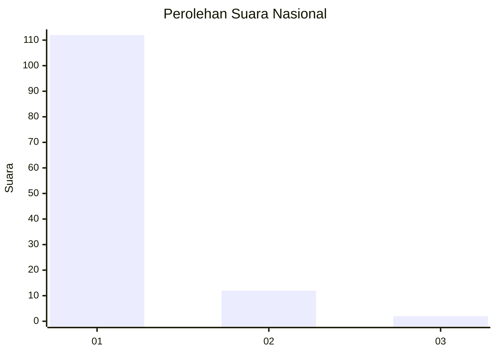
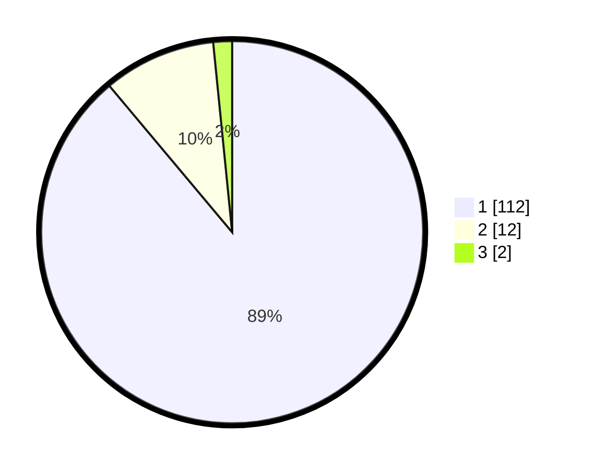

# Hasil

## Grafik

## Tabel

| No. | Nama Paslon    | Suara | Suara (raw) | Persentase |
|:--- |:-------------- | -----:| -----------:| ----------:|
| 1   | ANIES MUHAIMIN | 112   | [112][p-1]  | 88,89      |
| 2   | PRABOWO GIBRAN | 12    | [12][p-2]   | 9,52       |
| 3   | GANJAR MAHFUD  | 2     | [2][p-3]    | 1,59       |

[p-1]: https://github.com/gigit-pemilu/pemilu-2024/blob/main/pilpres/hitung-suara/sub/11-aceh/sub/07-pidie/sub/22-keumala/sub/2006-rheng/sub/002-tps/sub/paslon-1.txt
[p-2]: https://github.com/gigit-pemilu/pemilu-2024/blob/main/pilpres/hitung-suara/sub/11-aceh/sub/07-pidie/sub/22-keumala/sub/2006-rheng/sub/002-tps/sub/paslon-2.txt
[p-3]: https://github.com/gigit-pemilu/pemilu-2024/blob/main/pilpres/hitung-suara/sub/11-aceh/sub/07-pidie/sub/22-keumala/sub/2006-rheng/sub/002-tps/sub/paslon-3.txt

## Foto C Plano

https://sirekap-obj-formc.kpu.go.id/af4c/pemilu/ppwp/11/07/22/20/06/1107222006002-20240215-083516--69488abf-0e32-4294-82b5-01c806baf39e.jpg

https://sirekap-obj-formc.kpu.go.id/af4c/pemilu/ppwp/11/07/22/20/06/1107222006002-20240215-083618--d661902e-553c-4cd9-99f3-3d768d5afc22.jpg

https://sirekap-obj-formc.kpu.go.id/af4c/pemilu/ppwp/11/07/22/20/06/1107222006002-20240215-083712--7de08a52-129f-4a0a-aee6-c0a71d8c31b5.jpg

## Metadata

| Key        | Value               |
| ---------- | ------------------- |
| Time Stamp | 2024-02-16 02:30:27 |

