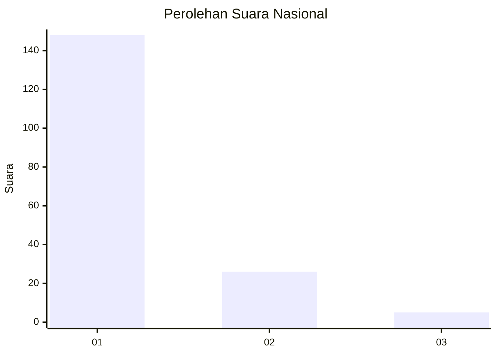
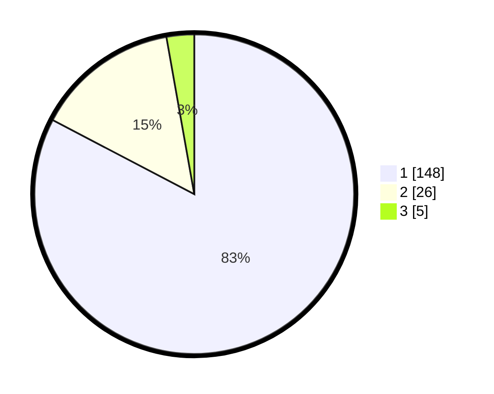

# Hasil

## Grafik

## Tabel

| No. | Nama Paslon    | Suara | Suara (raw) | Persentase |
|:--- |:-------------- | -----:| -----------:| ----------:|
| 1   | ANIES MUHAIMIN | 148   | [148][p-1]  | 82,68      |
| 2   | PRABOWO GIBRAN | 26    | [26][p-2]   | 14,53      |
| 3   | GANJAR MAHFUD  | 5     | [5][p-3]    | 2,79       |

[p-1]: https://github.com/gigit-pemilu/pemilu-2024/blob/main/pilpres/hitung-suara/sub/11-aceh/sub/07-pidie/sub/24-mutiara-timur/sub/2001-baroh-ujong-rimba/sub/001-tps/sub/paslon-1.txt
[p-2]: https://github.com/gigit-pemilu/pemilu-2024/blob/main/pilpres/hitung-suara/sub/11-aceh/sub/07-pidie/sub/24-mutiara-timur/sub/2001-baroh-ujong-rimba/sub/001-tps/sub/paslon-2.txt
[p-3]: https://github.com/gigit-pemilu/pemilu-2024/blob/main/pilpres/hitung-suara/sub/11-aceh/sub/07-pidie/sub/24-mutiara-timur/sub/2001-baroh-ujong-rimba/sub/001-tps/sub/paslon-3.txt

## Foto C Plano

https://sirekap-obj-formc.kpu.go.id/bf78/pemilu/ppwp/11/07/24/20/01/1107242001001-20240216-150955--8b52b24d-7058-41de-bc8c-f186ae9deebe.jpg

## Metadata

| Key        | Value               |
| ---------- | ------------------- |
| Time Stamp | 2024-02-17 02:30:03 |

