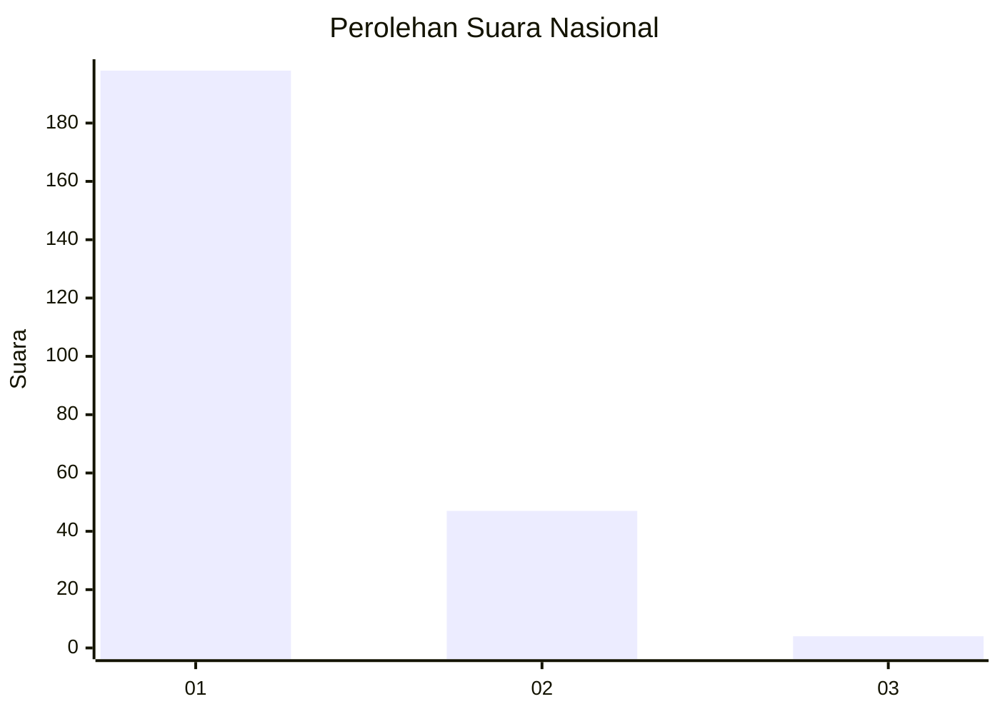
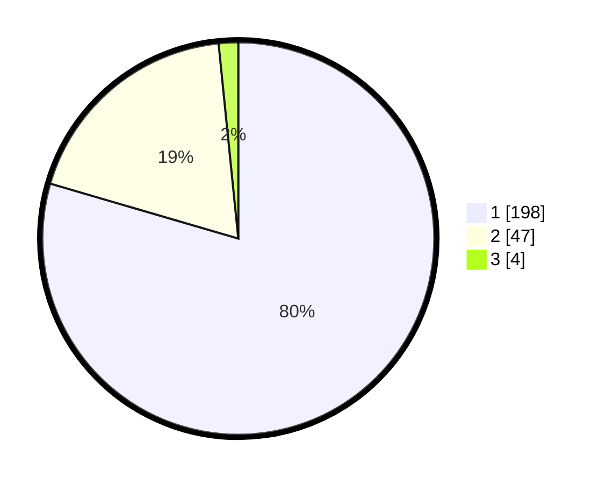

# Hasil

## Grafik

## Tabel

| No. | Nama Paslon    | Suara | Suara (raw) | Persentase |
|:--- |:-------------- | -----:| -----------:| ----------:|
| 1   | ANIES MUHAIMIN | 198   | [198][p-1]  | 79,52      |
| 2   | PRABOWO GIBRAN | 47    | [47][p-2]   | 18,88      |
| 3   | GANJAR MAHFUD  | 4     | [4][p-3]    | 1,61       |

[p-1]: https://github.com/gigit-pemilu/pemilu-2024/blob/main/pilpres/hitung-suara/sub/11-aceh/sub/07-pidie/sub/24-mutiara-timur/sub/2002-jojo/sub/001-tps/sub/paslon-1.txt
[p-2]: https://github.com/gigit-pemilu/pemilu-2024/blob/main/pilpres/hitung-suara/sub/11-aceh/sub/07-pidie/sub/24-mutiara-timur/sub/2002-jojo/sub/001-tps/sub/paslon-2.txt
[p-3]: https://github.com/gigit-pemilu/pemilu-2024/blob/main/pilpres/hitung-suara/sub/11-aceh/sub/07-pidie/sub/24-mutiara-timur/sub/2002-jojo/sub/001-tps/sub/paslon-3.txt

## Foto C Plano

https://sirekap-obj-formc.kpu.go.id/cf6f/pemilu/ppwp/11/07/24/20/02/1107242002001-20240215-144451--941991e5-47df-4239-a101-aaaab2aa5584.jpg

https://sirekap-obj-formc.kpu.go.id/cf6f/pemilu/ppwp/11/07/24/20/02/1107242002001-20240215-161842--0b946297-c2f6-45ea-bb5c-63ba1022eaaa.jpg

https://sirekap-obj-formc.kpu.go.id/cf6f/pemilu/ppwp/11/07/24/20/02/1107242002001-20240215-145211--70e08261-adb0-44ae-84e3-396d95225586.jpg

## Metadata

| Key        | Value               |
| ---------- | ------------------- |
| Time Stamp | 2024-02-17 19:30:00 |

