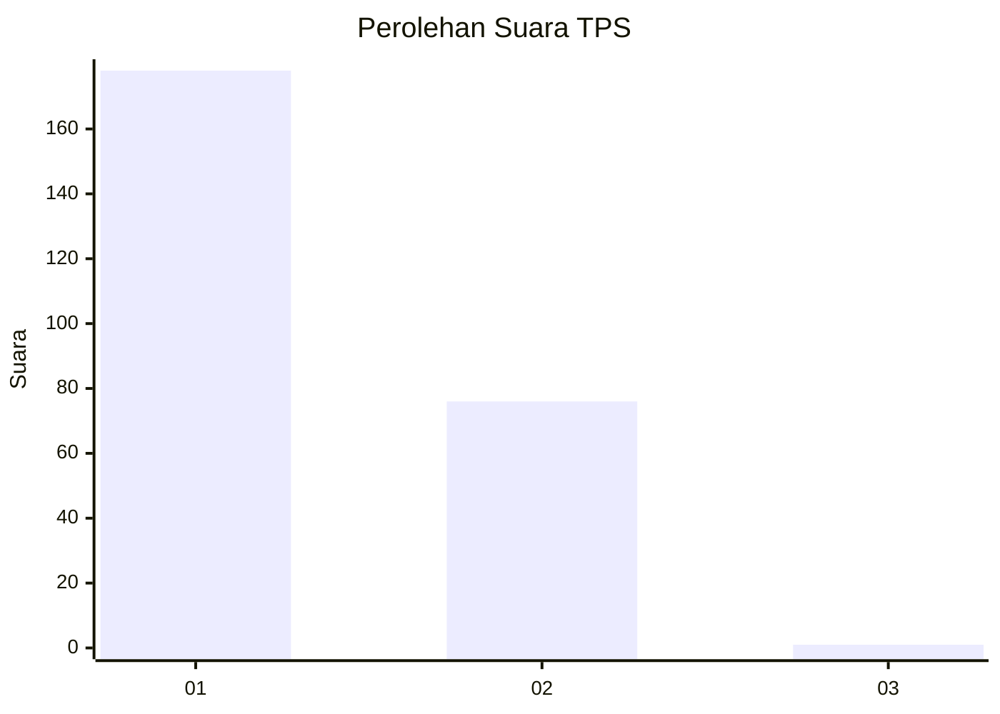
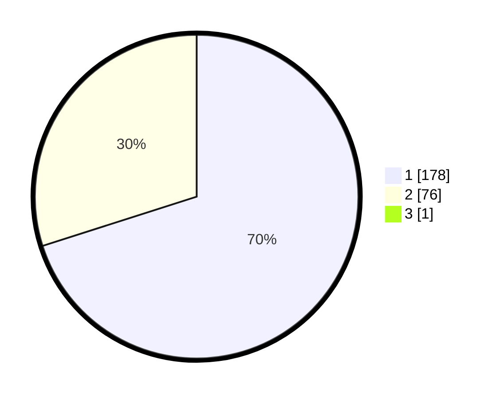

# Hasil

## Grafik

## Tabel

| No. | Nama Paslon    | Suara | Suara (raw) | Persentase |
|:--- |:-------------- | -----:| -----------:| ----------:|
| 1   | ANIES MUHAIMIN | 178   | [178][p-1]  | 69,80      |
| 2   | PRABOWO GIBRAN | 76    | [76][p-2]   | 29,80      |
| 3   | GANJAR MAHFUD  | 1     | [1][p-3]    | 0,39       |

[p-1]: https://github.com/gigit-pemilu/pemilu-2024-11-aceh/blob/main/pilpres/hitung-suara/sub/11-aceh/sub/07-pidie/sub/24-mutiara-timur/sub/2002-jojo/sub/002-tps/sub/paslon-1.txt
[p-2]: https://github.com/gigit-pemilu/pemilu-2024-11-aceh/blob/main/pilpres/hitung-suara/sub/11-aceh/sub/07-pidie/sub/24-mutiara-timur/sub/2002-jojo/sub/002-tps/sub/paslon-2.txt
[p-3]: https://github.com/gigit-pemilu/pemilu-2024-11-aceh/blob/main/pilpres/hitung-suara/sub/11-aceh/sub/07-pidie/sub/24-mutiara-timur/sub/2002-jojo/sub/002-tps/sub/paslon-3.txt

## Foto C Plano

https://sirekap-obj-formc.kpu.go.id/8679/pemilu/ppwp/11/07/24/20/02/1107242002002-20240215-144948--9aeaf78f-83d5-4048-8fb5-f6bfe56b9462.jpg

https://sirekap-obj-formc.kpu.go.id/8679/pemilu/ppwp/11/07/24/20/02/1107242002002-20240215-145036--b846d1cd-9631-4fa3-a0c2-a69a96fc91c7.jpg

https://sirekap-obj-formc.kpu.go.id/8679/pemilu/ppwp/11/07/24/20/02/1107242002002-20240215-112110--52e2de45-f441-4598-bd16-b6887dfa5e86.jpg

## Metadata

| Key        | Value               |
| ---------- | ------------------- |
| Time Stamp | 2024-02-17 19:30:00 |

