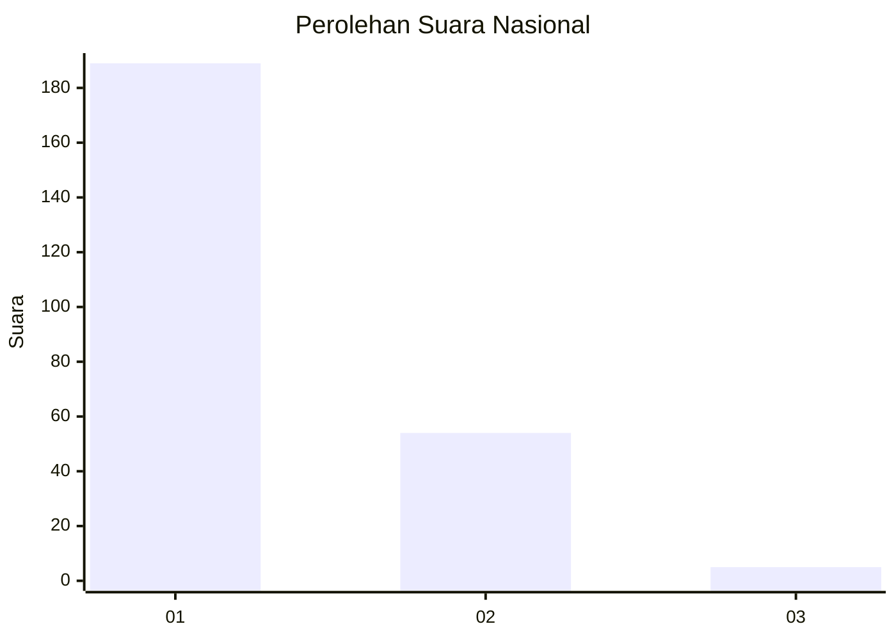
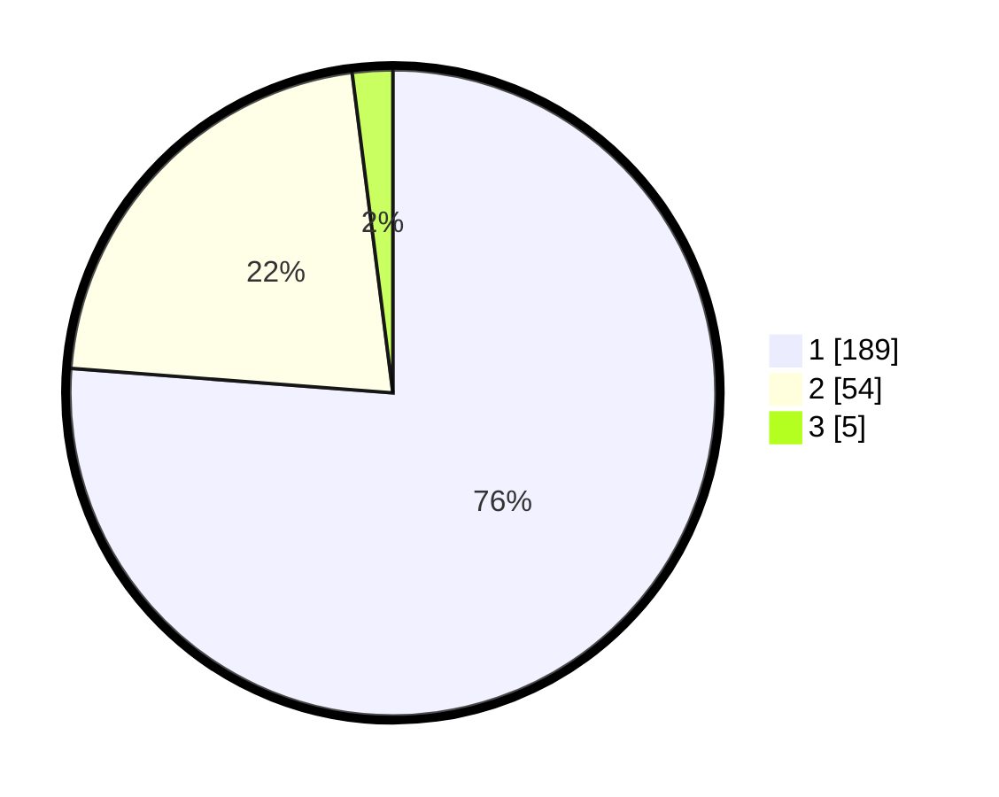

# Hasil

## Grafik

## Tabel

| No. | Nama Paslon    | Suara | Suara (raw) | Persentase |
|:--- |:-------------- | -----:| -----------:| ----------:|
| 1   | ANIES MUHAIMIN | 189   | [189][p-1]  | 76,21      |
| 2   | PRABOWO GIBRAN | 54    | [54][p-2]   | 21,77      |
| 3   | GANJAR MAHFUD  | 5     | [5][p-3]    | 2,02       |

[p-1]: https://github.com/gigit-pemilu/pemilu-2024/blob/main/pilpres/hitung-suara/sub/11-aceh/sub/07-pidie/sub/24-mutiara-timur/sub/2002-jojo/sub/003-tps/sub/paslon-1.txt
[p-2]: https://github.com/gigit-pemilu/pemilu-2024/blob/main/pilpres/hitung-suara/sub/11-aceh/sub/07-pidie/sub/24-mutiara-timur/sub/2002-jojo/sub/003-tps/sub/paslon-2.txt
[p-3]: https://github.com/gigit-pemilu/pemilu-2024/blob/main/pilpres/hitung-suara/sub/11-aceh/sub/07-pidie/sub/24-mutiara-timur/sub/2002-jojo/sub/003-tps/sub/paslon-3.txt

## Foto C Plano

https://sirekap-obj-formc.kpu.go.id/5eba/pemilu/ppwp/11/07/24/20/02/1107242002003-20240215-110344--21d24bf6-add5-4257-b793-48d56bdb0113.jpg

https://sirekap-obj-formc.kpu.go.id/5eba/pemilu/ppwp/11/07/24/20/02/1107242002003-20240215-110559--949cd1a5-00b8-4737-8dcb-0c4961cdfe08.jpg

https://sirekap-obj-formc.kpu.go.id/5eba/pemilu/ppwp/11/07/24/20/02/1107242002003-20240215-110727--66a1cf27-f5ee-4dc6-83bf-f4c9793c329d.jpg

## Metadata

| Key        | Value               |
| ---------- | ------------------- |
| Time Stamp | 2024-02-17 19:30:00 |

