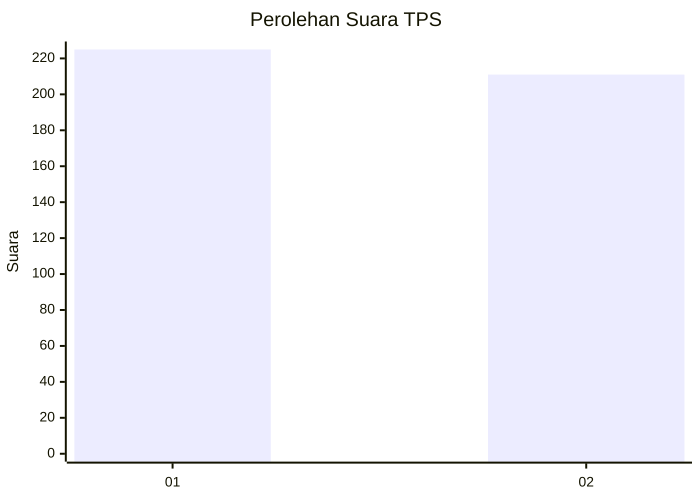
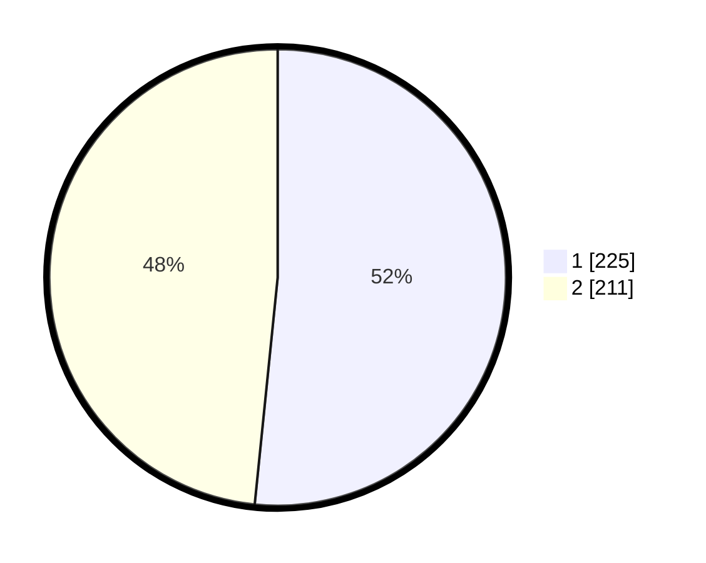

# Hasil

## Grafik

## Tabel

| No. | Nama Paslon    | Suara | Suara (raw) | Persentase |
|:--- |:-------------- | -----:| -----------:| ----------:|
| 1   | ANIES MUHAIMIN | 225   | [225][p-1]  | 51,61      |
| 2   | PRABOWO GIBRAN | 211   | [211][p-2]  | 48,39      |

[p-1]: https://github.com/gigit-pemilu/pemilu-2024-11-aceh/blob/main/pilpres/hitung-suara/sub/11-aceh/sub/07-pidie/sub/24-mutiara-timur/sub/2002-jojo/sub/004-tps/sub/paslon-1.txt
[p-2]: https://github.com/gigit-pemilu/pemilu-2024-11-aceh/blob/main/pilpres/hitung-suara/sub/11-aceh/sub/07-pidie/sub/24-mutiara-timur/sub/2002-jojo/sub/004-tps/sub/paslon-2.txt
[p-3]: https://github.com/gigit-pemilu/pemilu-2024-11-aceh/blob/main/pilpres/hitung-suara/sub/11-aceh/sub/07-pidie/sub/24-mutiara-timur/sub/2002-jojo/sub/004-tps/sub/paslon-3.txt

## Foto C Plano

https://sirekap-obj-formc.kpu.go.id/9dbe/pemilu/ppwp/11/07/24/20/02/1107242002004-20240215-142658--173fdab4-2274-4ec4-8f4c-4116643b6ce8.jpg

https://sirekap-obj-formc.kpu.go.id/9dbe/pemilu/ppwp/11/07/24/20/02/1107242002004-20240215-142900--9464cdef-d08f-430f-bff0-7883679afbe1.jpg

https://sirekap-obj-formc.kpu.go.id/9dbe/pemilu/ppwp/11/07/24/20/02/1107242002004-20240215-143005--72e2fc90-4edf-44c3-9afb-5005faa2c726.jpg

## Metadata

| Key        | Value               |
| ---------- | ------------------- |
| Time Stamp | 2024-02-25 22:00:00 |

