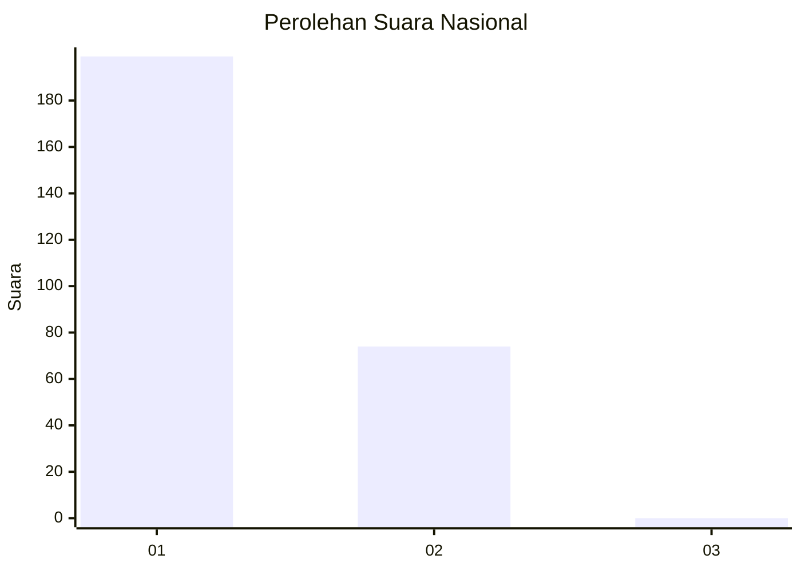
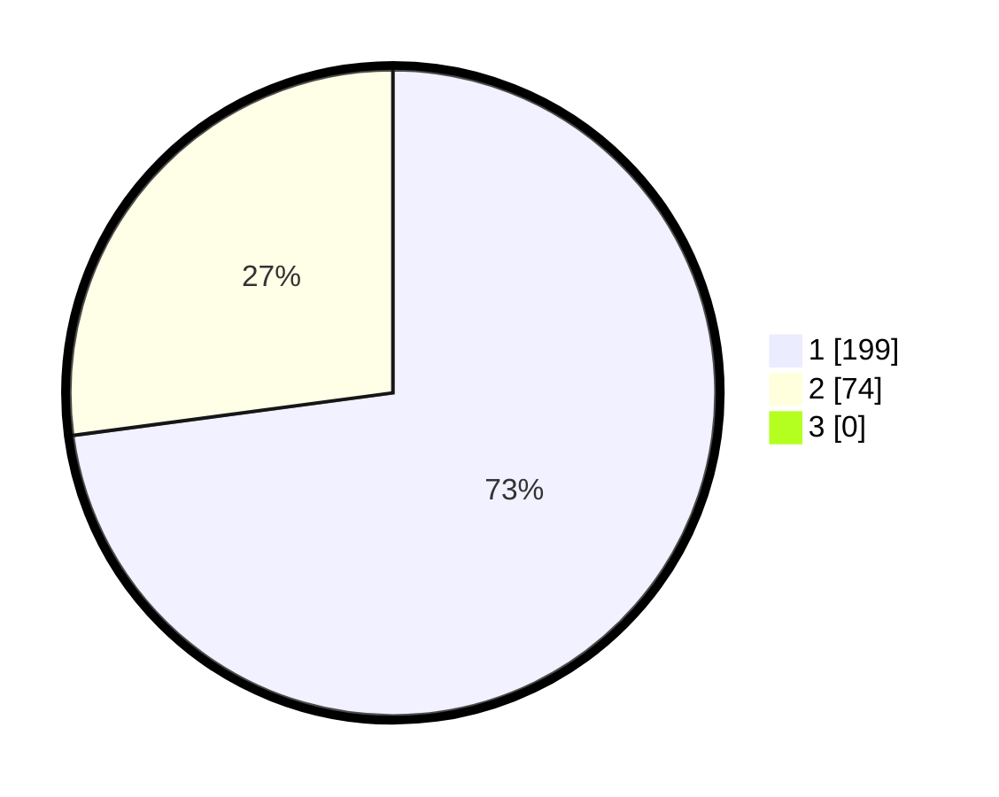

# Hasil

## Grafik

## Tabel

| No. | Nama Paslon    | Suara | Suara (raw) | Persentase |
|:--- |:-------------- | -----:| -----------:| ----------:|
| 1   | ANIES MUHAIMIN | 199   | [199][p-1]  | 72,89      |
| 2   | PRABOWO GIBRAN | 74    | [74][p-2]   | 27,11      |
| 3   | GANJAR MAHFUD  | 0     | [0][p-3]    | 0,00       |

[p-1]: https://github.com/gigit-pemilu/pemilu-2024/blob/main/pilpres/hitung-suara/sub/11-aceh/sub/07-pidie/sub/24-mutiara-timur/sub/2005-paloh-lhok-usi/sub/001-tps/sub/paslon-1.txt
[p-2]: https://github.com/gigit-pemilu/pemilu-2024/blob/main/pilpres/hitung-suara/sub/11-aceh/sub/07-pidie/sub/24-mutiara-timur/sub/2005-paloh-lhok-usi/sub/001-tps/sub/paslon-2.txt
[p-3]: https://github.com/gigit-pemilu/pemilu-2024/blob/main/pilpres/hitung-suara/sub/11-aceh/sub/07-pidie/sub/24-mutiara-timur/sub/2005-paloh-lhok-usi/sub/001-tps/sub/paslon-3.txt

## Foto C Plano

https://sirekap-obj-formc.kpu.go.id/ee0f/pemilu/ppwp/11/07/24/20/05/1107242005001-20240215-080845--e66da8fb-6db3-4b49-a9be-f2dec8ee2cd9.jpg

https://sirekap-obj-formc.kpu.go.id/ee0f/pemilu/ppwp/11/07/24/20/05/1107242005001-20240215-080708--7661243a-d88d-4dc7-b9fa-23368a3fba34.jpg

https://sirekap-obj-formc.kpu.go.id/ee0f/pemilu/ppwp/11/07/24/20/05/1107242005001-20240215-081315--b10d9421-c93e-49c9-8586-a54581d4d02f.jpg

## Metadata

| Key        | Value               |
| ---------- | ------------------- |
| Time Stamp | 2024-02-17 19:30:00 |

