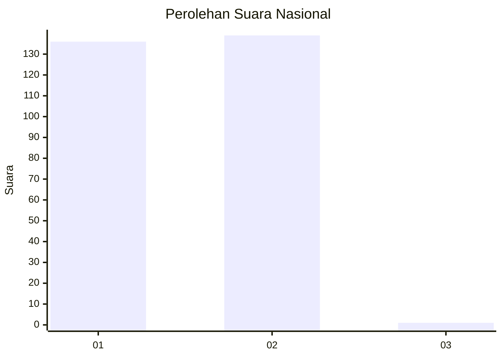
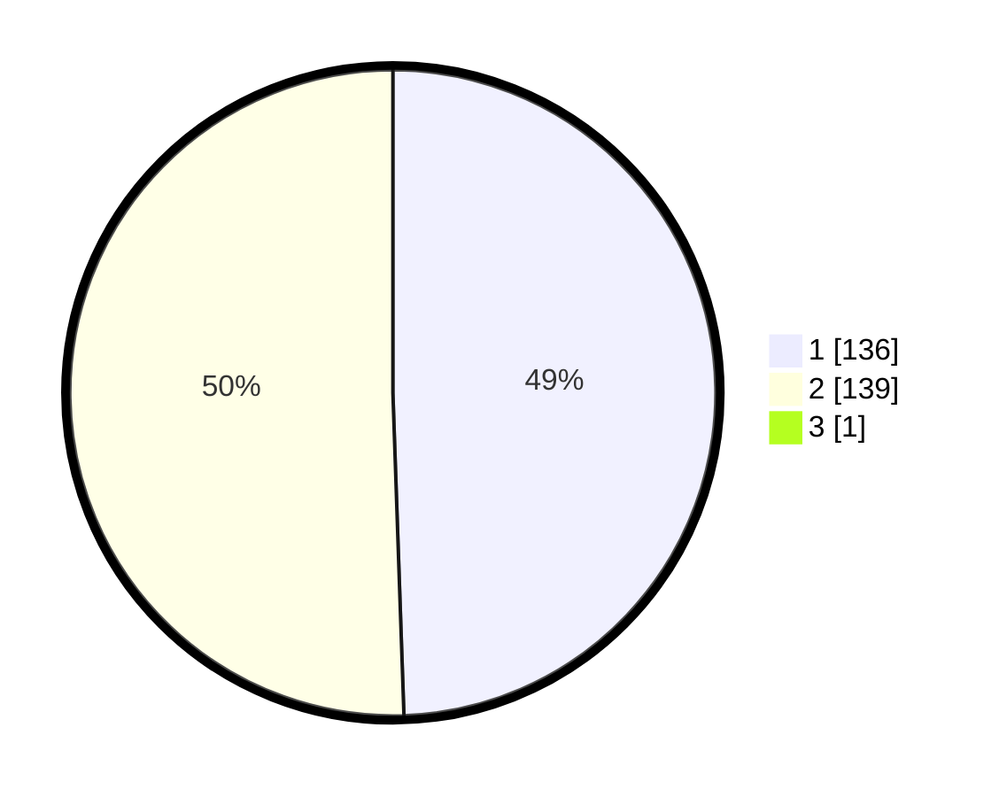

# Hasil

## Grafik

## Tabel

| No. | Nama Paslon    | Suara | Suara (raw) | Persentase |
|:--- |:-------------- | -----:| -----------:| ----------:|
| 1   | ANIES MUHAIMIN | 136   | [136][p-1]  | 49,28      |
| 2   | PRABOWO GIBRAN | 139   | [139][p-2]  | 50,36      |
| 3   | GANJAR MAHFUD  | 1     | [1][p-3]    | 0,36       |

[p-1]: https://github.com/gigit-pemilu/pemilu-2024/blob/main/pilpres/hitung-suara/sub/11-aceh/sub/07-pidie/sub/24-mutiara-timur/sub/2005-paloh-lhok-usi/sub/002-tps/sub/paslon-1.txt
[p-2]: https://github.com/gigit-pemilu/pemilu-2024/blob/main/pilpres/hitung-suara/sub/11-aceh/sub/07-pidie/sub/24-mutiara-timur/sub/2005-paloh-lhok-usi/sub/002-tps/sub/paslon-2.txt
[p-3]: https://github.com/gigit-pemilu/pemilu-2024/blob/main/pilpres/hitung-suara/sub/11-aceh/sub/07-pidie/sub/24-mutiara-timur/sub/2005-paloh-lhok-usi/sub/002-tps/sub/paslon-3.txt

## Foto C Plano

https://sirekap-obj-formc.kpu.go.id/026c/pemilu/ppwp/11/07/24/20/05/1107242005002-20240215-080546--4bec7f5a-d6e8-4b86-8d5a-ae75682477df.jpg

https://sirekap-obj-formc.kpu.go.id/026c/pemilu/ppwp/11/07/24/20/05/1107242005002-20240215-080757--91c4dd6e-40da-456a-9813-680138e8cbfb.jpg

https://sirekap-obj-formc.kpu.go.id/026c/pemilu/ppwp/11/07/24/20/05/1107242005002-20240215-080937--b811273b-9076-4f53-bda6-9720ef092a17.jpg

## Metadata

| Key        | Value               |
| ---------- | ------------------- |
| Time Stamp | 2024-02-17 19:30:00 |

