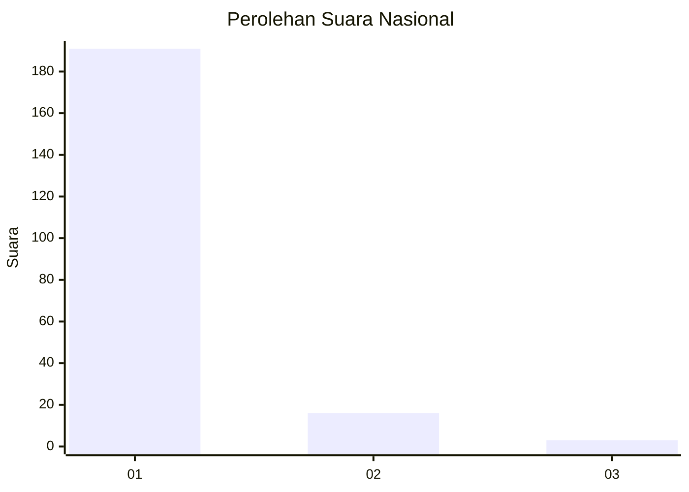
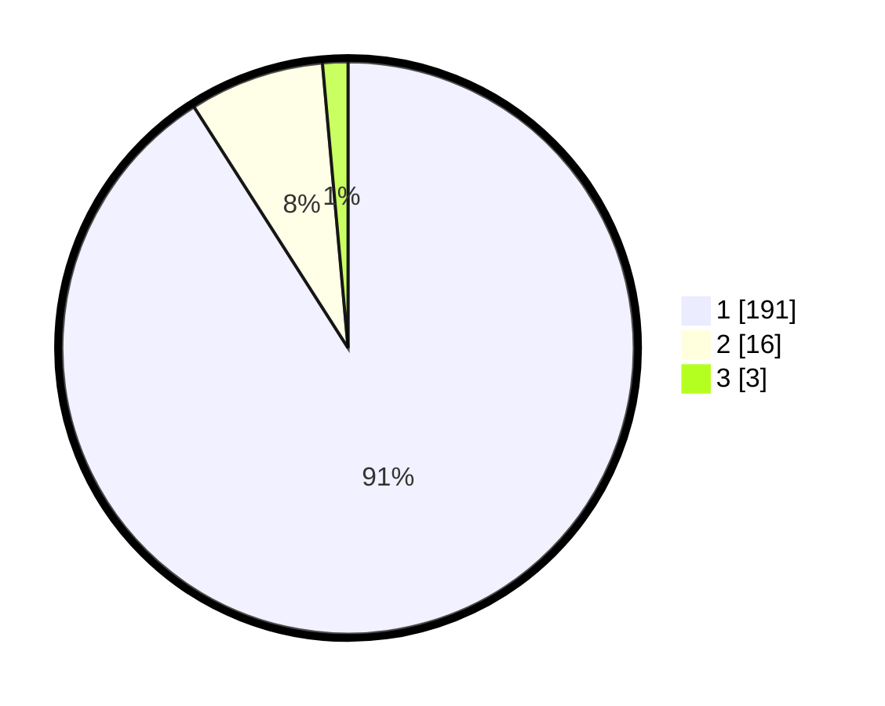

# Hasil

## Grafik

## Tabel

| No. | Nama Paslon    | Suara | Suara (raw) | Persentase |
|:--- |:-------------- | -----:| -----------:| ----------:|
| 1   | ANIES MUHAIMIN | 191   | [191][p-1]  | 90,95      |
| 2   | PRABOWO GIBRAN | 16    | [16][p-2]   | 7,62       |
| 3   | GANJAR MAHFUD  | 3     | [3][p-3]    | 1,43       |

[p-1]: https://github.com/gigit-pemilu/pemilu-2024/blob/main/pilpres/hitung-suara/sub/11-aceh/sub/07-pidie/sub/24-mutiara-timur/sub/2007-mee-tanjong-usi/sub/001-tps/sub/paslon-1.txt
[p-2]: https://github.com/gigit-pemilu/pemilu-2024/blob/main/pilpres/hitung-suara/sub/11-aceh/sub/07-pidie/sub/24-mutiara-timur/sub/2007-mee-tanjong-usi/sub/001-tps/sub/paslon-2.txt
[p-3]: https://github.com/gigit-pemilu/pemilu-2024/blob/main/pilpres/hitung-suara/sub/11-aceh/sub/07-pidie/sub/24-mutiara-timur/sub/2007-mee-tanjong-usi/sub/001-tps/sub/paslon-3.txt

## Foto C Plano

https://sirekap-obj-formc.kpu.go.id/c539/pemilu/ppwp/11/07/24/20/07/1107242007001-20240215-011546--52459eb0-53ac-47e4-9d2b-1bd4d0a900cd.jpg

https://sirekap-obj-formc.kpu.go.id/c539/pemilu/ppwp/11/07/24/20/07/1107242007001-20240215-011258--3763f6cd-204f-4e54-8626-e2ea200e2d94.jpg

https://sirekap-obj-formc.kpu.go.id/c539/pemilu/ppwp/11/07/24/20/07/1107242007001-20240215-012248--e937ccd8-280b-4fdb-b176-9ec7b97f932a.jpg

## Metadata

| Key        | Value               |
| ---------- | ------------------- |
| Time Stamp | 2024-02-17 19:30:00 |

