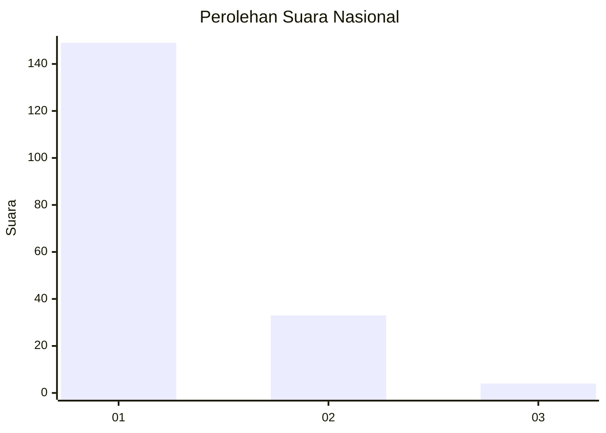
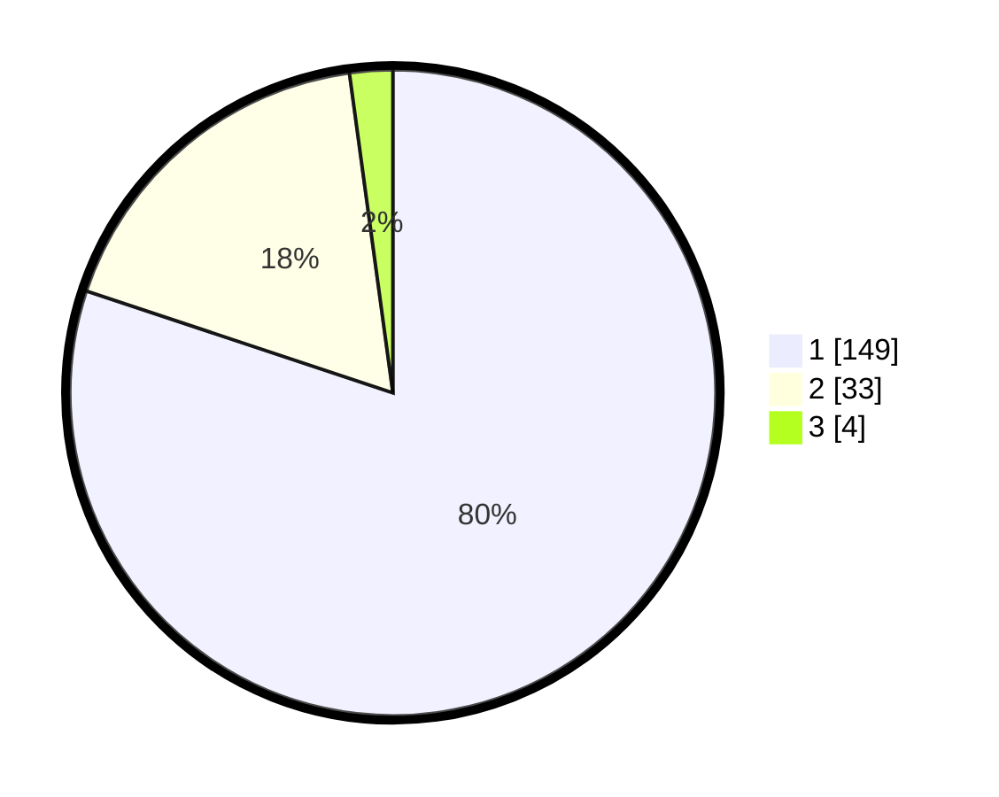

# Hasil

## Grafik

## Tabel

| No. | Nama Paslon    | Suara | Suara (raw) | Persentase |
|:--- |:-------------- | -----:| -----------:| ----------:|
| 1   | ANIES MUHAIMIN | 149   | [149][p-1]  | 80,11      |
| 2   | PRABOWO GIBRAN | 33    | [33][p-2]   | 17,74      |
| 3   | GANJAR MAHFUD  | 4     | [4][p-3]    | 2,15       |

[p-1]: https://github.com/gigit-pemilu/pemilu-2024/blob/main/pilpres/hitung-suara/sub/11-aceh/sub/07-pidie/sub/24-mutiara-timur/sub/2007-mee-tanjong-usi/sub/003-tps/sub/paslon-1.txt
[p-2]: https://github.com/gigit-pemilu/pemilu-2024/blob/main/pilpres/hitung-suara/sub/11-aceh/sub/07-pidie/sub/24-mutiara-timur/sub/2007-mee-tanjong-usi/sub/003-tps/sub/paslon-2.txt
[p-3]: https://github.com/gigit-pemilu/pemilu-2024/blob/main/pilpres/hitung-suara/sub/11-aceh/sub/07-pidie/sub/24-mutiara-timur/sub/2007-mee-tanjong-usi/sub/003-tps/sub/paslon-3.txt

## Foto C Plano

https://sirekap-obj-formc.kpu.go.id/24e2/pemilu/ppwp/11/07/24/20/07/1107242007003-20240215-162007--7544ce60-2929-4755-b828-7c2b4921183c.jpg

https://sirekap-obj-formc.kpu.go.id/24e2/pemilu/ppwp/11/07/24/20/07/1107242007003-20240215-162345--0a0f4b6f-8d80-4a2d-8461-992189d4843d.jpg

https://sirekap-obj-formc.kpu.go.id/24e2/pemilu/ppwp/11/07/24/20/07/1107242007003-20240215-162213--c8911348-9ac1-4b0f-8301-b739aa2704a8.jpg

## Metadata

| Key        | Value               |
| ---------- | ------------------- |
| Time Stamp | 2024-02-24 22:31:28 |

