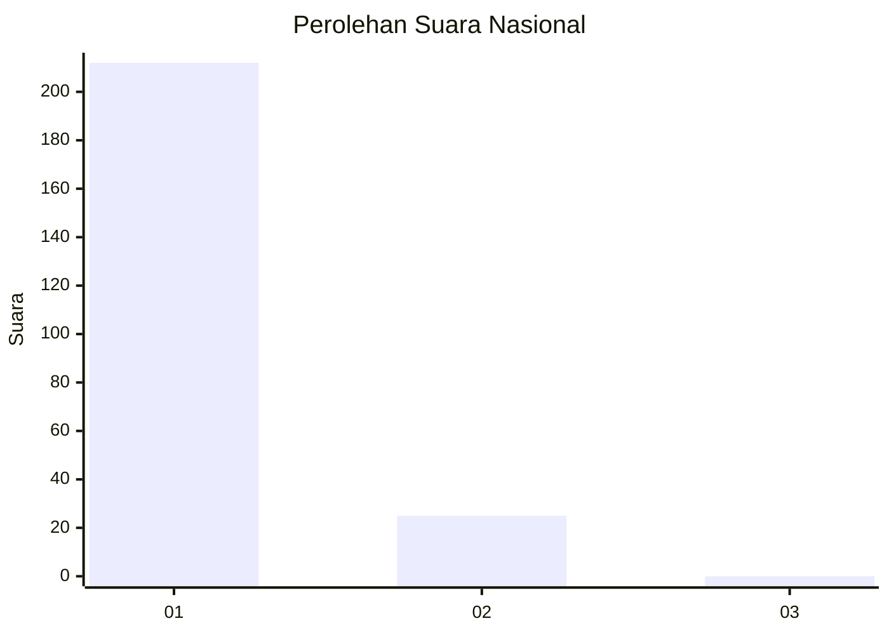
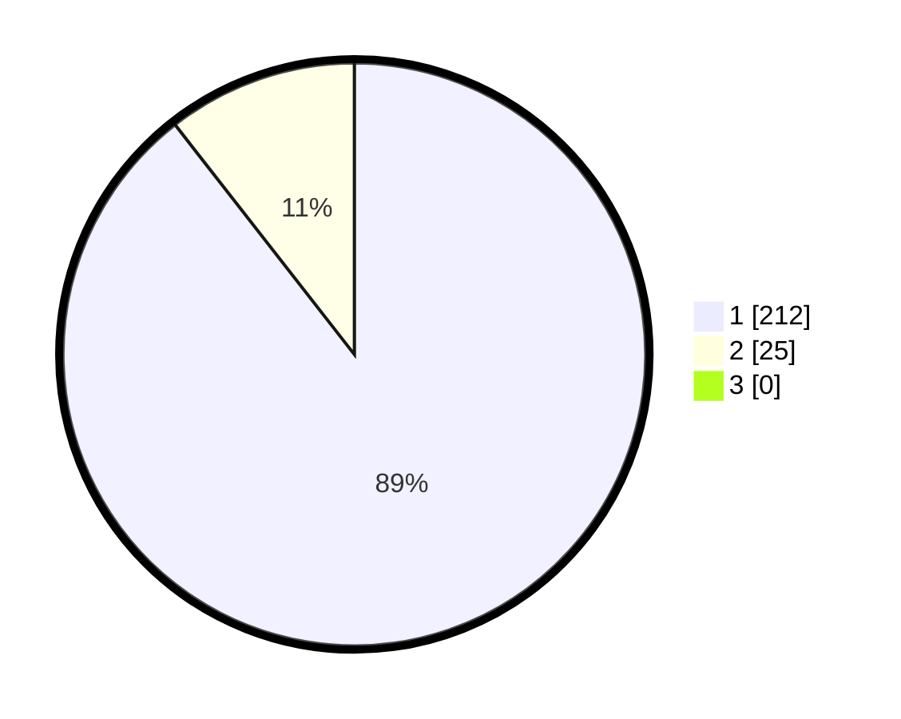

# Hasil

## Grafik

## Tabel

| No. | Nama Paslon    | Suara | Suara (raw) | Persentase |
|:--- |:-------------- | -----:| -----------:| ----------:|
| 1   | ANIES MUHAIMIN | 212   | [212][p-1]  | 89,45      |
| 2   | PRABOWO GIBRAN | 25    | [25][p-2]   | 10,55      |
| 3   | GANJAR MAHFUD  | 0     | [0][p-3]    | 0,00       |

[p-1]: https://github.com/gigit-pemilu/pemilu-2024/blob/main/pilpres/hitung-suara/sub/11-aceh/sub/07-pidie/sub/24-mutiara-timur/sub/2008-mesjid-usi/sub/002-tps/sub/paslon-1.txt
[p-2]: https://github.com/gigit-pemilu/pemilu-2024/blob/main/pilpres/hitung-suara/sub/11-aceh/sub/07-pidie/sub/24-mutiara-timur/sub/2008-mesjid-usi/sub/002-tps/sub/paslon-2.txt
[p-3]: https://github.com/gigit-pemilu/pemilu-2024/blob/main/pilpres/hitung-suara/sub/11-aceh/sub/07-pidie/sub/24-mutiara-timur/sub/2008-mesjid-usi/sub/002-tps/sub/paslon-3.txt

## Foto C Plano

https://sirekap-obj-formc.kpu.go.id/be5c/pemilu/ppwp/11/07/24/20/08/1107242008002-20240216-083836--d6315292-9b80-4e0d-ba2a-c407f5801a90.jpg

https://sirekap-obj-formc.kpu.go.id/be5c/pemilu/ppwp/11/07/24/20/08/1107242008002-20240215-022517--bcf01135-b32d-4b88-baeb-588e8e692632.jpg

https://sirekap-obj-formc.kpu.go.id/be5c/pemilu/ppwp/11/07/24/20/08/1107242008002-20240215-031538--dd116e99-eb0d-408f-a4a8-56c4cc82829a.jpg

## Metadata

| Key        | Value               |
| ---------- | ------------------- |
| Time Stamp | 2024-02-24 22:31:28 |

