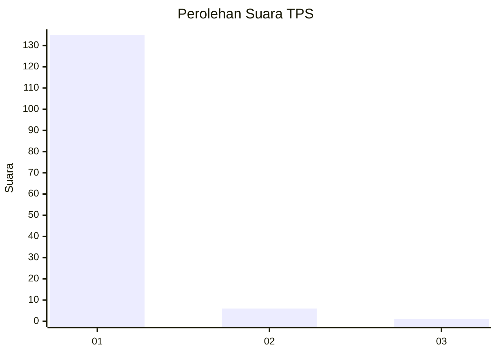
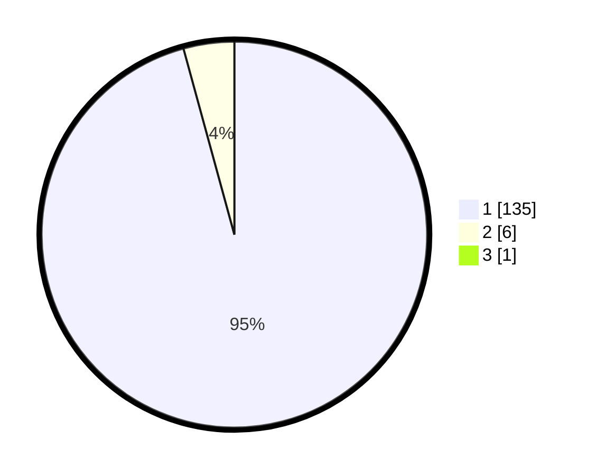

# Hasil

## Grafik

## Tabel

| No. | Nama Paslon    | Suara | Suara (raw) | Persentase |
|:--- |:-------------- | -----:| -----------:| ----------:|
| 1   | ANIES MUHAIMIN | 135   | [135][p-1]  | 95,07      |
| 2   | PRABOWO GIBRAN | 6     | [6][p-2]    | 4,23       |
| 3   | GANJAR MAHFUD  | 1     | [1][p-3]    | 0,70       |

[p-1]: https://github.com/gigit-pemilu/pemilu-2024-11-aceh/blob/main/pilpres/hitung-suara/sub/11-aceh/sub/07-pidie/sub/24-mutiara-timur/sub/2010-nibong/sub/002-tps/sub/paslon-1.txt
[p-2]: https://github.com/gigit-pemilu/pemilu-2024-11-aceh/blob/main/pilpres/hitung-suara/sub/11-aceh/sub/07-pidie/sub/24-mutiara-timur/sub/2010-nibong/sub/002-tps/sub/paslon-2.txt
[p-3]: https://github.com/gigit-pemilu/pemilu-2024-11-aceh/blob/main/pilpres/hitung-suara/sub/11-aceh/sub/07-pidie/sub/24-mutiara-timur/sub/2010-nibong/sub/002-tps/sub/paslon-3.txt

## Foto C Plano

https://sirekap-obj-formc.kpu.go.id/6a41/pemilu/ppwp/11/07/24/20/10/1107242010002-20240215-093914--6589c9e1-865f-4a79-aa58-c76dd43fb2cd.jpg

https://sirekap-obj-formc.kpu.go.id/6a41/pemilu/ppwp/11/07/24/20/10/1107242010002-20240215-094534--a7b2fd85-2f29-4341-81dd-8e1304b7822e.jpg

https://sirekap-obj-formc.kpu.go.id/6a41/pemilu/ppwp/11/07/24/20/10/1107242010002-20240215-101727--09037d6a-d83f-4a1b-ad3f-7092bf74271e.jpg

## Metadata

| Key        | Value               |
| ---------- | ------------------- |
| Time Stamp | 2024-02-19 06:16:00 |

