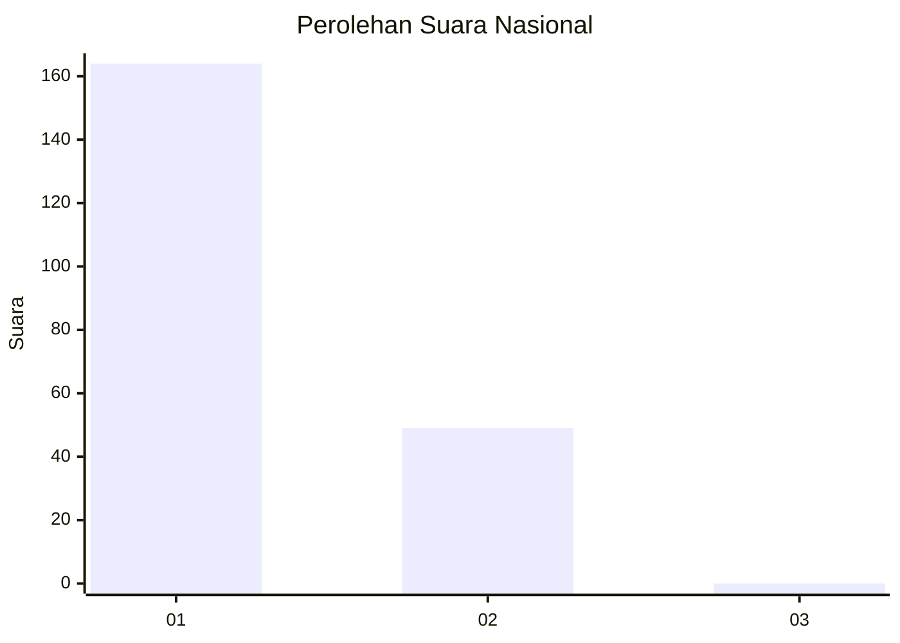
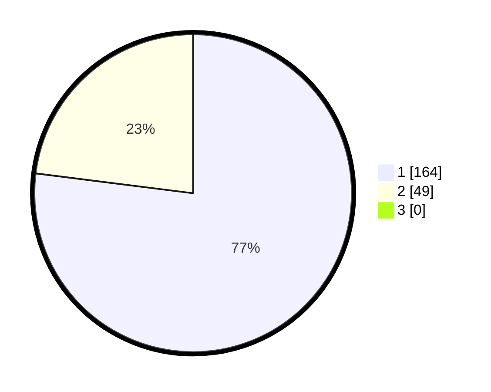

# Hasil

## Grafik

## Tabel

| No. | Nama Paslon    | Suara | Suara (raw) | Persentase |
|:--- |:-------------- | -----:| -----------:| ----------:|
| 1   | ANIES MUHAIMIN | 164   | [164][p-1]  | 77,00      |
| 2   | PRABOWO GIBRAN | 49    | [49][p-2]   | 23,00      |
| 3   | GANJAR MAHFUD  | 0     | [0][p-3]    | 0,00       |

[p-1]: https://github.com/gigit-pemilu/pemilu-2024/blob/main/pilpres/hitung-suara/sub/11-aceh/sub/07-pidie/sub/24-mutiara-timur/sub/2013-didoh/sub/002-tps/sub/paslon-1.txt
[p-2]: https://github.com/gigit-pemilu/pemilu-2024/blob/main/pilpres/hitung-suara/sub/11-aceh/sub/07-pidie/sub/24-mutiara-timur/sub/2013-didoh/sub/002-tps/sub/paslon-2.txt
[p-3]: https://github.com/gigit-pemilu/pemilu-2024/blob/main/pilpres/hitung-suara/sub/11-aceh/sub/07-pidie/sub/24-mutiara-timur/sub/2013-didoh/sub/002-tps/sub/paslon-3.txt

## Foto C Plano

https://sirekap-obj-formc.kpu.go.id/3085/pemilu/ppwp/11/07/24/20/13/1107242013002-20240215-114434--4bf61273-9bb2-49bb-a145-b55496012922.jpg

https://sirekap-obj-formc.kpu.go.id/3085/pemilu/ppwp/11/07/24/20/13/1107242013002-20240215-114026--8a0ef194-2ad5-4976-8cff-0f83d68bb49e.jpg

https://sirekap-obj-formc.kpu.go.id/3085/pemilu/ppwp/11/07/24/20/13/1107242013002-20240215-113906--776e978c-26fd-4add-bf0b-9490a2da9b2a.jpg

## Metadata

| Key        | Value               |
| ---------- | ------------------- |
| Time Stamp | 2024-02-19 06:16:00 |

