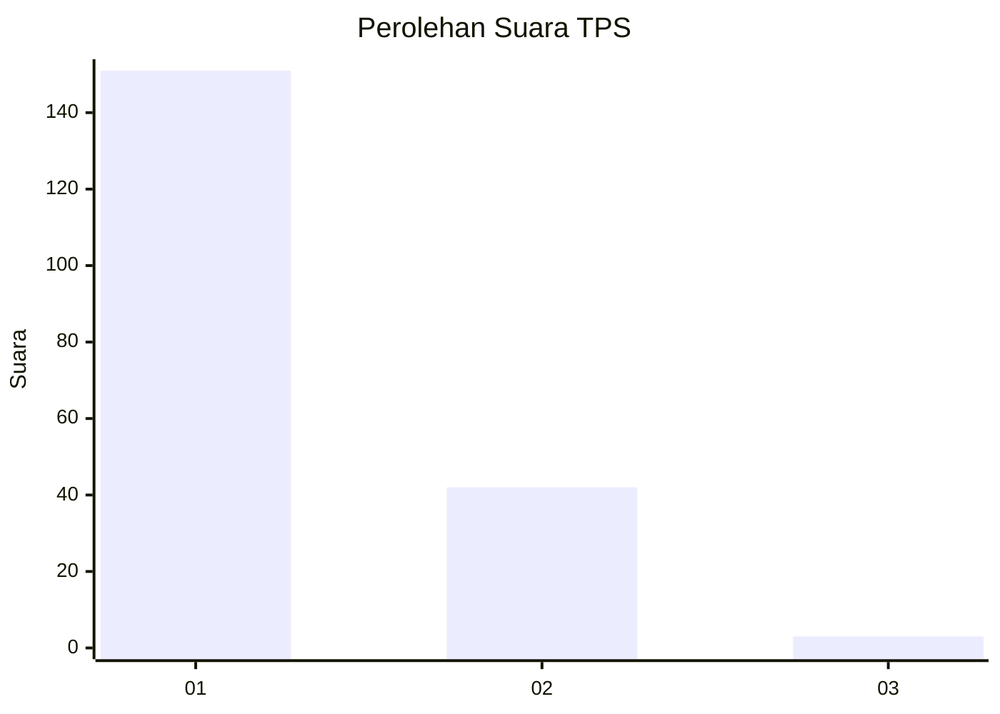
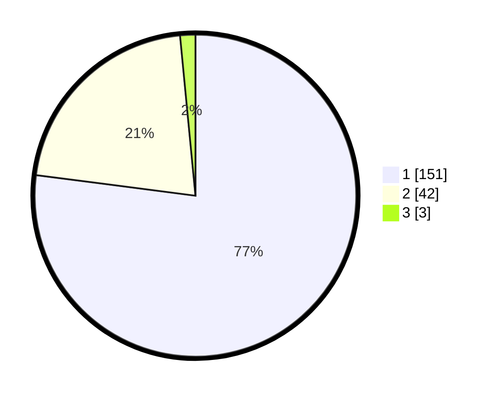

# Hasil

## Grafik

## Tabel

| No. | Nama Paslon    | Suara | Suara (raw) | Persentase |
|:--- |:-------------- | -----:| -----------:| ----------:|
| 1   | ANIES MUHAIMIN | 151   | [151][p-1]  | 77,04      |
| 2   | PRABOWO GIBRAN | 42    | [42][p-2]   | 21,43      |
| 3   | GANJAR MAHFUD  | 3     | [3][p-3]    | 1,53       |

[p-1]: https://github.com/gigit-pemilu/pemilu-2024-11-aceh/blob/main/pilpres/hitung-suara/sub/11-aceh/sub/07-pidie/sub/24-mutiara-timur/sub/2015-empeh/sub/002-tps/sub/paslon-1.txt
[p-2]: https://github.com/gigit-pemilu/pemilu-2024-11-aceh/blob/main/pilpres/hitung-suara/sub/11-aceh/sub/07-pidie/sub/24-mutiara-timur/sub/2015-empeh/sub/002-tps/sub/paslon-2.txt
[p-3]: https://github.com/gigit-pemilu/pemilu-2024-11-aceh/blob/main/pilpres/hitung-suara/sub/11-aceh/sub/07-pidie/sub/24-mutiara-timur/sub/2015-empeh/sub/002-tps/sub/paslon-3.txt

## Foto C Plano

https://sirekap-obj-formc.kpu.go.id/bb69/pemilu/ppwp/11/07/24/20/15/1107242015002-20240215-130619--27872407-656e-4198-b836-b3d6b398d0a9.jpg

https://sirekap-obj-formc.kpu.go.id/bb69/pemilu/ppwp/11/07/24/20/15/1107242015002-20240215-130849--518bf405-383a-4ced-a0df-df3a4c6bbbd8.jpg

https://sirekap-obj-formc.kpu.go.id/bb69/pemilu/ppwp/11/07/24/20/15/1107242015002-20240215-131053--d4041637-21be-47e1-a8b0-58ef60078f91.jpg

## Metadata

| Key        | Value               |
| ---------- | ------------------- |
| Time Stamp | 2024-02-17 16:52:47 |

