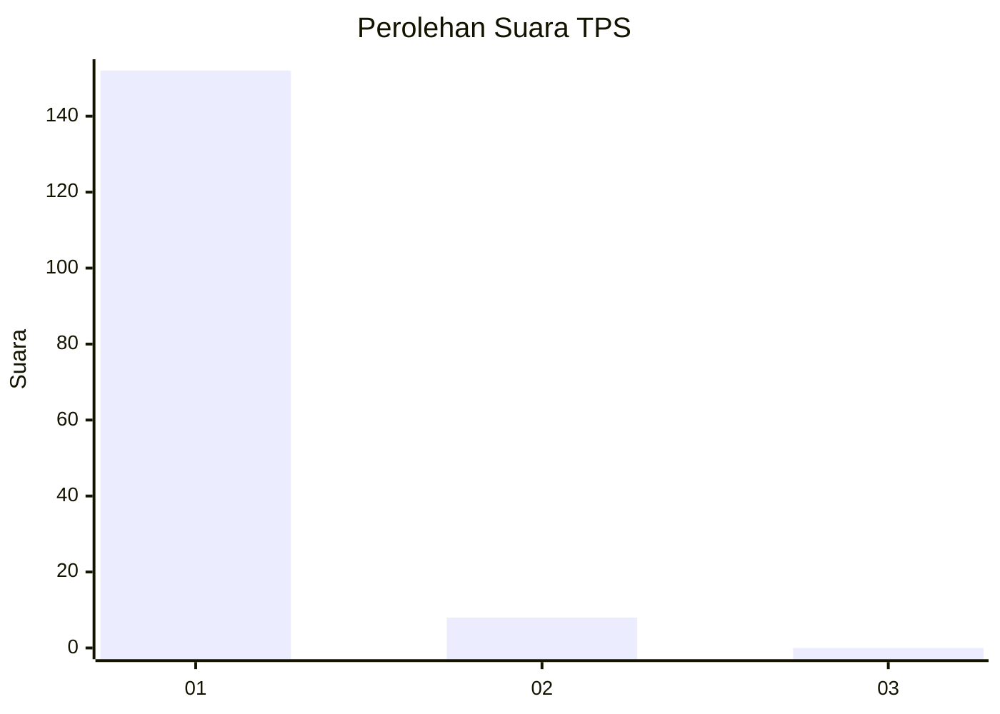
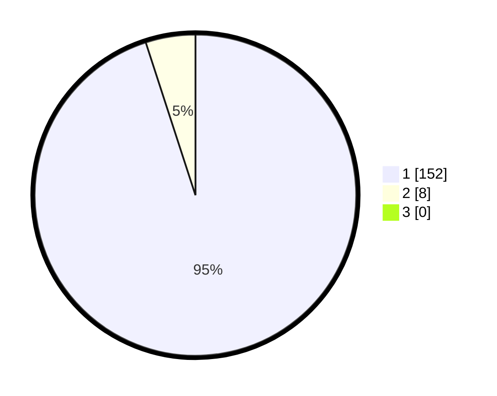

# Hasil

## Grafik

## Tabel

| No. | Nama Paslon    | Suara | Suara (raw) | Persentase |
|:--- |:-------------- | -----:| -----------:| ----------:|
| 1   | ANIES MUHAIMIN | 152   | [152][p-1]  | 95,00      |
| 2   | PRABOWO GIBRAN | 8     | [8][p-2]    | 5,00       |
| 3   | GANJAR MAHFUD  | 0     | [0][p-3]    | 0,00       |

[p-1]: https://github.com/gigit-pemilu/pemilu-2024-11-aceh/blob/main/pilpres/hitung-suara/sub/11-aceh/sub/07-pidie/sub/24-mutiara-timur/sub/2016-blang-riek/sub/001-tps/sub/paslon-1.txt
[p-2]: https://github.com/gigit-pemilu/pemilu-2024-11-aceh/blob/main/pilpres/hitung-suara/sub/11-aceh/sub/07-pidie/sub/24-mutiara-timur/sub/2016-blang-riek/sub/001-tps/sub/paslon-2.txt
[p-3]: https://github.com/gigit-pemilu/pemilu-2024-11-aceh/blob/main/pilpres/hitung-suara/sub/11-aceh/sub/07-pidie/sub/24-mutiara-timur/sub/2016-blang-riek/sub/001-tps/sub/paslon-3.txt

## Foto C Plano

https://sirekap-obj-formc.kpu.go.id/e9a6/pemilu/ppwp/11/07/24/20/16/1107242016001-20240214-223456--b10577b2-f56d-4898-81cf-3a00b42825a7.jpg

https://sirekap-obj-formc.kpu.go.id/e9a6/pemilu/ppwp/11/07/24/20/16/1107242016001-20240214-225059--ba4850b7-8dc6-4038-b1e7-ba55e40b154b.jpg

https://sirekap-obj-formc.kpu.go.id/e9a6/pemilu/ppwp/11/07/24/20/16/1107242016001-20240214-223934--16762625-6edd-4db0-89f5-06e565b3f431.jpg

## Metadata

| Key        | Value               |
| ---------- | ------------------- |
| Time Stamp | 2024-02-17 02:30:03 |

