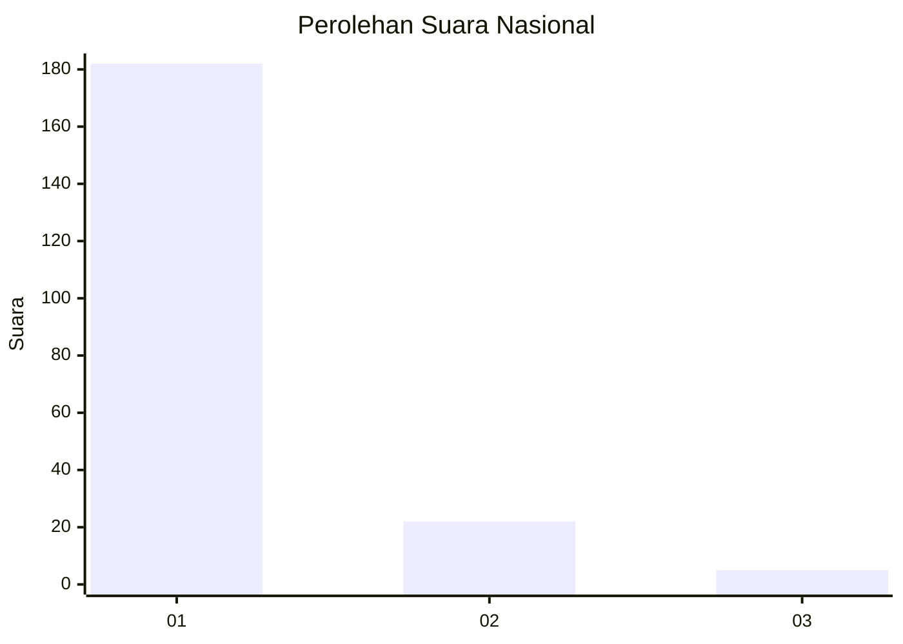
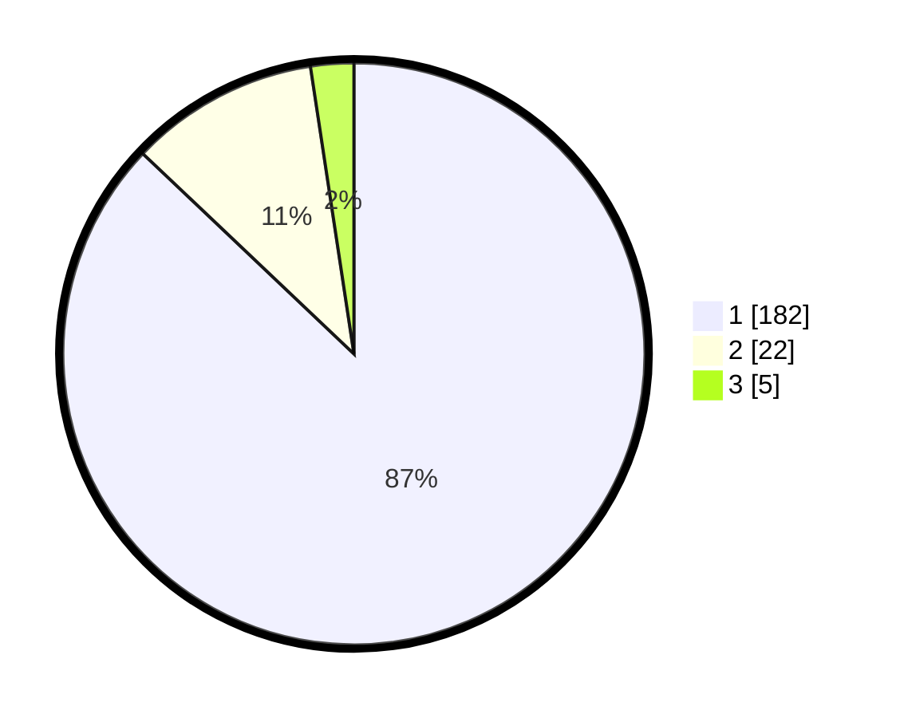

# Hasil

## Grafik

## Tabel

| No. | Nama Paslon    | Suara | Suara (raw) | Persentase |
|:--- |:-------------- | -----:| -----------:| ----------:|
| 1   | ANIES MUHAIMIN | 182   | [182][p-1]  | 87,08      |
| 2   | PRABOWO GIBRAN | 22    | [22][p-2]   | 10,53      |
| 3   | GANJAR MAHFUD  | 5     | [5][p-3]    | 2,39       |

[p-1]: https://github.com/gigit-pemilu/pemilu-2024/blob/main/pilpres/hitung-suara/sub/11-aceh/sub/07-pidie/sub/24-mutiara-timur/sub/2023-dayah-kumba/sub/001-tps/sub/paslon-1.txt
[p-2]: https://github.com/gigit-pemilu/pemilu-2024/blob/main/pilpres/hitung-suara/sub/11-aceh/sub/07-pidie/sub/24-mutiara-timur/sub/2023-dayah-kumba/sub/001-tps/sub/paslon-2.txt
[p-3]: https://github.com/gigit-pemilu/pemilu-2024/blob/main/pilpres/hitung-suara/sub/11-aceh/sub/07-pidie/sub/24-mutiara-timur/sub/2023-dayah-kumba/sub/001-tps/sub/paslon-3.txt

## Foto C Plano

https://sirekap-obj-formc.kpu.go.id/41c9/pemilu/ppwp/11/07/24/20/23/1107242023001-20240214-234619--ca484071-357e-401a-951e-08d899758775.jpg

https://sirekap-obj-formc.kpu.go.id/41c9/pemilu/ppwp/11/07/24/20/23/1107242023001-20240216-142914--036eaac1-1217-4c93-a98b-54eec10372d9.jpg

https://sirekap-obj-formc.kpu.go.id/41c9/pemilu/ppwp/11/07/24/20/23/1107242023001-20240216-142913--ebd03343-bd14-48b4-a67d-6f59a5df8bc4.jpg

## Metadata

| Key        | Value               |
| ---------- | ------------------- |
| Time Stamp | 2024-02-17 02:30:03 |

