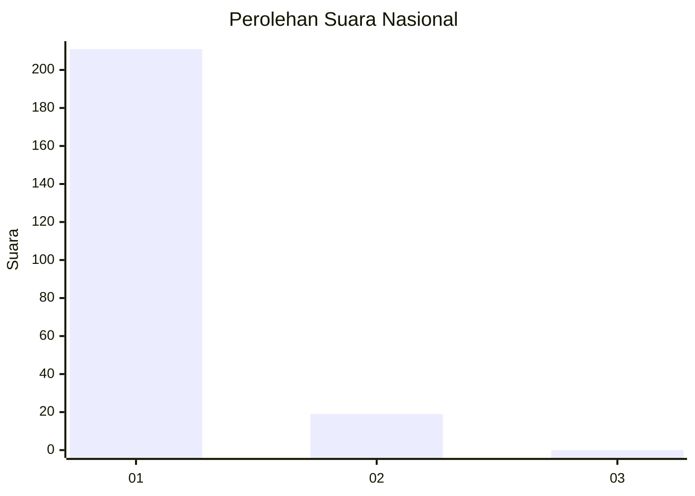
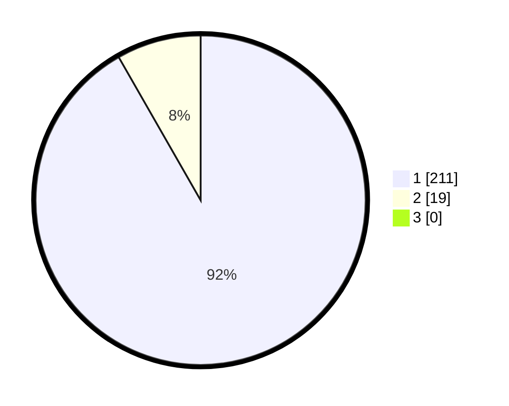

# Hasil

## Grafik

## Tabel

| No. | Nama Paslon    | Suara | Suara (raw) | Persentase |
|:--- |:-------------- | -----:| -----------:| ----------:|
| 1   | ANIES MUHAIMIN | 211   | [211][p-1]  | 91,74      |
| 2   | PRABOWO GIBRAN | 19    | [19][p-2]   | 8,26       |
| 3   | GANJAR MAHFUD  | 0     | [0][p-3]    | 0,00       |

[p-1]: https://github.com/gigit-pemilu/pemilu-2024/blob/main/pilpres/hitung-suara/sub/11-aceh/sub/07-pidie/sub/24-mutiara-timur/sub/2025-dayah-tanoh/sub/001-tps/sub/paslon-1.txt
[p-2]: https://github.com/gigit-pemilu/pemilu-2024/blob/main/pilpres/hitung-suara/sub/11-aceh/sub/07-pidie/sub/24-mutiara-timur/sub/2025-dayah-tanoh/sub/001-tps/sub/paslon-2.txt
[p-3]: https://github.com/gigit-pemilu/pemilu-2024/blob/main/pilpres/hitung-suara/sub/11-aceh/sub/07-pidie/sub/24-mutiara-timur/sub/2025-dayah-tanoh/sub/001-tps/sub/paslon-3.txt

## Foto C Plano

https://sirekap-obj-formc.kpu.go.id/ede8/pemilu/ppwp/11/07/24/20/25/1107242025001-20240215-045051--fddbbe31-5369-442e-98f2-eb07ce4963e9.jpg

https://sirekap-obj-formc.kpu.go.id/ede8/pemilu/ppwp/11/07/24/20/25/1107242025001-20240215-045302--53d75c06-bb53-4e7b-a4c3-1e2b3376cf10.jpg

https://sirekap-obj-formc.kpu.go.id/ede8/pemilu/ppwp/11/07/24/20/25/1107242025001-20240215-105648--988ed142-cc96-4fa2-acca-fbcb1e65d174.jpg

## Metadata

| Key        | Value               |
| ---------- | ------------------- |
| Time Stamp | 2024-02-24 22:31:28 |

