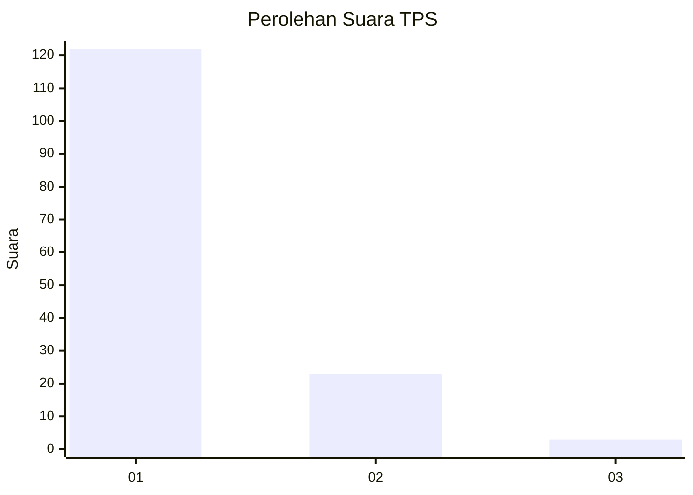
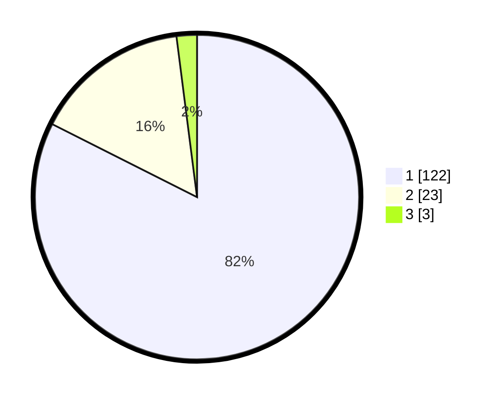

# Hasil

## Grafik

## Tabel

| No. | Nama Paslon    | Suara | Suara (raw) | Persentase |
|:--- |:-------------- | -----:| -----------:| ----------:|
| 1   | ANIES MUHAIMIN | 122   | [122][p-1]  | 82,43      |
| 2   | PRABOWO GIBRAN | 23    | [23][p-2]   | 15,54      |
| 3   | GANJAR MAHFUD  | 3     | [3][p-3]    | 2,03       |

[p-1]: https://github.com/gigit-pemilu/pemilu-2024-11-aceh/blob/main/pilpres/hitung-suara/sub/11-aceh/sub/07-pidie/sub/24-mutiara-timur/sub/2027-beureueh-ii/sub/001-tps/sub/paslon-1.txt
[p-2]: https://github.com/gigit-pemilu/pemilu-2024-11-aceh/blob/main/pilpres/hitung-suara/sub/11-aceh/sub/07-pidie/sub/24-mutiara-timur/sub/2027-beureueh-ii/sub/001-tps/sub/paslon-2.txt
[p-3]: https://github.com/gigit-pemilu/pemilu-2024-11-aceh/blob/main/pilpres/hitung-suara/sub/11-aceh/sub/07-pidie/sub/24-mutiara-timur/sub/2027-beureueh-ii/sub/001-tps/sub/paslon-3.txt

## Foto C Plano

https://sirekap-obj-formc.kpu.go.id/fa0c/pemilu/ppwp/11/07/24/20/27/1107242027001-20240215-090240--6ec2c065-5bbb-4177-8d56-c127fabe33e6.jpg

https://sirekap-obj-formc.kpu.go.id/fa0c/pemilu/ppwp/11/07/24/20/27/1107242027001-20240215-091254--2dc38382-ecad-46d0-b098-26a3cfc898ce.jpg

https://sirekap-obj-formc.kpu.go.id/fa0c/pemilu/ppwp/11/07/24/20/27/1107242027001-20240215-091635--91d08da1-3017-4e8b-b4fd-2810855e7aba.jpg

## Metadata

| Key        | Value               |
| ---------- | ------------------- |
| Time Stamp | 2024-02-19 06:16:00 |

