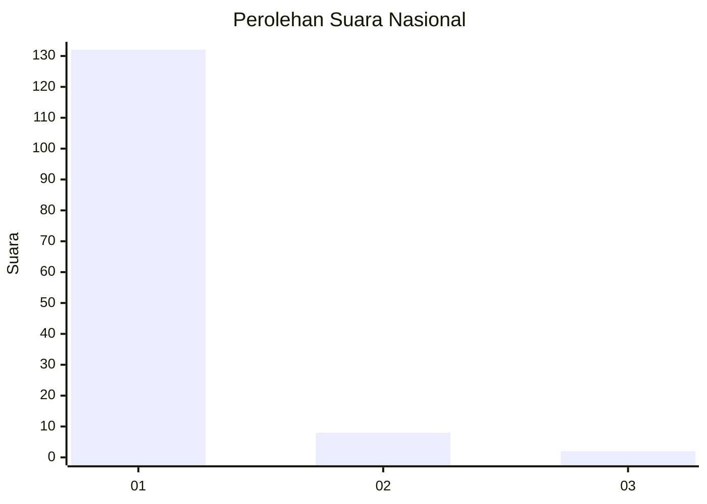
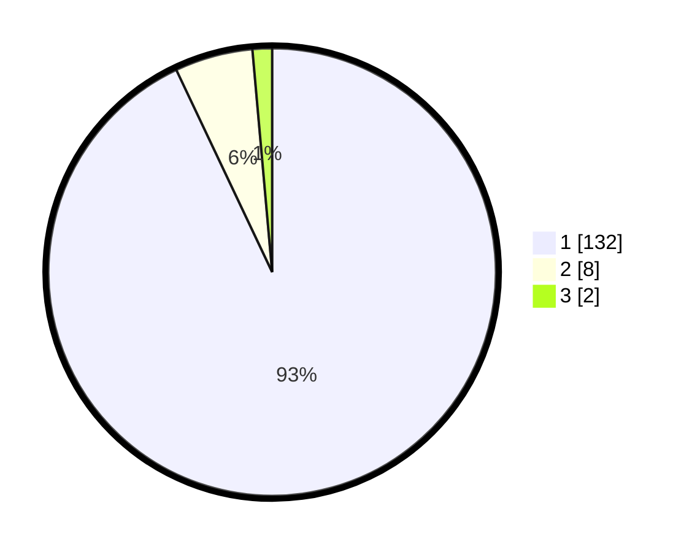

# Hasil

## Grafik

## Tabel

| No. | Nama Paslon    | Suara | Suara (raw) | Persentase |
|:--- |:-------------- | -----:| -----------:| ----------:|
| 1   | ANIES MUHAIMIN | 132   | [132][p-1]  | 92,96      |
| 2   | PRABOWO GIBRAN | 8     | [8][p-2]    | 5,63       |
| 3   | GANJAR MAHFUD  | 2     | [2][p-3]    | 1,41       |

[p-1]: https://github.com/gigit-pemilu/pemilu-2024/blob/main/pilpres/hitung-suara/sub/11-aceh/sub/07-pidie/sub/24-mutiara-timur/sub/2027-beureueh-ii/sub/002-tps/sub/paslon-1.txt
[p-2]: https://github.com/gigit-pemilu/pemilu-2024/blob/main/pilpres/hitung-suara/sub/11-aceh/sub/07-pidie/sub/24-mutiara-timur/sub/2027-beureueh-ii/sub/002-tps/sub/paslon-2.txt
[p-3]: https://github.com/gigit-pemilu/pemilu-2024/blob/main/pilpres/hitung-suara/sub/11-aceh/sub/07-pidie/sub/24-mutiara-timur/sub/2027-beureueh-ii/sub/002-tps/sub/paslon-3.txt

## Foto C Plano

https://sirekap-obj-formc.kpu.go.id/9b92/pemilu/ppwp/11/07/24/20/27/1107242027002-20240215-082940--0f91094e-85a7-40da-b19f-ef31d555da2f.jpg

https://sirekap-obj-formc.kpu.go.id/9b92/pemilu/ppwp/11/07/24/20/27/1107242027002-20240215-082739--7324d0a7-52c1-4f01-b270-71dd4088d378.jpg

https://sirekap-obj-formc.kpu.go.id/9b92/pemilu/ppwp/11/07/24/20/27/1107242027002-20240215-083559--9453214b-1b43-4107-bb2c-9ec4131c6e86.jpg

## Metadata

| Key        | Value               |
| ---------- | ------------------- |
| Time Stamp | 2024-02-19 06:16:00 |

