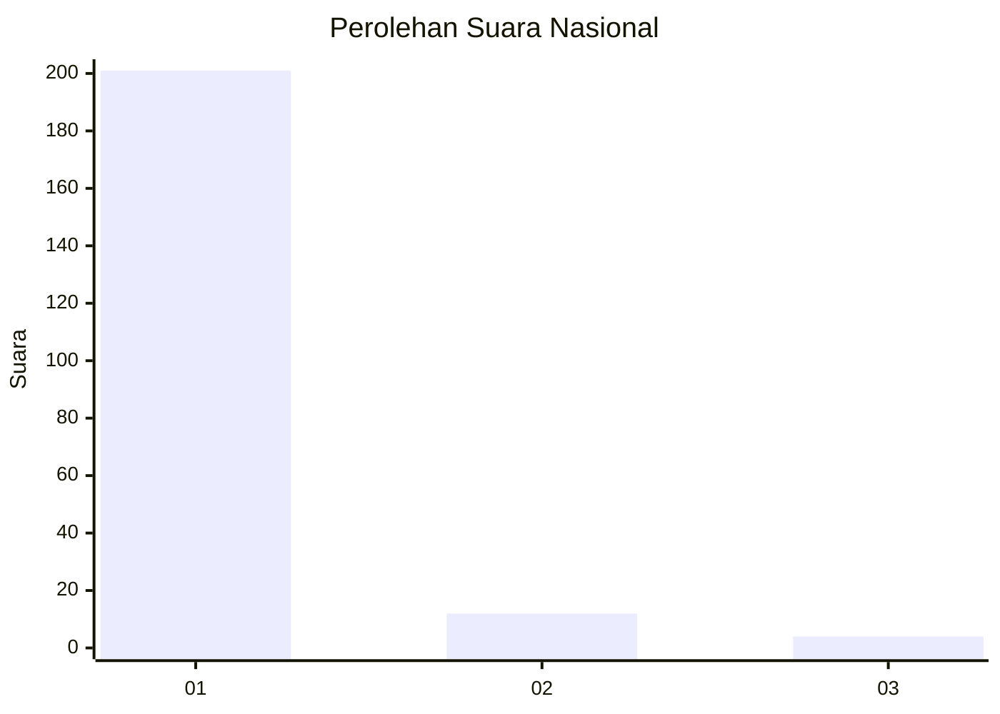
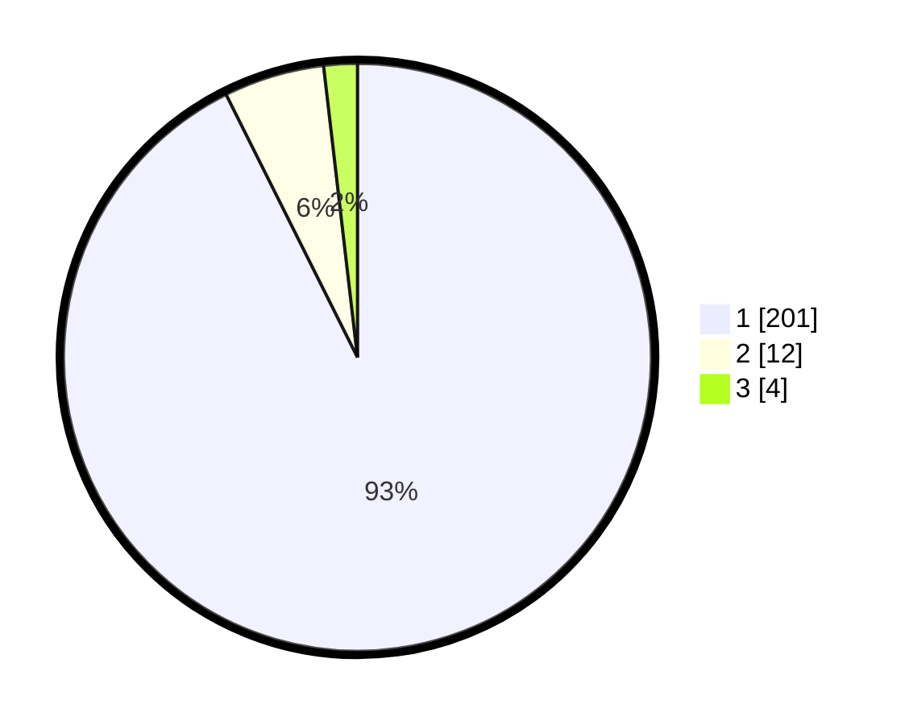

# Hasil

## Grafik

## Tabel

| No. | Nama Paslon    | Suara | Suara (raw) | Persentase |
|:--- |:-------------- | -----:| -----------:| ----------:|
| 1   | ANIES MUHAIMIN | 201   | [201][p-1]  | 92,63      |
| 2   | PRABOWO GIBRAN | 12    | [12][p-2]   | 5,53       |
| 3   | GANJAR MAHFUD  | 4     | [4][p-3]    | 1,84       |

[p-1]: https://github.com/gigit-pemilu/pemilu-2024/blob/main/pilpres/hitung-suara/sub/11-aceh/sub/07-pidie/sub/24-mutiara-timur/sub/2029-paloh-tinggi/sub/001-tps/sub/paslon-1.txt
[p-2]: https://github.com/gigit-pemilu/pemilu-2024/blob/main/pilpres/hitung-suara/sub/11-aceh/sub/07-pidie/sub/24-mutiara-timur/sub/2029-paloh-tinggi/sub/001-tps/sub/paslon-2.txt
[p-3]: https://github.com/gigit-pemilu/pemilu-2024/blob/main/pilpres/hitung-suara/sub/11-aceh/sub/07-pidie/sub/24-mutiara-timur/sub/2029-paloh-tinggi/sub/001-tps/sub/paslon-3.txt

## Foto C Plano

https://sirekap-obj-formc.kpu.go.id/43b8/pemilu/ppwp/11/07/24/20/29/1107242029001-20240215-023343--fa1501a4-dcab-4e5b-bb9d-de1144eb2fee.jpg

https://sirekap-obj-formc.kpu.go.id/43b8/pemilu/ppwp/11/07/24/20/29/1107242029001-20240215-023611--d9a12640-d8a5-4348-a5ea-b127e2ba1eac.jpg

https://sirekap-obj-formc.kpu.go.id/43b8/pemilu/ppwp/11/07/24/20/29/1107242029001-20240215-023723--34a69813-b252-4d6b-a039-fcf66274f815.jpg

## Metadata

| Key        | Value               |
| ---------- | ------------------- |
| Time Stamp | 2024-02-19 06:16:00 |

