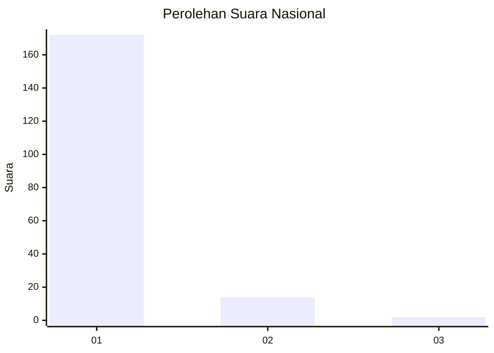
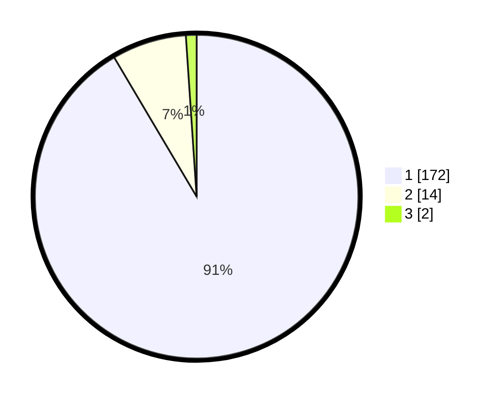

# Hasil

## Grafik

## Tabel

| No. | Nama Paslon    | Suara | Suara (raw) | Persentase |
|:--- |:-------------- | -----:| -----------:| ----------:|
| 1   | ANIES MUHAIMIN | 172   | [172][p-1]  | 91,49      |
| 2   | PRABOWO GIBRAN | 14    | [14][p-2]   | 7,45       |
| 3   | GANJAR MAHFUD  | 2     | [2][p-3]    | 1,06       |

[p-1]: https://github.com/gigit-pemilu/pemilu-2024/blob/main/pilpres/hitung-suara/sub/11-aceh/sub/07-pidie/sub/24-mutiara-timur/sub/2029-paloh-tinggi/sub/003-tps/sub/paslon-1.txt
[p-2]: https://github.com/gigit-pemilu/pemilu-2024/blob/main/pilpres/hitung-suara/sub/11-aceh/sub/07-pidie/sub/24-mutiara-timur/sub/2029-paloh-tinggi/sub/003-tps/sub/paslon-2.txt
[p-3]: https://github.com/gigit-pemilu/pemilu-2024/blob/main/pilpres/hitung-suara/sub/11-aceh/sub/07-pidie/sub/24-mutiara-timur/sub/2029-paloh-tinggi/sub/003-tps/sub/paslon-3.txt

## Foto C Plano

https://sirekap-obj-formc.kpu.go.id/6295/pemilu/ppwp/11/07/24/20/29/1107242029003-20240215-013927--9570dff6-858d-483b-9358-ffea11b94640.jpg

https://sirekap-obj-formc.kpu.go.id/6295/pemilu/ppwp/11/07/24/20/29/1107242029003-20240215-014119--c1eec31b-ecd6-4f20-bd40-2074258a5bb8.jpg

https://sirekap-obj-formc.kpu.go.id/6295/pemilu/ppwp/11/07/24/20/29/1107242029003-20240215-014253--6b70966b-2342-4e36-9229-f0e314f2e92b.jpg

## Metadata

| Key        | Value               |
| ---------- | ------------------- |
| Time Stamp | 2024-02-27 12:00:00 |

