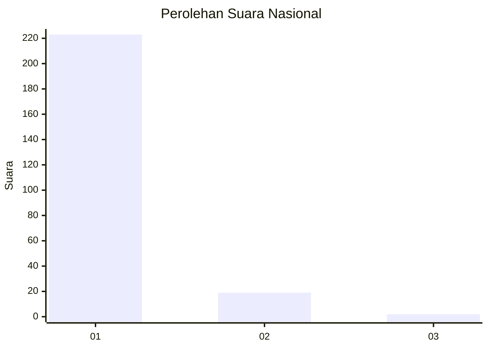
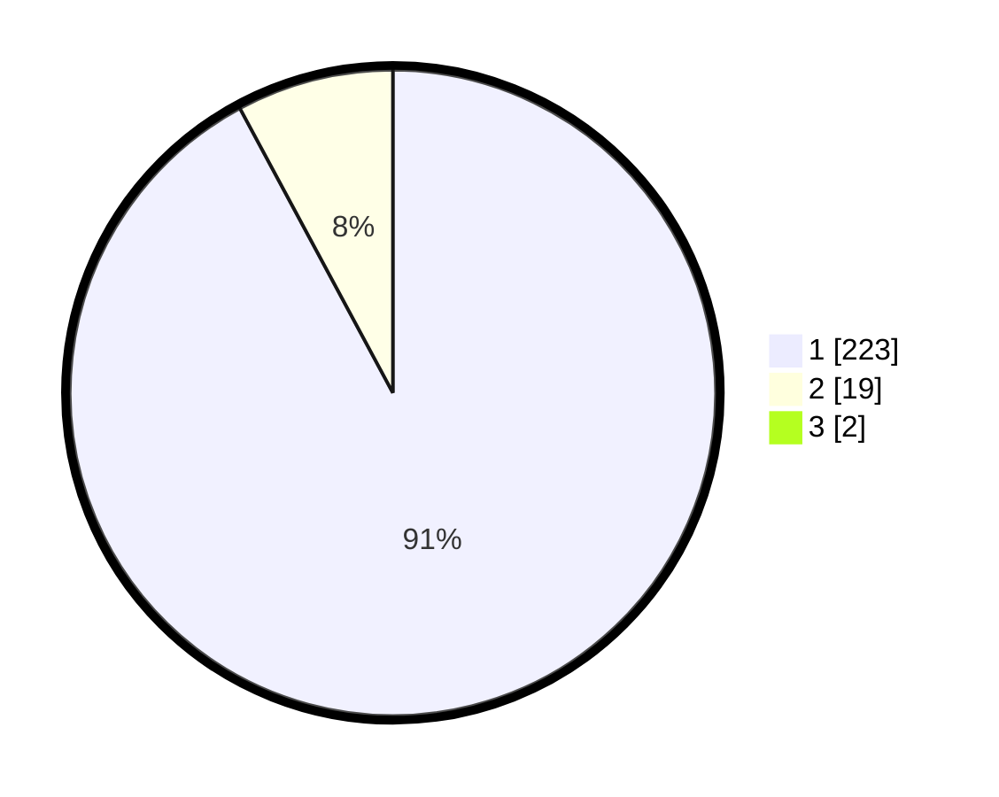

# Hasil

## Grafik

## Tabel

| No. | Nama Paslon    | Suara | Suara (raw) | Persentase |
|:--- |:-------------- | -----:| -----------:| ----------:|
| 1   | ANIES MUHAIMIN | 223   | [223][p-1]  | 91,39      |
| 2   | PRABOWO GIBRAN | 19    | [19][p-2]   | 7,79       |
| 3   | GANJAR MAHFUD  | 2     | [2][p-3]    | 0,82       |

[p-1]: https://github.com/gigit-pemilu/pemilu-2024/blob/main/pilpres/hitung-suara/sub/11-aceh/sub/07-pidie/sub/24-mutiara-timur/sub/2030-karieng/sub/001-tps/sub/paslon-1.txt
[p-2]: https://github.com/gigit-pemilu/pemilu-2024/blob/main/pilpres/hitung-suara/sub/11-aceh/sub/07-pidie/sub/24-mutiara-timur/sub/2030-karieng/sub/001-tps/sub/paslon-2.txt
[p-3]: https://github.com/gigit-pemilu/pemilu-2024/blob/main/pilpres/hitung-suara/sub/11-aceh/sub/07-pidie/sub/24-mutiara-timur/sub/2030-karieng/sub/001-tps/sub/paslon-3.txt

## Foto C Plano

https://sirekap-obj-formc.kpu.go.id/1a9b/pemilu/ppwp/11/07/24/20/30/1107242030001-20240215-180922--d5642ea3-11e6-4f7f-94ad-5103a6cce118.jpg

https://sirekap-obj-formc.kpu.go.id/1a9b/pemilu/ppwp/11/07/24/20/30/1107242030001-20240215-181122--58508a99-7336-4657-88ff-ed5e32015d67.jpg

https://sirekap-obj-formc.kpu.go.id/1a9b/pemilu/ppwp/11/07/24/20/30/1107242030001-20240215-065224--df8e3b39-c99b-4789-92a8-26bebe919a6d.jpg

## Metadata

| Key        | Value               |
| ---------- | ------------------- |
| Time Stamp | 2024-02-19 06:16:00 |

