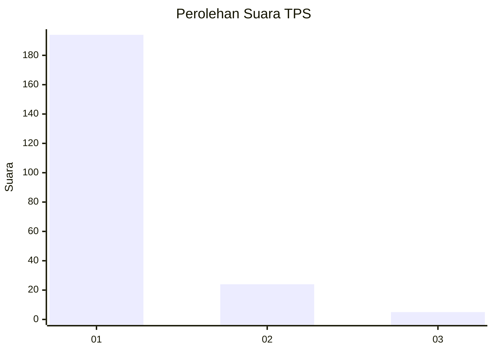
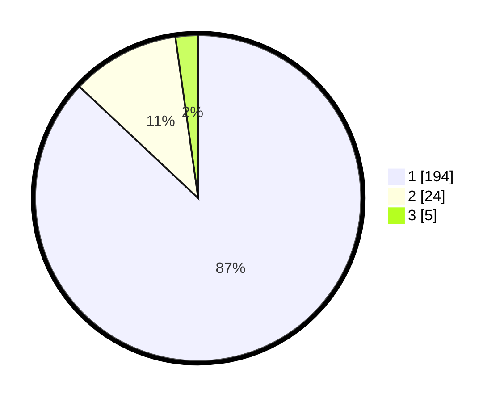

# Hasil

## Grafik

## Tabel

| No. | Nama Paslon    | Suara | Suara (raw) | Persentase |
|:--- |:-------------- | -----:| -----------:| ----------:|
| 1   | ANIES MUHAIMIN | 194   | [194][p-1]  | 87,00      |
| 2   | PRABOWO GIBRAN | 24    | [24][p-2]   | 10,76      |
| 3   | GANJAR MAHFUD  | 5     | [5][p-3]    | 2,24       |

[p-1]: https://github.com/gigit-pemilu/pemilu-2024-11-aceh/blob/main/pilpres/hitung-suara/sub/11-aceh/sub/07-pidie/sub/24-mutiara-timur/sub/2031-sagoe-teumpeun/sub/001-tps/sub/paslon-1.txt
[p-2]: https://github.com/gigit-pemilu/pemilu-2024-11-aceh/blob/main/pilpres/hitung-suara/sub/11-aceh/sub/07-pidie/sub/24-mutiara-timur/sub/2031-sagoe-teumpeun/sub/001-tps/sub/paslon-2.txt
[p-3]: https://github.com/gigit-pemilu/pemilu-2024-11-aceh/blob/main/pilpres/hitung-suara/sub/11-aceh/sub/07-pidie/sub/24-mutiara-timur/sub/2031-sagoe-teumpeun/sub/001-tps/sub/paslon-3.txt

## Foto C Plano

https://sirekap-obj-formc.kpu.go.id/9a1c/pemilu/ppwp/11/07/24/20/31/1107242031001-20240215-085057--df50d37a-85e3-4a0c-b40e-5acbd2657344.jpg

https://sirekap-obj-formc.kpu.go.id/9a1c/pemilu/ppwp/11/07/24/20/31/1107242031001-20240214-235833--031fdce0-0348-4d7c-9cb7-6fa32663fd62.jpg

https://sirekap-obj-formc.kpu.go.id/9a1c/pemilu/ppwp/11/07/24/20/31/1107242031001-20240215-000005--9eaa5b23-b604-48f0-be44-dfe8ff8f1783.jpg

## Metadata

| Key        | Value               |
| ---------- | ------------------- |
| Time Stamp | 2024-02-19 06:16:00 |

