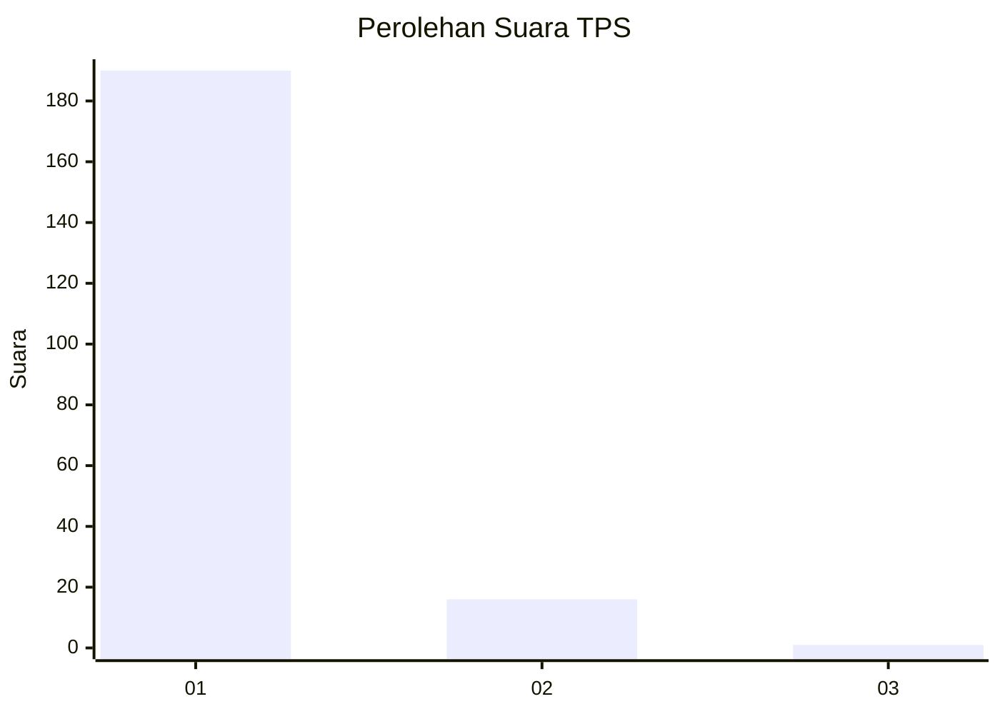
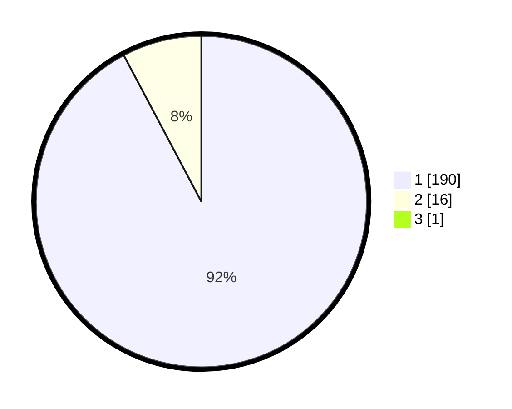

# Hasil

## Grafik

## Tabel

| No. | Nama Paslon    | Suara | Suara (raw) | Persentase |
|:--- |:-------------- | -----:| -----------:| ----------:|
| 1   | ANIES MUHAIMIN | 190   | [190][p-1]  | 91,79      |
| 2   | PRABOWO GIBRAN | 16    | [16][p-2]   | 7,73       |
| 3   | GANJAR MAHFUD  | 1     | [1][p-3]    | 0,48       |

[p-1]: https://github.com/gigit-pemilu/pemilu-2024-11-aceh/blob/main/pilpres/hitung-suara/sub/11-aceh/sub/07-pidie/sub/24-mutiara-timur/sub/2033-tong-weng/sub/001-tps/sub/paslon-1.txt
[p-2]: https://github.com/gigit-pemilu/pemilu-2024-11-aceh/blob/main/pilpres/hitung-suara/sub/11-aceh/sub/07-pidie/sub/24-mutiara-timur/sub/2033-tong-weng/sub/001-tps/sub/paslon-2.txt
[p-3]: https://github.com/gigit-pemilu/pemilu-2024-11-aceh/blob/main/pilpres/hitung-suara/sub/11-aceh/sub/07-pidie/sub/24-mutiara-timur/sub/2033-tong-weng/sub/001-tps/sub/paslon-3.txt

## Foto C Plano

https://sirekap-obj-formc.kpu.go.id/ba91/pemilu/ppwp/11/07/24/20/33/1107242033001-20240219-104801--0b4817c9-1965-4605-9ef8-5dc8d94aaa08.jpg

https://sirekap-obj-formc.kpu.go.id/ba91/pemilu/ppwp/11/07/24/20/33/1107242033001-20240219-105415--898967f1-ee39-4122-b45d-970610ac6cca.jpg

https://sirekap-obj-formc.kpu.go.id/ba91/pemilu/ppwp/11/07/24/20/33/1107242033001-20240219-105142--f842fbb6-e2bb-4aff-96ed-feaa64ad9ecf.jpg

## Metadata

| Key        | Value               |
| ---------- | ------------------- |
| Time Stamp | 2024-02-24 22:31:28 |

