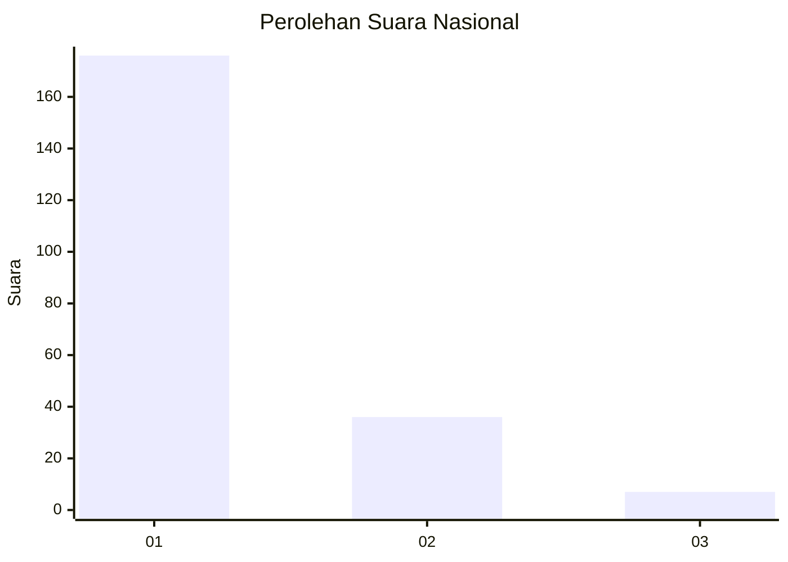
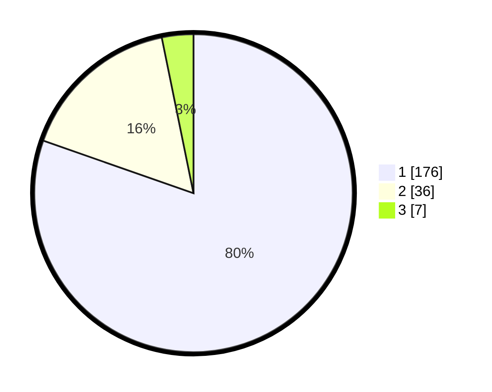

# Hasil

## Grafik

## Tabel

| No. | Nama Paslon    | Suara | Suara (raw) | Persentase |
|:--- |:-------------- | -----:| -----------:| ----------:|
| 1   | ANIES MUHAIMIN | 176   | [176][p-1]  | 80,37      |
| 2   | PRABOWO GIBRAN | 36    | [36][p-2]   | 16,44      |
| 3   | GANJAR MAHFUD  | 7     | [7][p-3]    | 3,20       |

[p-1]: https://github.com/gigit-pemilu/pemilu-2024/blob/main/pilpres/hitung-suara/sub/11-aceh/sub/07-pidie/sub/24-mutiara-timur/sub/2033-tong-weng/sub/002-tps/sub/paslon-1.txt
[p-2]: https://github.com/gigit-pemilu/pemilu-2024/blob/main/pilpres/hitung-suara/sub/11-aceh/sub/07-pidie/sub/24-mutiara-timur/sub/2033-tong-weng/sub/002-tps/sub/paslon-2.txt
[p-3]: https://github.com/gigit-pemilu/pemilu-2024/blob/main/pilpres/hitung-suara/sub/11-aceh/sub/07-pidie/sub/24-mutiara-timur/sub/2033-tong-weng/sub/002-tps/sub/paslon-3.txt

## Foto C Plano

https://sirekap-obj-formc.kpu.go.id/665e/pemilu/ppwp/11/07/24/20/33/1107242033002-20240215-023454--8b2a4d98-9ded-4996-b6c7-f06fa39200f3.jpg

https://sirekap-obj-formc.kpu.go.id/665e/pemilu/ppwp/11/07/24/20/33/1107242033002-20240215-023613--2d9ee6a2-34f3-49fc-946f-d740e6c5d751.jpg

## Metadata

| Key        | Value               |
| ---------- | ------------------- |
| Time Stamp | 2024-02-17 18:30:00 |

