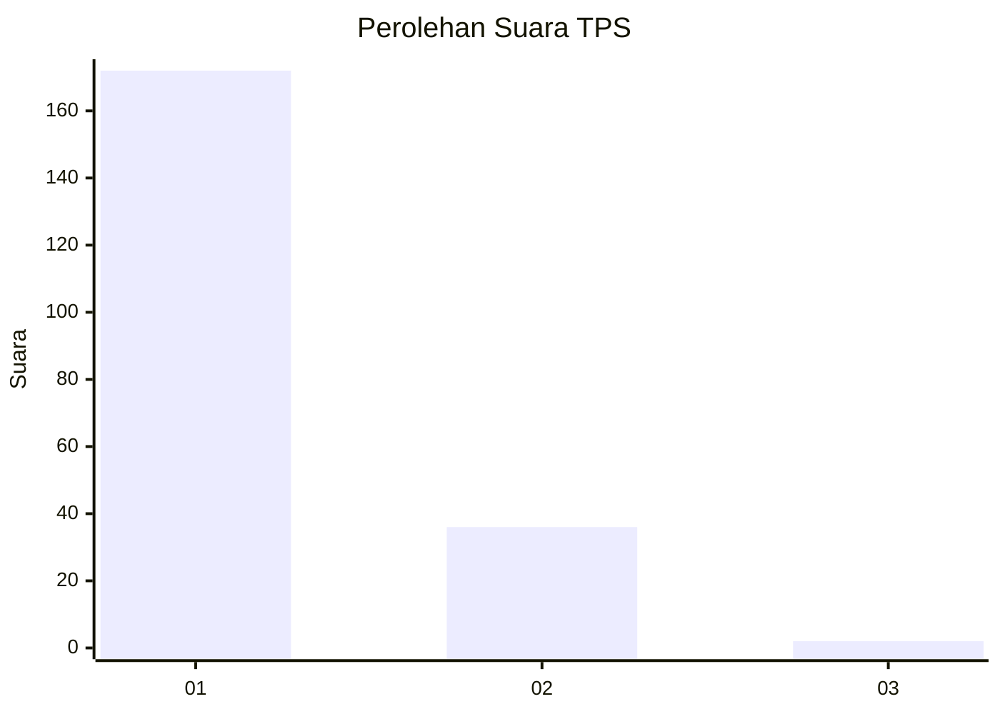
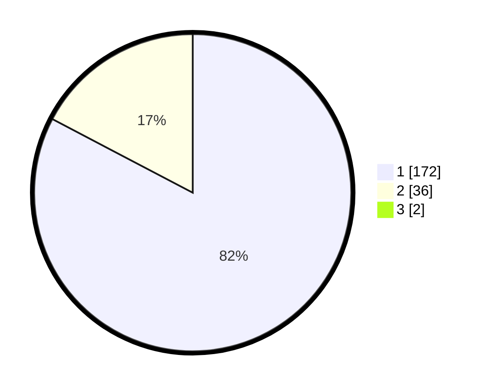

# Hasil

## Grafik

## Tabel

| No. | Nama Paslon    | Suara | Suara (raw) | Persentase |
|:--- |:-------------- | -----:| -----------:| ----------:|
| 1   | ANIES MUHAIMIN | 172   | [172][p-1]  | 81,90      |
| 2   | PRABOWO GIBRAN | 36    | [36][p-2]   | 17,14      |
| 3   | GANJAR MAHFUD  | 2     | [2][p-3]    | 0,95       |

[p-1]: https://github.com/gigit-pemilu/pemilu-2024-11-aceh/blob/main/pilpres/hitung-suara/sub/11-aceh/sub/07-pidie/sub/24-mutiara-timur/sub/2035-mesjid-gumpueng/sub/001-tps/sub/paslon-1.txt
[p-2]: https://github.com/gigit-pemilu/pemilu-2024-11-aceh/blob/main/pilpres/hitung-suara/sub/11-aceh/sub/07-pidie/sub/24-mutiara-timur/sub/2035-mesjid-gumpueng/sub/001-tps/sub/paslon-2.txt
[p-3]: https://github.com/gigit-pemilu/pemilu-2024-11-aceh/blob/main/pilpres/hitung-suara/sub/11-aceh/sub/07-pidie/sub/24-mutiara-timur/sub/2035-mesjid-gumpueng/sub/001-tps/sub/paslon-3.txt

## Foto C Plano

https://sirekap-obj-formc.kpu.go.id/ddbb/pemilu/ppwp/11/07/24/20/35/1107242035001-20240215-093641--7fae5a11-2072-4204-9bc1-8da378f21495.jpg

https://sirekap-obj-formc.kpu.go.id/ddbb/pemilu/ppwp/11/07/24/20/35/1107242035001-20240215-093745--c3726671-8e65-4594-9636-3ad6ef9913ad.jpg

https://sirekap-obj-formc.kpu.go.id/ddbb/pemilu/ppwp/11/07/24/20/35/1107242035001-20240215-093831--f4be3d5f-6167-43a5-9de5-d22751c7ac05.jpg

## Metadata

| Key        | Value               |
| ---------- | ------------------- |
| Time Stamp | 2024-02-19 06:16:00 |

