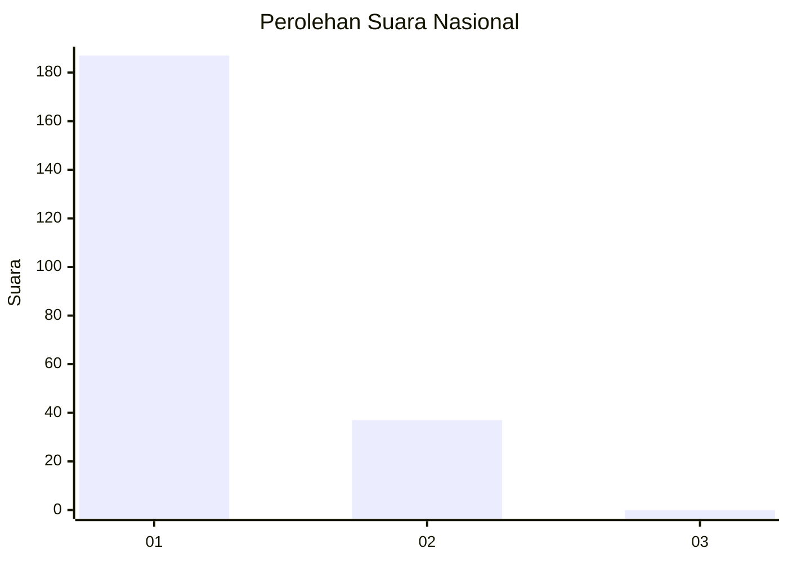
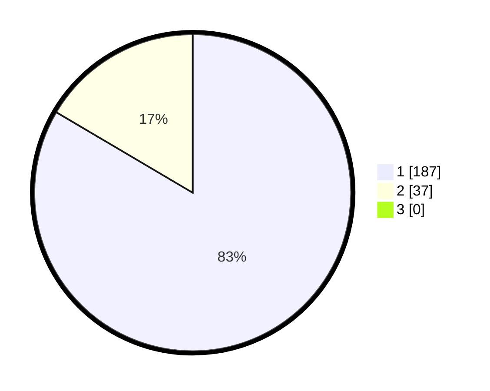

# Hasil

## Grafik

## Tabel

| No. | Nama Paslon    | Suara | Suara (raw) | Persentase |
|:--- |:-------------- | -----:| -----------:| ----------:|
| 1   | ANIES MUHAIMIN | 187   | [187][p-1]  | 83,48      |
| 2   | PRABOWO GIBRAN | 37    | [37][p-2]   | 16,52      |
| 3   | GANJAR MAHFUD  | 0     | [0][p-3]    | 0,00       |

[p-1]: https://github.com/gigit-pemilu/pemilu-2024/blob/main/pilpres/hitung-suara/sub/11-aceh/sub/07-pidie/sub/24-mutiara-timur/sub/2035-mesjid-gumpueng/sub/002-tps/sub/paslon-1.txt
[p-2]: https://github.com/gigit-pemilu/pemilu-2024/blob/main/pilpres/hitung-suara/sub/11-aceh/sub/07-pidie/sub/24-mutiara-timur/sub/2035-mesjid-gumpueng/sub/002-tps/sub/paslon-2.txt
[p-3]: https://github.com/gigit-pemilu/pemilu-2024/blob/main/pilpres/hitung-suara/sub/11-aceh/sub/07-pidie/sub/24-mutiara-timur/sub/2035-mesjid-gumpueng/sub/002-tps/sub/paslon-3.txt

## Foto C Plano

https://sirekap-obj-formc.kpu.go.id/bdd2/pemilu/ppwp/11/07/24/20/35/1107242035002-20240215-090409--f59bcb3a-371f-4f4a-823a-7a125da93c6d.jpg

https://sirekap-obj-formc.kpu.go.id/bdd2/pemilu/ppwp/11/07/24/20/35/1107242035002-20240215-090830--b22857d2-6386-4084-8e1d-e38e288c90e1.jpg

https://sirekap-obj-formc.kpu.go.id/bdd2/pemilu/ppwp/11/07/24/20/35/1107242035002-20240215-090939--06660e0d-5d97-459b-b05a-c75a1ca9c101.jpg

## Metadata

| Key        | Value               |
| ---------- | ------------------- |
| Time Stamp | 2024-02-24 22:31:28 |

