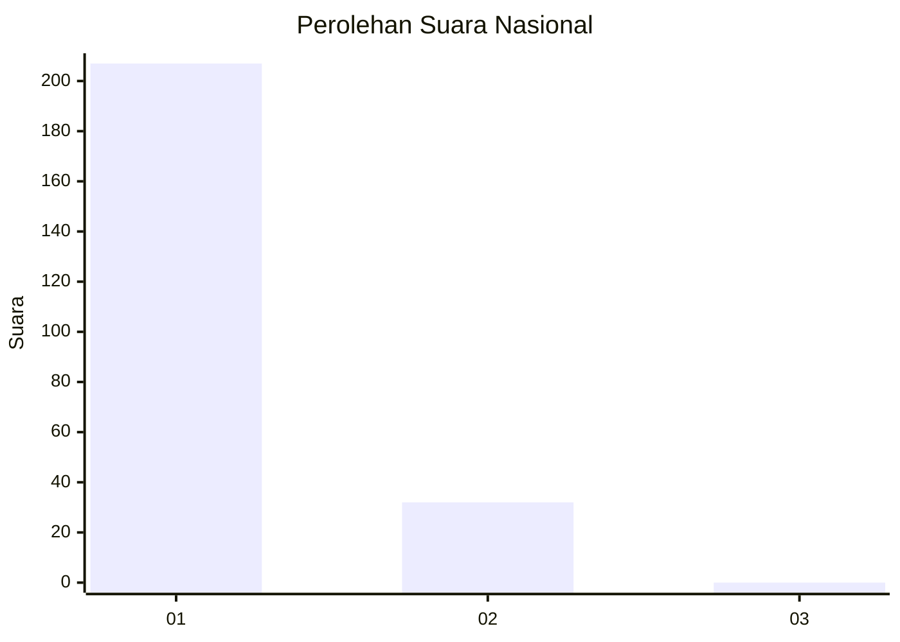
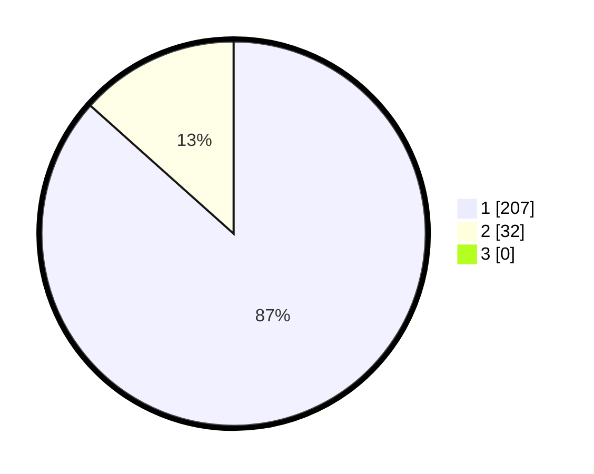

# Hasil

## Grafik

## Tabel

| No. | Nama Paslon    | Suara | Suara (raw) | Persentase |
|:--- |:-------------- | -----:| -----------:| ----------:|
| 1   | ANIES MUHAIMIN | 207   | [207][p-1]  | 86,61      |
| 2   | PRABOWO GIBRAN | 32    | [32][p-2]   | 13,39      |
| 3   | GANJAR MAHFUD  | 0     | [0][p-3]    | 0,00       |

[p-1]: https://github.com/gigit-pemilu/pemilu-2024/blob/main/pilpres/hitung-suara/sub/11-aceh/sub/07-pidie/sub/24-mutiara-timur/sub/2036-ulee-gampong/sub/001-tps/sub/paslon-1.txt
[p-2]: https://github.com/gigit-pemilu/pemilu-2024/blob/main/pilpres/hitung-suara/sub/11-aceh/sub/07-pidie/sub/24-mutiara-timur/sub/2036-ulee-gampong/sub/001-tps/sub/paslon-2.txt
[p-3]: https://github.com/gigit-pemilu/pemilu-2024/blob/main/pilpres/hitung-suara/sub/11-aceh/sub/07-pidie/sub/24-mutiara-timur/sub/2036-ulee-gampong/sub/001-tps/sub/paslon-3.txt

## Foto C Plano

https://sirekap-obj-formc.kpu.go.id/c30b/pemilu/ppwp/11/07/24/20/36/1107242036001-20240214-232318--51cd9f8c-9ceb-4139-bfb7-7cb1c3687fda.jpg

https://sirekap-obj-formc.kpu.go.id/c30b/pemilu/ppwp/11/07/24/20/36/1107242036001-20240214-213743--61489aac-2156-4d24-87c7-28ef9f067fed.jpg

https://sirekap-obj-formc.kpu.go.id/c30b/pemilu/ppwp/11/07/24/20/36/1107242036001-20240214-223434--36fb0bd6-3724-4fce-b6e8-8e2d8e3aa8c2.jpg

## Metadata

| Key        | Value               |
| ---------- | ------------------- |
| Time Stamp | 2024-02-24 22:31:28 |

