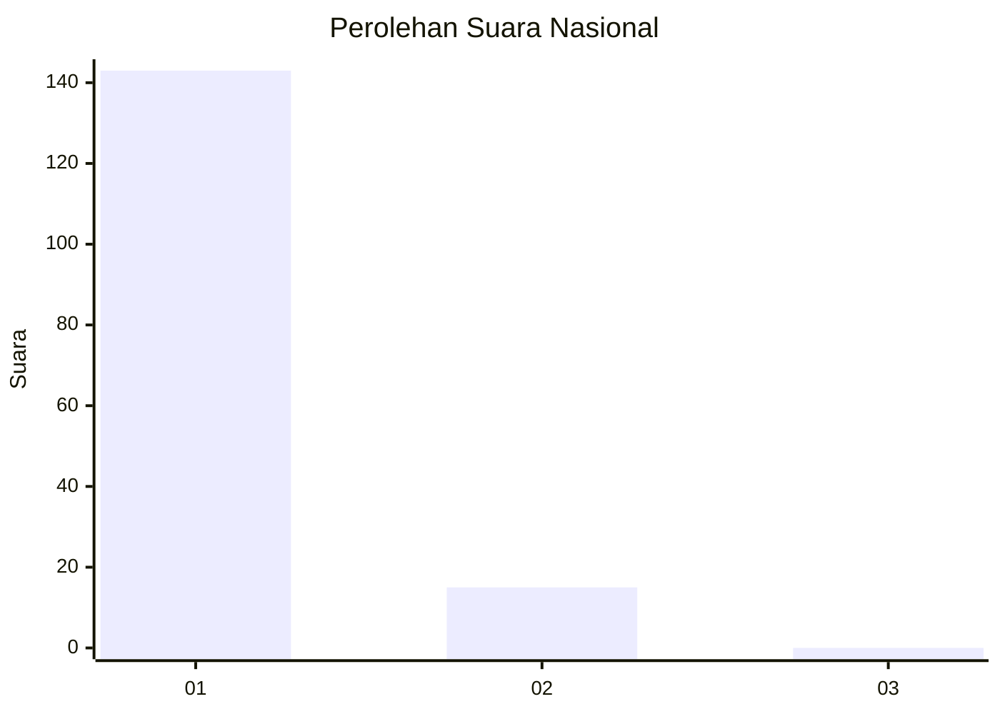
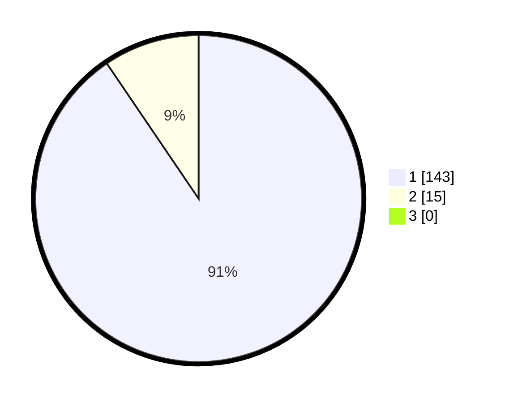

# Hasil

## Grafik

## Tabel

| No. | Nama Paslon    | Suara | Suara (raw) | Persentase |
|:--- |:-------------- | -----:| -----------:| ----------:|
| 1   | ANIES MUHAIMIN | 143   | [143][p-1]  | 90,51      |
| 2   | PRABOWO GIBRAN | 15    | [15][p-2]   | 9,49       |
| 3   | GANJAR MAHFUD  | 0     | [0][p-3]    | 0,00       |

[p-1]: https://github.com/gigit-pemilu/pemilu-2024/blob/main/pilpres/hitung-suara/sub/11-aceh/sub/07-pidie/sub/24-mutiara-timur/sub/2037-barieh/sub/002-tps/sub/paslon-1.txt
[p-2]: https://github.com/gigit-pemilu/pemilu-2024/blob/main/pilpres/hitung-suara/sub/11-aceh/sub/07-pidie/sub/24-mutiara-timur/sub/2037-barieh/sub/002-tps/sub/paslon-2.txt
[p-3]: https://github.com/gigit-pemilu/pemilu-2024/blob/main/pilpres/hitung-suara/sub/11-aceh/sub/07-pidie/sub/24-mutiara-timur/sub/2037-barieh/sub/002-tps/sub/paslon-3.txt

## Foto C Plano

https://sirekap-obj-formc.kpu.go.id/e273/pemilu/ppwp/11/07/24/20/37/1107242037002-20240214-232105--971626a5-d286-4968-9329-7f0f748577b3.jpg

https://sirekap-obj-formc.kpu.go.id/e273/pemilu/ppwp/11/07/24/20/37/1107242037002-20240214-232804--553808b1-a163-4402-b2fa-1355a49db205.jpg

https://sirekap-obj-formc.kpu.go.id/e273/pemilu/ppwp/11/07/24/20/37/1107242037002-20240214-233455--e5a85fc7-f428-4018-b877-57f0bf8844ee.jpg

## Metadata

| Key        | Value               |
| ---------- | ------------------- |
| Time Stamp | 2024-02-24 22:31:28 |

