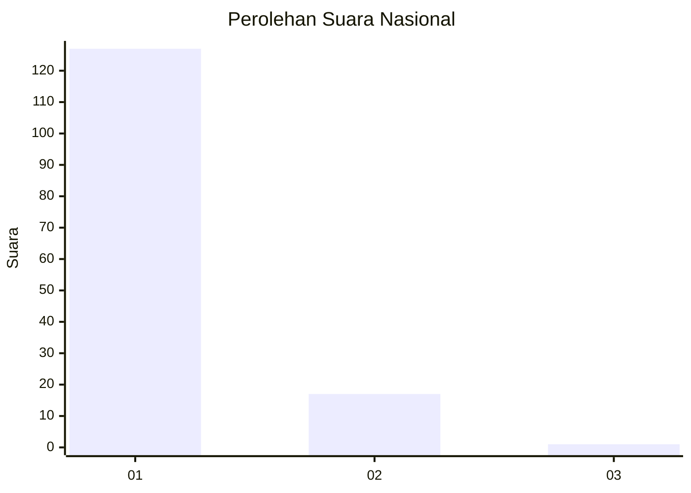
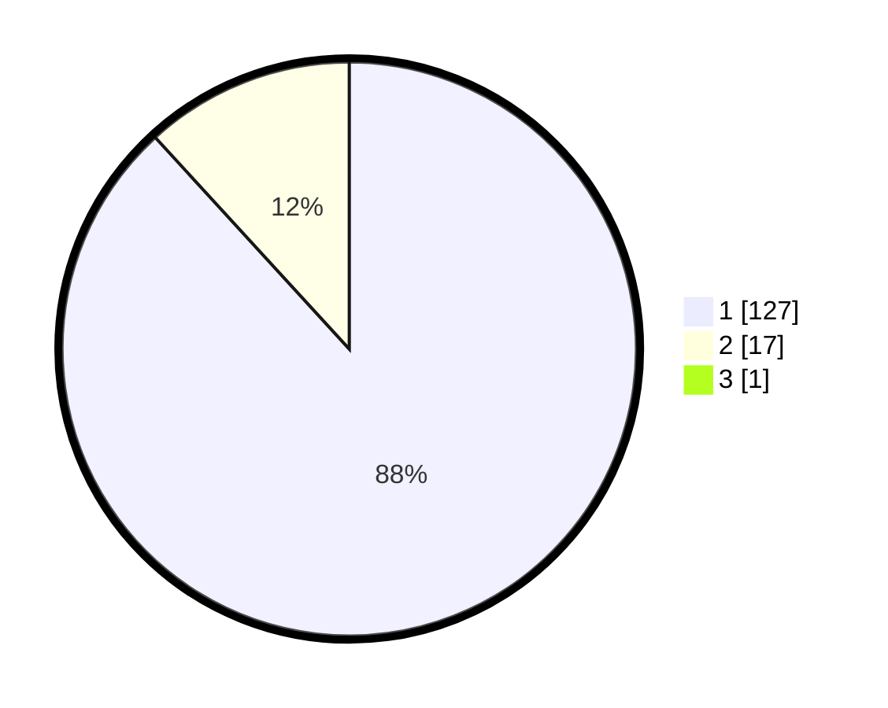

# Hasil

## Grafik

## Tabel

| No. | Nama Paslon    | Suara | Suara (raw) | Persentase |
|:--- |:-------------- | -----:| -----------:| ----------:|
| 1   | ANIES MUHAIMIN | 127   | [127][p-1]  | 87,59      |
| 2   | PRABOWO GIBRAN | 17    | [17][p-2]   | 11,72      |
| 3   | GANJAR MAHFUD  | 1     | [1][p-3]    | 0,69       |

[p-1]: https://github.com/gigit-pemilu/pemilu-2024/blob/main/pilpres/hitung-suara/sub/11-aceh/sub/07-pidie/sub/24-mutiara-timur/sub/2038-jumphoih-adan/sub/002-tps/sub/paslon-1.txt
[p-2]: https://github.com/gigit-pemilu/pemilu-2024/blob/main/pilpres/hitung-suara/sub/11-aceh/sub/07-pidie/sub/24-mutiara-timur/sub/2038-jumphoih-adan/sub/002-tps/sub/paslon-2.txt
[p-3]: https://github.com/gigit-pemilu/pemilu-2024/blob/main/pilpres/hitung-suara/sub/11-aceh/sub/07-pidie/sub/24-mutiara-timur/sub/2038-jumphoih-adan/sub/002-tps/sub/paslon-3.txt

## Foto C Plano

https://sirekap-obj-formc.kpu.go.id/d6b0/pemilu/ppwp/11/07/24/20/38/1107242038002-20240215-075324--0db1b2ed-b19b-47ee-9eed-bf0344419a92.jpg

https://sirekap-obj-formc.kpu.go.id/d6b0/pemilu/ppwp/11/07/24/20/38/1107242038002-20240214-233356--08fdca36-14fb-4bc3-bae1-e6c9d8729b87.jpg

https://sirekap-obj-formc.kpu.go.id/d6b0/pemilu/ppwp/11/07/24/20/38/1107242038002-20240215-000500--f73b3110-faaf-48e2-b6f4-0948bcd9a9ae.jpg

## Metadata

| Key        | Value               |
| ---------- | ------------------- |
| Time Stamp | 2024-02-24 22:31:28 |

