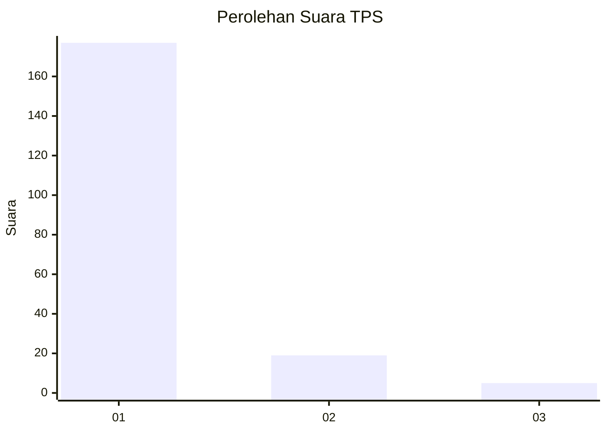
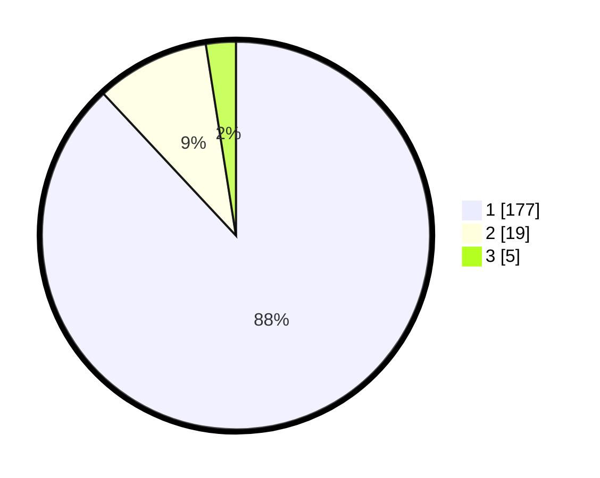

# Hasil

## Grafik

## Tabel

| No. | Nama Paslon    | Suara | Suara (raw) | Persentase |
|:--- |:-------------- | -----:| -----------:| ----------:|
| 1   | ANIES MUHAIMIN | 177   | [177][p-1]  | 88,06      |
| 2   | PRABOWO GIBRAN | 19    | [19][p-2]   | 9,45       |
| 3   | GANJAR MAHFUD  | 5     | [5][p-3]    | 2,49       |

[p-1]: https://github.com/gigit-pemilu/pemilu-2024-11-aceh/blob/main/pilpres/hitung-suara/sub/11-aceh/sub/07-pidie/sub/24-mutiara-timur/sub/2045-tiba-raya/sub/004-tps/sub/paslon-1.txt
[p-2]: https://github.com/gigit-pemilu/pemilu-2024-11-aceh/blob/main/pilpres/hitung-suara/sub/11-aceh/sub/07-pidie/sub/24-mutiara-timur/sub/2045-tiba-raya/sub/004-tps/sub/paslon-2.txt
[p-3]: https://github.com/gigit-pemilu/pemilu-2024-11-aceh/blob/main/pilpres/hitung-suara/sub/11-aceh/sub/07-pidie/sub/24-mutiara-timur/sub/2045-tiba-raya/sub/004-tps/sub/paslon-3.txt

## Foto C Plano

https://sirekap-obj-formc.kpu.go.id/b79f/pemilu/ppwp/11/07/24/20/45/1107242045004-20240215-011545--60d03ffb-5a7f-4a1b-ba6a-502a4d4c63cc.jpg

https://sirekap-obj-formc.kpu.go.id/b79f/pemilu/ppwp/11/07/24/20/45/1107242045004-20240215-011753--c9359b11-6524-44e4-aea4-c31ce31c3ab9.jpg

https://sirekap-obj-formc.kpu.go.id/b79f/pemilu/ppwp/11/07/24/20/45/1107242045004-20240215-011909--65021168-372d-4336-bf5a-85a23c05e611.jpg

## Metadata

| Key        | Value               |
| ---------- | ------------------- |
| Time Stamp | 2024-02-25 11:00:00 |

