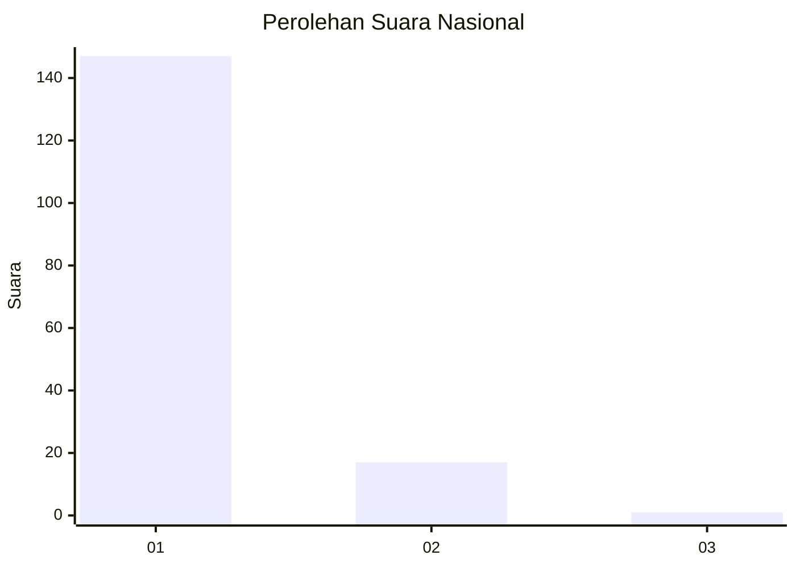
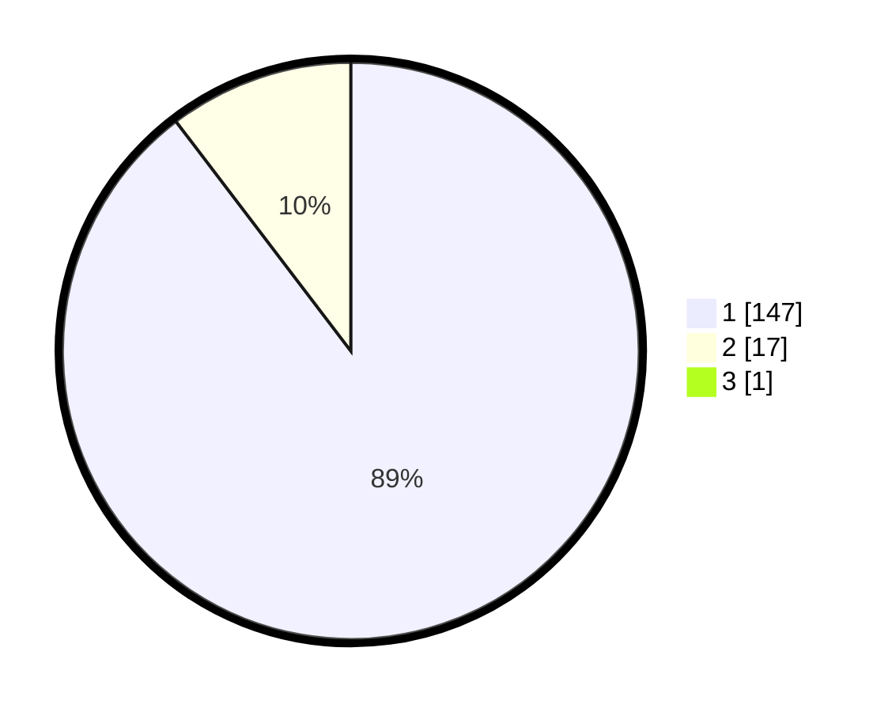

# Hasil

## Grafik

## Tabel

| No. | Nama Paslon    | Suara | Suara (raw) | Persentase |
|:--- |:-------------- | -----:| -----------:| ----------:|
| 1   | ANIES MUHAIMIN | 147   | [147][p-1]  | 89,09      |
| 2   | PRABOWO GIBRAN | 17    | [17][p-2]   | 10,30      |
| 3   | GANJAR MAHFUD  | 1     | [1][p-3]    | 0,61       |

[p-1]: https://github.com/gigit-pemilu/pemilu-2024/blob/main/pilpres/hitung-suara/sub/11-aceh/sub/07-pidie/sub/24-mutiara-timur/sub/2046-reubat/sub/001-tps/sub/paslon-1.txt
[p-2]: https://github.com/gigit-pemilu/pemilu-2024/blob/main/pilpres/hitung-suara/sub/11-aceh/sub/07-pidie/sub/24-mutiara-timur/sub/2046-reubat/sub/001-tps/sub/paslon-2.txt
[p-3]: https://github.com/gigit-pemilu/pemilu-2024/blob/main/pilpres/hitung-suara/sub/11-aceh/sub/07-pidie/sub/24-mutiara-timur/sub/2046-reubat/sub/001-tps/sub/paslon-3.txt

## Foto C Plano

https://sirekap-obj-formc.kpu.go.id/8479/pemilu/ppwp/11/07/24/20/46/1107242046001-20240215-052537--a85a8517-d761-4515-97c4-08de9673be06.jpg

https://sirekap-obj-formc.kpu.go.id/8479/pemilu/ppwp/11/07/24/20/46/1107242046001-20240215-052617--7d57ae89-c38b-44cd-a463-0da4c123e03f.jpg

https://sirekap-obj-formc.kpu.go.id/8479/pemilu/ppwp/11/07/24/20/46/1107242046001-20240215-052718--c4b0555c-dcd4-46d1-aa3d-bf7ce27e88a2.jpg

## Metadata

| Key        | Value               |
| ---------- | ------------------- |
| Time Stamp | 2024-02-16 02:00:27 |

