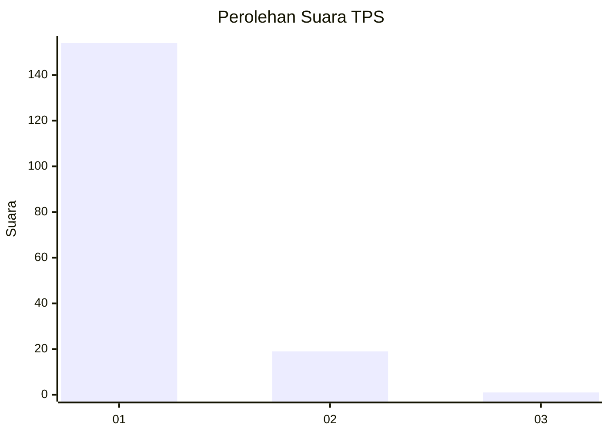
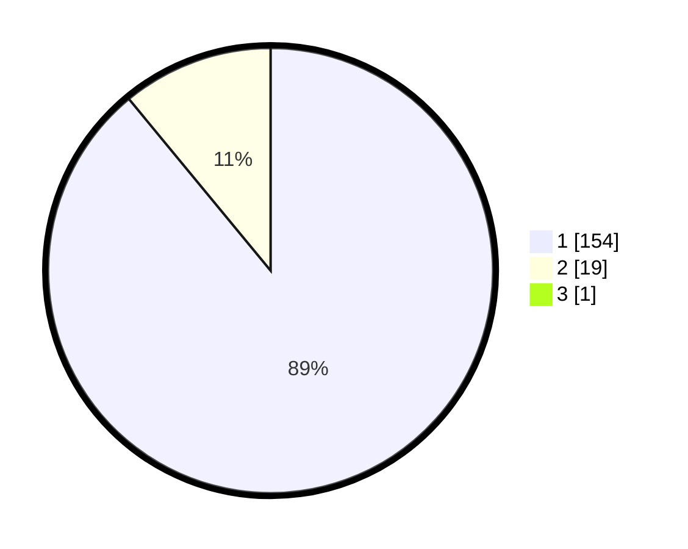

# Hasil

## Grafik

## Tabel

| No. | Nama Paslon    | Suara | Suara (raw) | Persentase |
|:--- |:-------------- | -----:| -----------:| ----------:|
| 1   | ANIES MUHAIMIN | 154   | [154][p-1]  | 88,51      |
| 2   | PRABOWO GIBRAN | 19    | [19][p-2]   | 10,92      |
| 3   | GANJAR MAHFUD  | 1     | [1][p-3]    | 0,57       |

[p-1]: https://github.com/gigit-pemilu/pemilu-2024-11-aceh/blob/main/pilpres/hitung-suara/sub/11-aceh/sub/07-pidie/sub/24-mutiara-timur/sub/2047-simbe/sub/002-tps/sub/paslon-1.txt
[p-2]: https://github.com/gigit-pemilu/pemilu-2024-11-aceh/blob/main/pilpres/hitung-suara/sub/11-aceh/sub/07-pidie/sub/24-mutiara-timur/sub/2047-simbe/sub/002-tps/sub/paslon-2.txt
[p-3]: https://github.com/gigit-pemilu/pemilu-2024-11-aceh/blob/main/pilpres/hitung-suara/sub/11-aceh/sub/07-pidie/sub/24-mutiara-timur/sub/2047-simbe/sub/002-tps/sub/paslon-3.txt

## Foto C Plano

https://sirekap-obj-formc.kpu.go.id/2ec5/pemilu/ppwp/11/07/24/20/47/1107242047002-20240215-070726--153c835c-40df-4e27-a9b2-95655cf45717.jpg

https://sirekap-obj-formc.kpu.go.id/2ec5/pemilu/ppwp/11/07/24/20/47/1107242047002-20240215-071030--c92c1bea-4270-4c76-a048-2447df8d8468.jpg

https://sirekap-obj-formc.kpu.go.id/2ec5/pemilu/ppwp/11/07/24/20/47/1107242047002-20240215-071136--1ba57d94-eff9-4437-8744-a8809a4d1b62.jpg

## Metadata

| Key        | Value               |
| ---------- | ------------------- |
| Time Stamp | 2024-02-24 22:31:28 |

