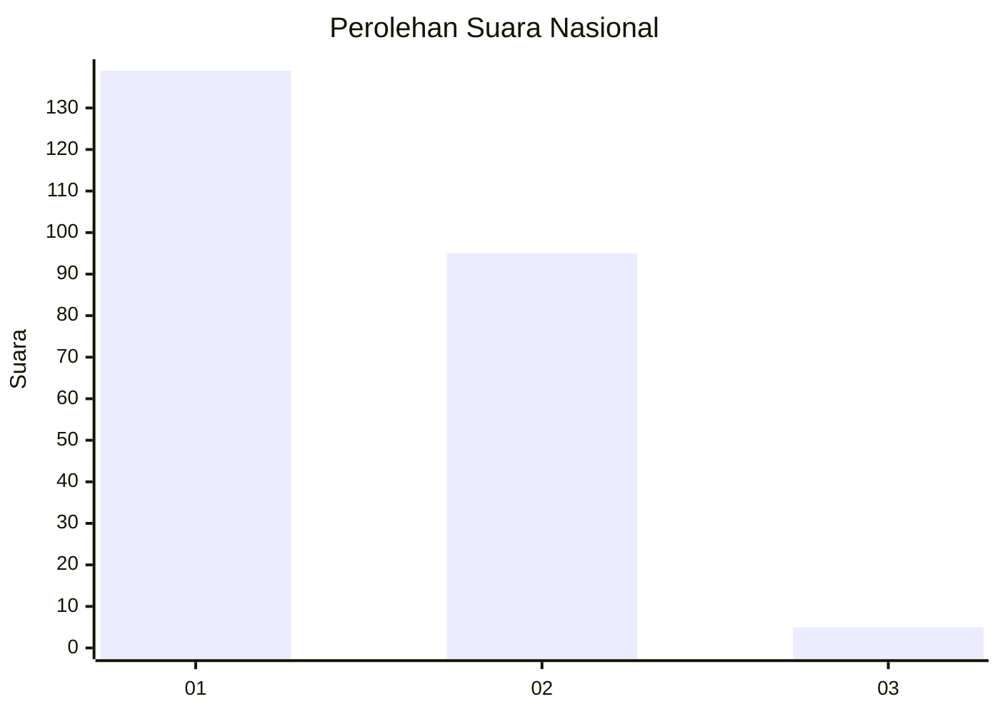
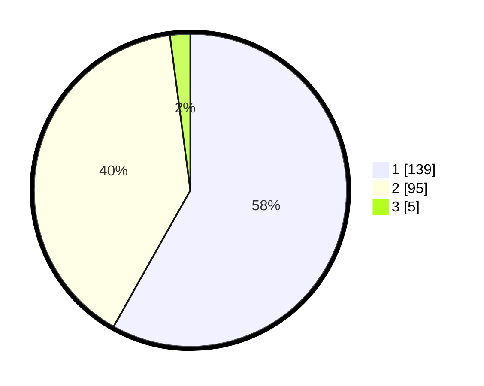

# Hasil

## Grafik

## Tabel

| No. | Nama Paslon    | Suara | Suara (raw) | Persentase |
|:--- |:-------------- | -----:| -----------:| ----------:|
| 1   | ANIES MUHAIMIN | 139   | [139][p-1]  | 58,16      |
| 2   | PRABOWO GIBRAN | 95    | [95][p-2]   | 39,75      |
| 3   | GANJAR MAHFUD  | 5     | [5][p-3]    | 2,09       |

[p-1]: https://github.com/gigit-pemilu/pemilu-2024/blob/main/pilpres/hitung-suara/sub/11-aceh/sub/07-pidie/sub/24-mutiara-timur/sub/2048-jiem/sub/001-tps/sub/paslon-1.txt
[p-2]: https://github.com/gigit-pemilu/pemilu-2024/blob/main/pilpres/hitung-suara/sub/11-aceh/sub/07-pidie/sub/24-mutiara-timur/sub/2048-jiem/sub/001-tps/sub/paslon-2.txt
[p-3]: https://github.com/gigit-pemilu/pemilu-2024/blob/main/pilpres/hitung-suara/sub/11-aceh/sub/07-pidie/sub/24-mutiara-timur/sub/2048-jiem/sub/001-tps/sub/paslon-3.txt

## Foto C Plano

https://sirekap-obj-formc.kpu.go.id/41cd/pemilu/ppwp/11/07/24/20/48/1107242048001-20240214-220219--453fdaca-1e92-4ca9-b850-6a40287e90bb.jpg

https://sirekap-obj-formc.kpu.go.id/41cd/pemilu/ppwp/11/07/24/20/48/1107242048001-20240214-220508--4355e459-6edb-44e2-b966-c617bef3fb92.jpg

https://sirekap-obj-formc.kpu.go.id/41cd/pemilu/ppwp/11/07/24/20/48/1107242048001-20240214-220633--f41b15f4-f927-45c3-8b4f-02b7ffd65bc4.jpg

## Metadata

| Key        | Value               |
| ---------- | ------------------- |
| Time Stamp | 2024-02-24 22:31:28 |

