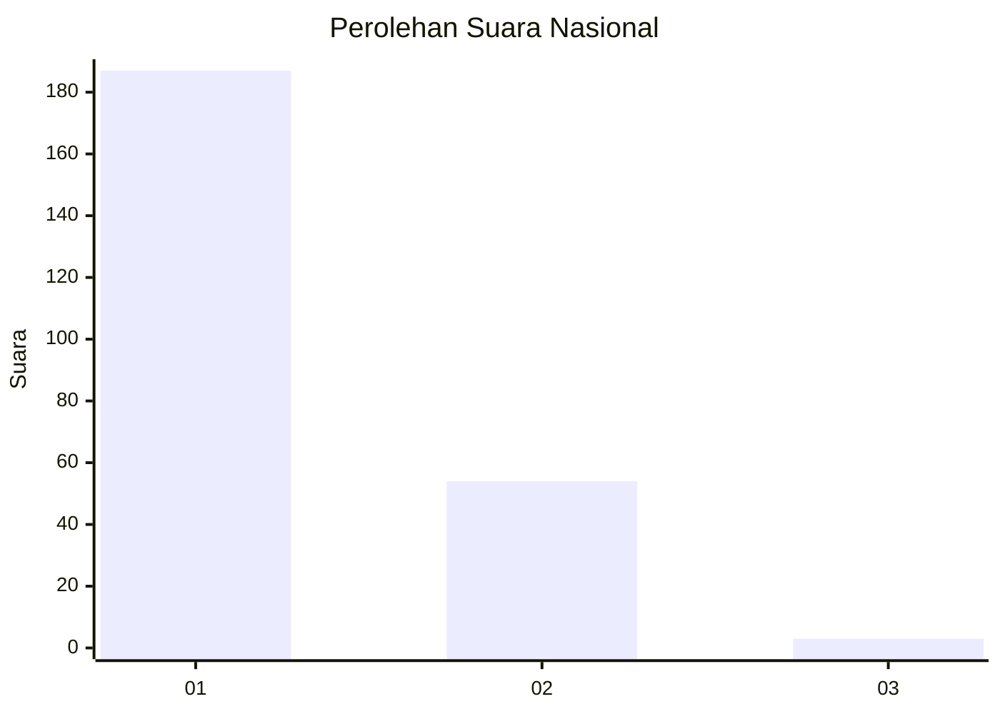
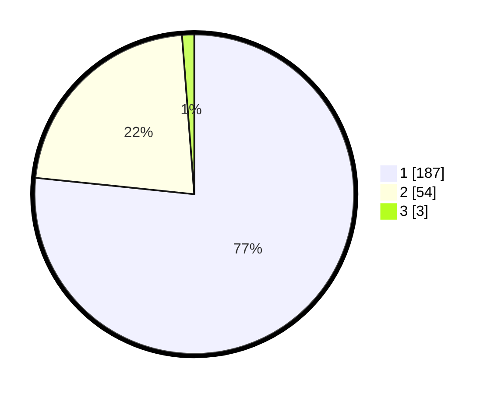

# Hasil

## Grafik

## Tabel

| No. | Nama Paslon    | Suara | Suara (raw) | Persentase |
|:--- |:-------------- | -----:| -----------:| ----------:|
| 1   | ANIES MUHAIMIN | 187   | [187][p-1]  | 76,64      |
| 2   | PRABOWO GIBRAN | 54    | [54][p-2]   | 22,13      |
| 3   | GANJAR MAHFUD  | 3     | [3][p-3]    | 1,23       |

[p-1]: https://github.com/gigit-pemilu/pemilu-2024/blob/main/pilpres/hitung-suara/sub/11-aceh/sub/07-pidie/sub/24-mutiara-timur/sub/2048-jiem/sub/002-tps/sub/paslon-1.txt
[p-2]: https://github.com/gigit-pemilu/pemilu-2024/blob/main/pilpres/hitung-suara/sub/11-aceh/sub/07-pidie/sub/24-mutiara-timur/sub/2048-jiem/sub/002-tps/sub/paslon-2.txt
[p-3]: https://github.com/gigit-pemilu/pemilu-2024/blob/main/pilpres/hitung-suara/sub/11-aceh/sub/07-pidie/sub/24-mutiara-timur/sub/2048-jiem/sub/002-tps/sub/paslon-3.txt

## Foto C Plano

https://sirekap-obj-formc.kpu.go.id/87a2/pemilu/ppwp/11/07/24/20/48/1107242048002-20240215-110312--ecf6fc3a-bee4-4a5d-b99e-0d8377396f30.jpg

https://sirekap-obj-formc.kpu.go.id/87a2/pemilu/ppwp/11/07/24/20/48/1107242048002-20240214-220359--fc9559ff-1fbc-4c66-abc7-57fbc670a820.jpg

https://sirekap-obj-formc.kpu.go.id/87a2/pemilu/ppwp/11/07/24/20/48/1107242048002-20240214-214006--8bb5a298-819b-406a-b3ea-4e577a3981a7.jpg

## Metadata

| Key        | Value               |
| ---------- | ------------------- |
| Time Stamp | 2024-02-24 22:31:28 |

