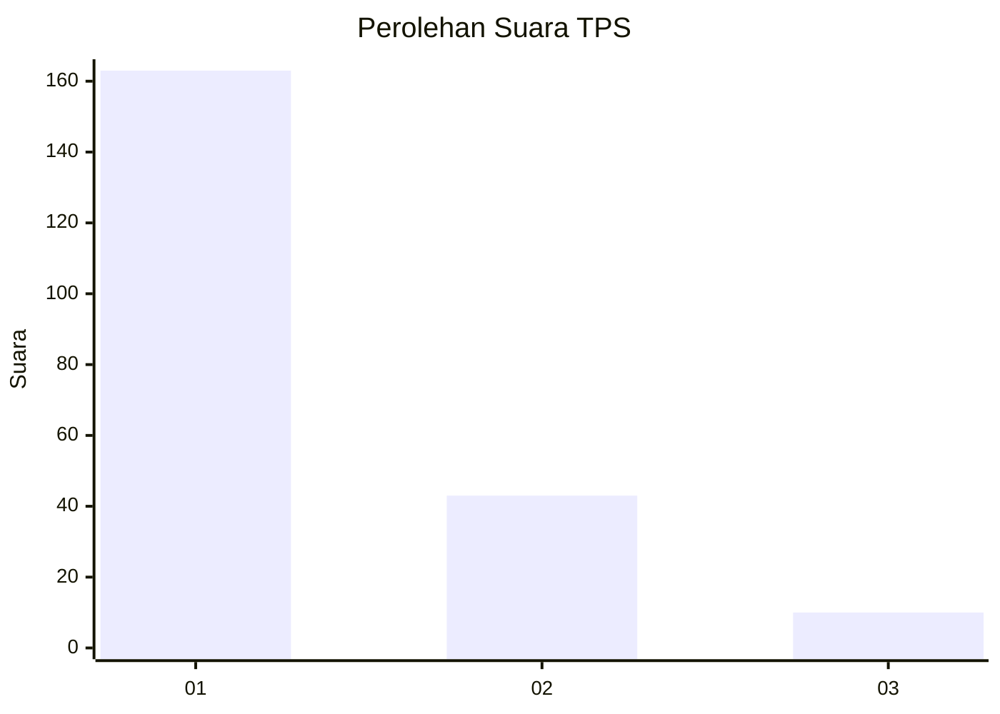
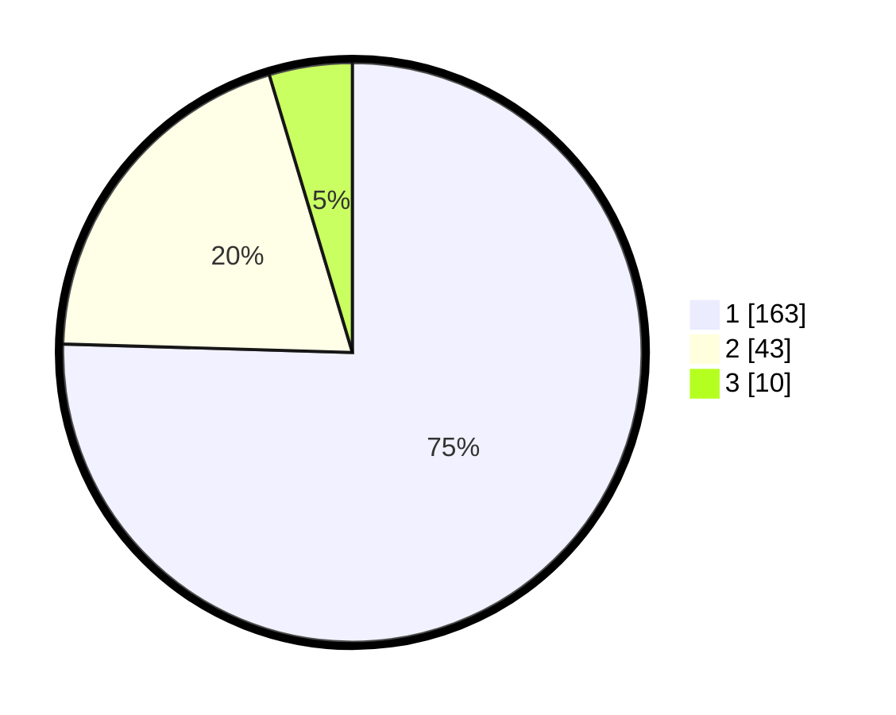

# Hasil

## Grafik

## Tabel

| No. | Nama Paslon    | Suara | Suara (raw) | Persentase |
|:--- |:-------------- | -----:| -----------:| ----------:|
| 1   | ANIES MUHAIMIN | 163   | [163][p-1]  | 75,46      |
| 2   | PRABOWO GIBRAN | 43    | [43][p-2]   | 19,91      |
| 3   | GANJAR MAHFUD  | 10    | [10][p-3]   | 4,63       |

[p-1]: https://github.com/gigit-pemilu/pemilu-2024-11-aceh/blob/main/pilpres/hitung-suara/sub/11-aceh/sub/07-pidie/sub/24-mutiara-timur/sub/2048-jiem/sub/003-tps/sub/paslon-1.txt
[p-2]: https://github.com/gigit-pemilu/pemilu-2024-11-aceh/blob/main/pilpres/hitung-suara/sub/11-aceh/sub/07-pidie/sub/24-mutiara-timur/sub/2048-jiem/sub/003-tps/sub/paslon-2.txt
[p-3]: https://github.com/gigit-pemilu/pemilu-2024-11-aceh/blob/main/pilpres/hitung-suara/sub/11-aceh/sub/07-pidie/sub/24-mutiara-timur/sub/2048-jiem/sub/003-tps/sub/paslon-3.txt

## Foto C Plano

https://sirekap-obj-formc.kpu.go.id/9f26/pemilu/ppwp/11/07/24/20/48/1107242048003-20240214-215103--df22f869-6baa-4e4a-933c-da8a862b1cfe.jpg

https://sirekap-obj-formc.kpu.go.id/9f26/pemilu/ppwp/11/07/24/20/48/1107242048003-20240214-215151--7381d524-c486-40c1-a734-669840a4e5f2.jpg

https://sirekap-obj-formc.kpu.go.id/9f26/pemilu/ppwp/11/07/24/20/48/1107242048003-20240214-215249--e59b5f35-67b0-4e93-98e9-72ea88980f97.jpg

## Metadata

| Key        | Value               |
| ---------- | ------------------- |
| Time Stamp | 2024-02-24 22:31:28 |

