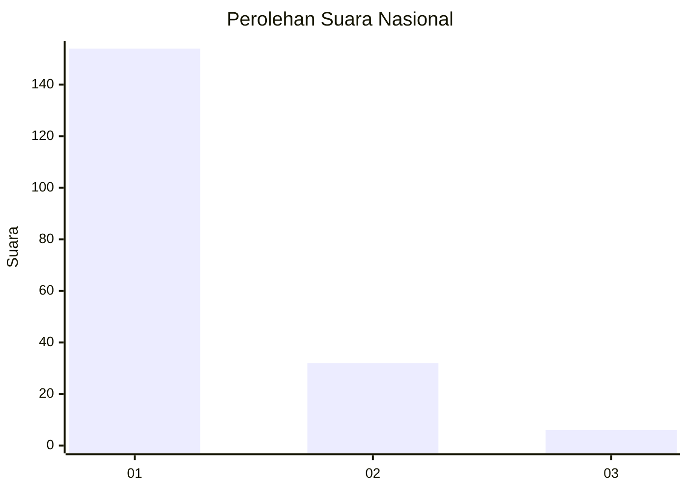
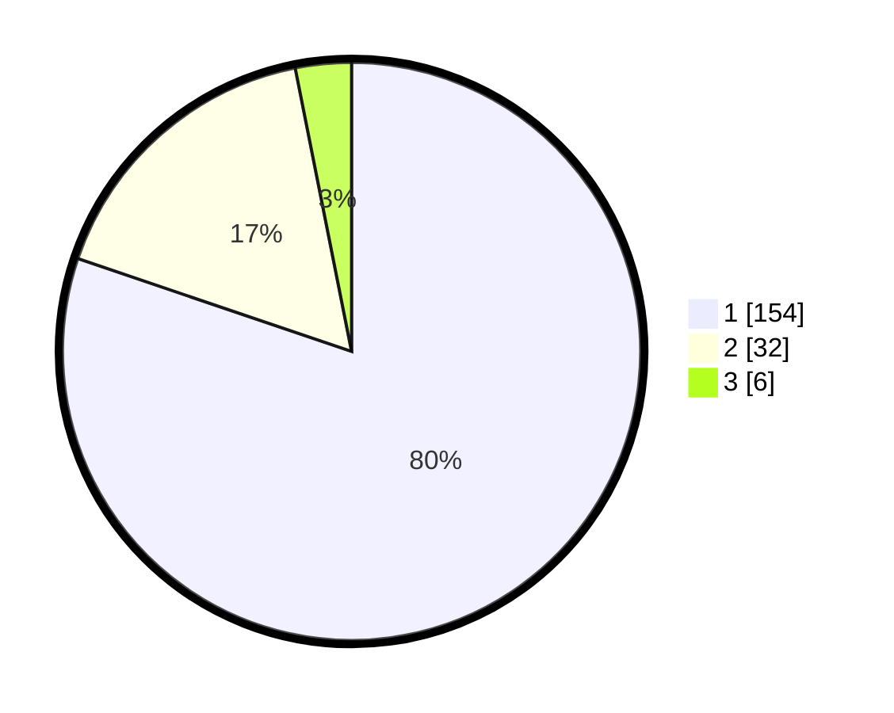

# Hasil

## Grafik

## Tabel

| No. | Nama Paslon    | Suara | Suara (raw) | Persentase |
|:--- |:-------------- | -----:| -----------:| ----------:|
| 1   | ANIES MUHAIMIN | 154   | [154][p-1]  | 80,21      |
| 2   | PRABOWO GIBRAN | 32    | [32][p-2]   | 16,67      |
| 3   | GANJAR MAHFUD  | 6     | [6][p-3]    | 3,13       |

[p-1]: https://github.com/gigit-pemilu/pemilu-2024/blob/main/pilpres/hitung-suara/sub/11-aceh/sub/07-pidie/sub/25-grong-grong/sub/2002-mesjid-beureuleung/sub/001-tps/sub/paslon-1.txt
[p-2]: https://github.com/gigit-pemilu/pemilu-2024/blob/main/pilpres/hitung-suara/sub/11-aceh/sub/07-pidie/sub/25-grong-grong/sub/2002-mesjid-beureuleung/sub/001-tps/sub/paslon-2.txt
[p-3]: https://github.com/gigit-pemilu/pemilu-2024/blob/main/pilpres/hitung-suara/sub/11-aceh/sub/07-pidie/sub/25-grong-grong/sub/2002-mesjid-beureuleung/sub/001-tps/sub/paslon-3.txt

## Foto C Plano

https://sirekap-obj-formc.kpu.go.id/5c3e/pemilu/ppwp/11/07/25/20/02/1107252002001-20240216-192057--553c24af-b243-47b4-9fa6-0f58bea83fa5.jpg

https://sirekap-obj-formc.kpu.go.id/5c3e/pemilu/ppwp/11/07/25/20/02/1107252002001-20240216-192150--c991a7fe-3f2c-48c3-b0fd-e6250af45a99.jpg

https://sirekap-obj-formc.kpu.go.id/5c3e/pemilu/ppwp/11/07/25/20/02/1107252002001-20240216-192209--30f50745-1983-4fae-84f5-9d127ef9f62d.jpg

## Metadata

| Key        | Value               |
| ---------- | ------------------- |
| Time Stamp | 2024-02-16 21:01:00 |

