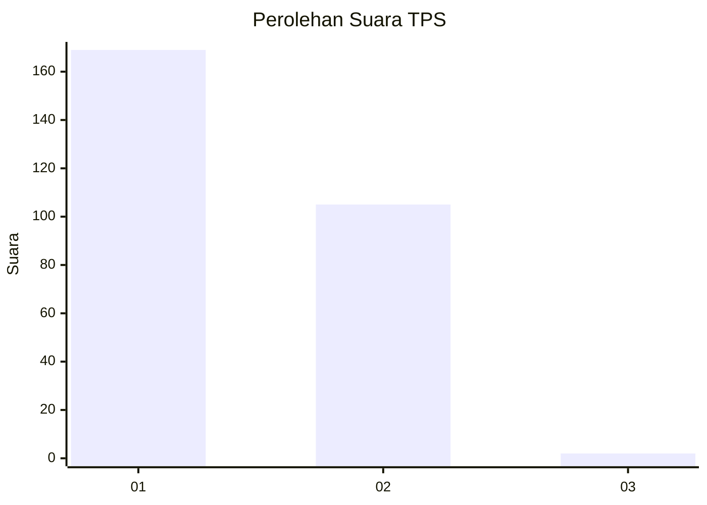
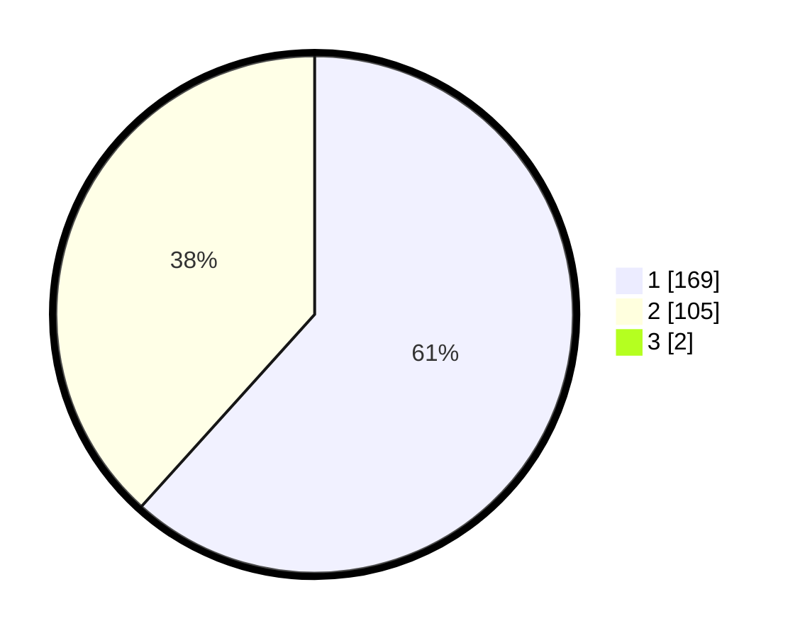

# Hasil

## Grafik

## Tabel

| No. | Nama Paslon    | Suara | Suara (raw) | Persentase |
|:--- |:-------------- | -----:| -----------:| ----------:|
| 1   | ANIES MUHAIMIN | 169   | [169][p-1]  | 61,23      |
| 2   | PRABOWO GIBRAN | 105   | [105][p-2]  | 38,04      |
| 3   | GANJAR MAHFUD  | 2     | [2][p-3]    | 0,72       |

[p-1]: https://github.com/gigit-pemilu/pemilu-2024-11-aceh/blob/main/pilpres/hitung-suara/sub/11-aceh/sub/07-pidie/sub/25-grong-grong/sub/2003-beureuleung/sub/001-tps/sub/paslon-1.txt
[p-2]: https://github.com/gigit-pemilu/pemilu-2024-11-aceh/blob/main/pilpres/hitung-suara/sub/11-aceh/sub/07-pidie/sub/25-grong-grong/sub/2003-beureuleung/sub/001-tps/sub/paslon-2.txt
[p-3]: https://github.com/gigit-pemilu/pemilu-2024-11-aceh/blob/main/pilpres/hitung-suara/sub/11-aceh/sub/07-pidie/sub/25-grong-grong/sub/2003-beureuleung/sub/001-tps/sub/paslon-3.txt

## Foto C Plano

https://sirekap-obj-formc.kpu.go.id/67bd/pemilu/ppwp/11/07/25/20/03/1107252003001-20240215-170403--9365dfcb-e739-48d2-a773-4a0b5cd65d8c.jpg

https://sirekap-obj-formc.kpu.go.id/67bd/pemilu/ppwp/11/07/25/20/03/1107252003001-20240215-141333--7b5fb663-a1b6-4f1c-9c0a-07e5058cfa3d.jpg

https://sirekap-obj-formc.kpu.go.id/67bd/pemilu/ppwp/11/07/25/20/03/1107252003001-20240215-133707--c10d4d0c-2387-45de-84aa-8bbb69c86872.jpg

## Metadata

| Key        | Value               |
| ---------- | ------------------- |
| Time Stamp | 2024-02-24 22:31:28 |

## DATA PEMILIH TETAP

Jumlah pemilih dalam DPT: **285**.
 * L: **136**.
 * P: **149**.

## DATA PENGGUNA HAK PILIH

Jumlah pengguna hak pilih dalam DPT: **284**.
 * L: **136**.
 * P: **148**.

Jumlah pengguna hak pilih dalam DPTb: **0**.
 * L: **0**.
 * P: **0**.

Jumlah pengguna hak pilih dalam DPK: **0**.
 * L: **0**.
 * P: **0**.

Jumlah pengguna hak pilih: **284**.
 * L: **136**.
 * P: **148**.

## JUMLAH SUARA SAH DAN TIDAK SAH

JUMLAH SELURUH SUARA SAH: **276**.

JUMLAH SUARA TIDAK SAH: **8**.

JUMLAH SELURUH SUARA SAH DAN SUARA TIDAK SAH: **284**.

