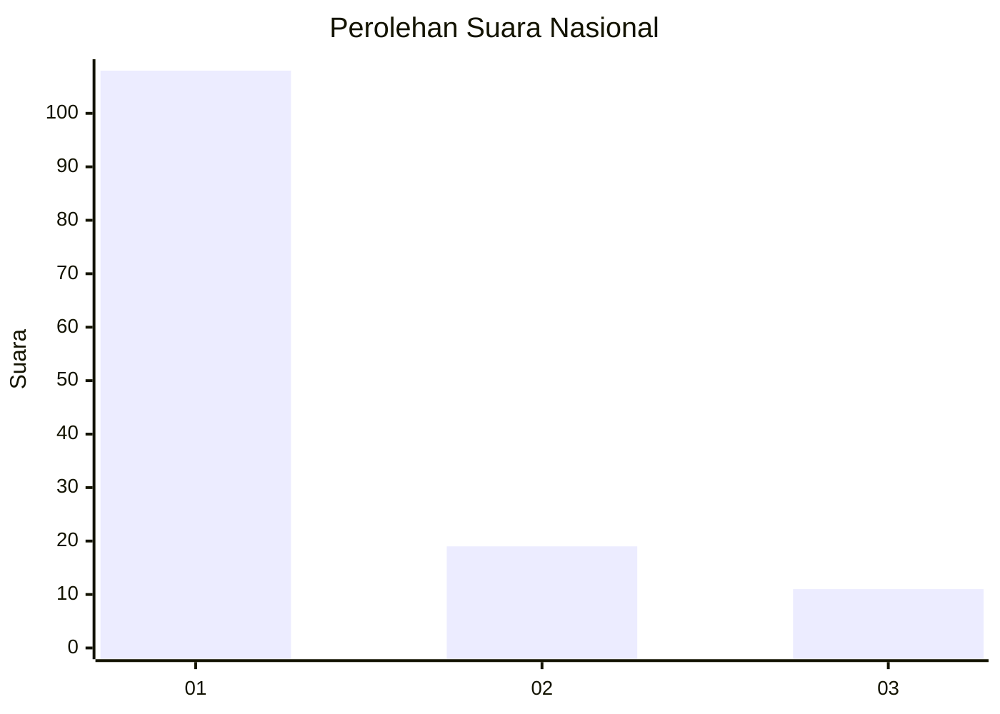
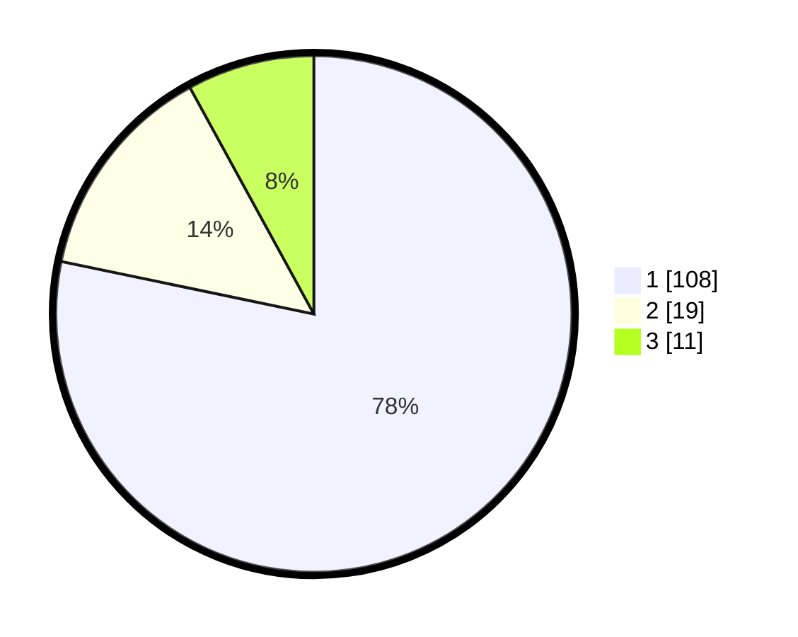

# Hasil

## Grafik

## Tabel

| No. | Nama Paslon    | Suara | Suara (raw) | Persentase |
|:--- |:-------------- | -----:| -----------:| ----------:|
| 1   | ANIES MUHAIMIN | 108   | [108][p-1]  | 78,26      |
| 2   | PRABOWO GIBRAN | 19    | [19][p-2]   | 13,77      |
| 3   | GANJAR MAHFUD  | 11    | [11][p-3]   | 7,97       |

[p-1]: https://github.com/gigit-pemilu/pemilu-2024/blob/main/pilpres/hitung-suara/sub/11-aceh/sub/07-pidie/sub/25-grong-grong/sub/2004-baroh/sub/001-tps/sub/paslon-1.txt
[p-2]: https://github.com/gigit-pemilu/pemilu-2024/blob/main/pilpres/hitung-suara/sub/11-aceh/sub/07-pidie/sub/25-grong-grong/sub/2004-baroh/sub/001-tps/sub/paslon-2.txt
[p-3]: https://github.com/gigit-pemilu/pemilu-2024/blob/main/pilpres/hitung-suara/sub/11-aceh/sub/07-pidie/sub/25-grong-grong/sub/2004-baroh/sub/001-tps/sub/paslon-3.txt

## Foto C Plano

https://sirekap-obj-formc.kpu.go.id/c169/pemilu/ppwp/11/07/25/20/04/1107252004001-20240215-081438--b6111407-2752-47a7-9c5c-9911d70f2e68.jpg

https://sirekap-obj-formc.kpu.go.id/c169/pemilu/ppwp/11/07/25/20/04/1107252004001-20240215-081744--6de4a586-735f-49ee-a8b9-e816da4ca4db.jpg

https://sirekap-obj-formc.kpu.go.id/c169/pemilu/ppwp/11/07/25/20/04/1107252004001-20240215-081940--91f8ef05-0e18-4d66-b46c-88682eda6e14.jpg

## Metadata

| Key        | Value               |
| ---------- | ------------------- |
| Time Stamp | 2024-02-17 03:30:02 |

