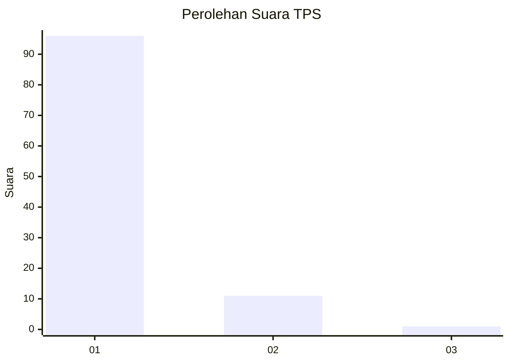
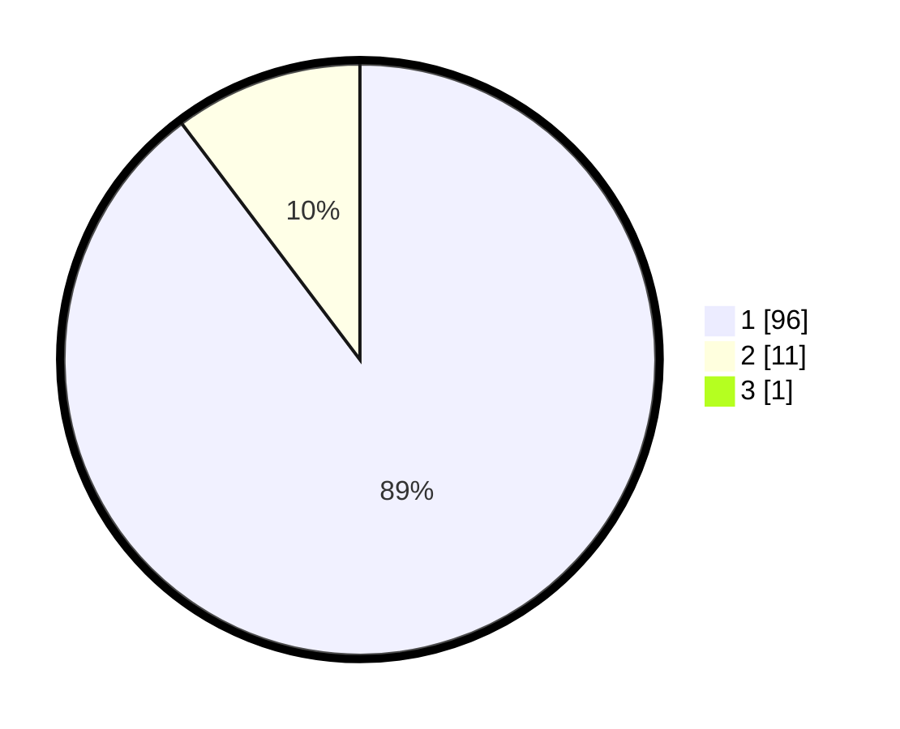

# Hasil

## Grafik

## Tabel

| No. | Nama Paslon    | Suara | Suara (raw) | Persentase |
|:--- |:-------------- | -----:| -----------:| ----------:|
| 1   | ANIES MUHAIMIN | 96    | [96][p-1]   | 88,89      |
| 2   | PRABOWO GIBRAN | 11    | [11][p-2]   | 10,19      |
| 3   | GANJAR MAHFUD  | 1     | [1][p-3]    | 0,93       |

[p-1]: https://github.com/gigit-pemilu/pemilu-2024-11-aceh/blob/main/pilpres/hitung-suara/sub/11-aceh/sub/07-pidie/sub/25-grong-grong/sub/2006-paya/sub/001-tps/sub/paslon-1.txt
[p-2]: https://github.com/gigit-pemilu/pemilu-2024-11-aceh/blob/main/pilpres/hitung-suara/sub/11-aceh/sub/07-pidie/sub/25-grong-grong/sub/2006-paya/sub/001-tps/sub/paslon-2.txt
[p-3]: https://github.com/gigit-pemilu/pemilu-2024-11-aceh/blob/main/pilpres/hitung-suara/sub/11-aceh/sub/07-pidie/sub/25-grong-grong/sub/2006-paya/sub/001-tps/sub/paslon-3.txt

## Foto C Plano

https://sirekap-obj-formc.kpu.go.id/9ae8/pemilu/ppwp/11/07/25/20/06/1107252006001-20240215-044948--7aef7e43-c96d-4e61-992e-3ce27d52678b.jpg

https://sirekap-obj-formc.kpu.go.id/9ae8/pemilu/ppwp/11/07/25/20/06/1107252006001-20240215-045641--ec9eb6e8-23bb-4700-9f22-f685d4df1848.jpg

https://sirekap-obj-formc.kpu.go.id/9ae8/pemilu/ppwp/11/07/25/20/06/1107252006001-20240215-050336--24bb6bad-3fb3-45dd-beaf-98c131ad4a75.jpg

## Metadata

| Key        | Value               |
| ---------- | ------------------- |
| Time Stamp | 2024-02-17 03:30:02 |

