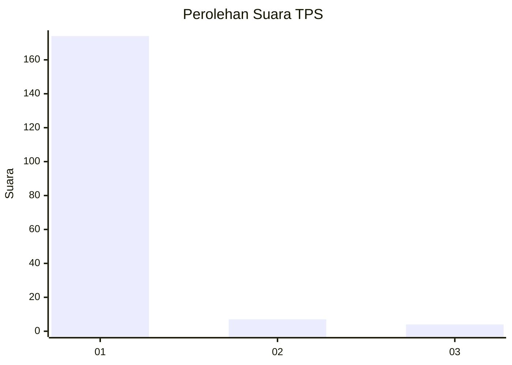
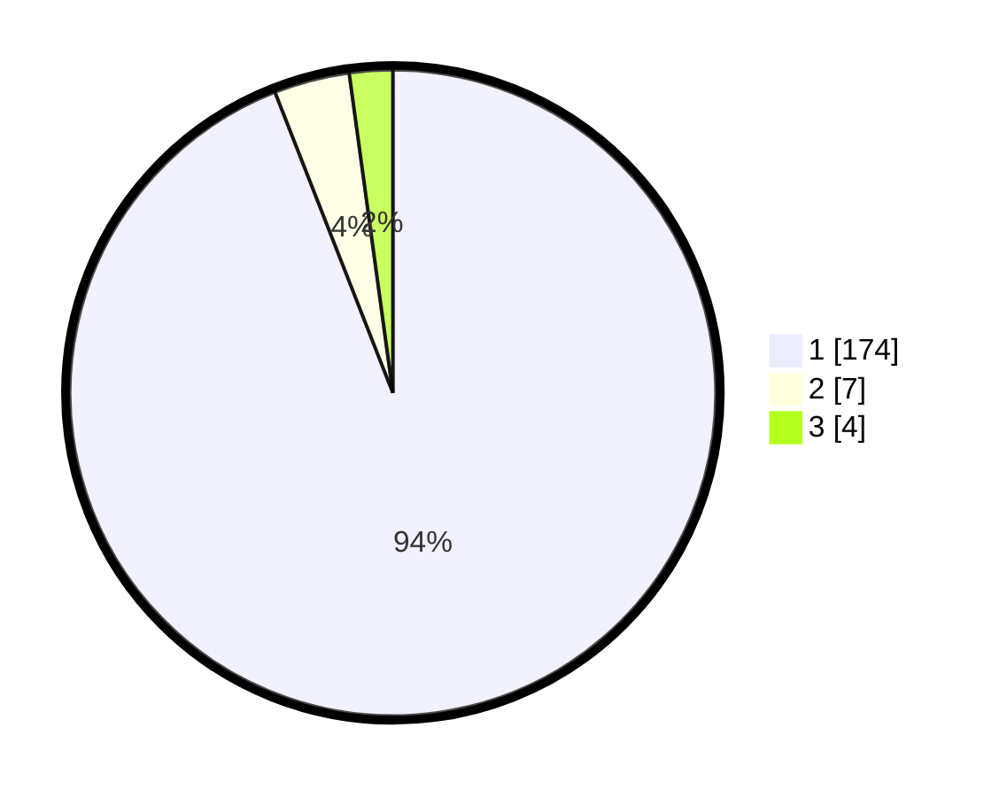

# Hasil

## Grafik

## Tabel

| No. | Nama Paslon    | Suara | Suara (raw) | Persentase |
|:--- |:-------------- | -----:| -----------:| ----------:|
| 1   | ANIES MUHAIMIN | 174   | [174][p-1]  | 94,05      |
| 2   | PRABOWO GIBRAN | 7     | [7][p-2]    | 3,78       |
| 3   | GANJAR MAHFUD  | 4     | [4][p-3]    | 2,16       |

[p-1]: https://github.com/gigit-pemilu/pemilu-2024-11-aceh/blob/main/pilpres/hitung-suara/sub/11-aceh/sub/07-pidie/sub/25-grong-grong/sub/2009-karieng/sub/001-tps/sub/paslon-1.txt
[p-2]: https://github.com/gigit-pemilu/pemilu-2024-11-aceh/blob/main/pilpres/hitung-suara/sub/11-aceh/sub/07-pidie/sub/25-grong-grong/sub/2009-karieng/sub/001-tps/sub/paslon-2.txt
[p-3]: https://github.com/gigit-pemilu/pemilu-2024-11-aceh/blob/main/pilpres/hitung-suara/sub/11-aceh/sub/07-pidie/sub/25-grong-grong/sub/2009-karieng/sub/001-tps/sub/paslon-3.txt

## Foto C Plano

https://sirekap-obj-formc.kpu.go.id/2913/pemilu/ppwp/11/07/25/20/09/1107252009001-20240214-160136--66d840af-c1fe-472e-973e-cef7ad24c3c4.jpg

https://sirekap-obj-formc.kpu.go.id/2913/pemilu/ppwp/11/07/25/20/09/1107252009001-20240214-200211--04c08868-cb06-4d9f-b874-b2d9b7043218.jpg

https://sirekap-obj-formc.kpu.go.id/2913/pemilu/ppwp/11/07/25/20/09/1107252009001-20240214-200223--52404653-2f2c-4e44-b129-e265b1036c15.jpg

## Metadata

| Key        | Value               |
| ---------- | ------------------- |
| Time Stamp | 2024-02-17 03:30:02 |

