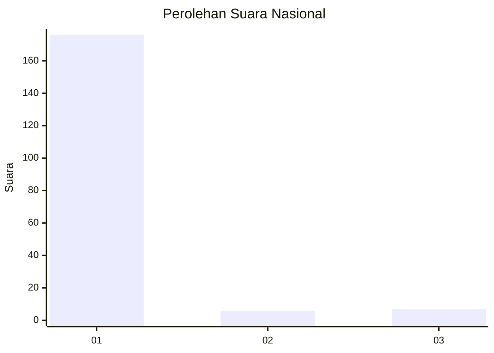
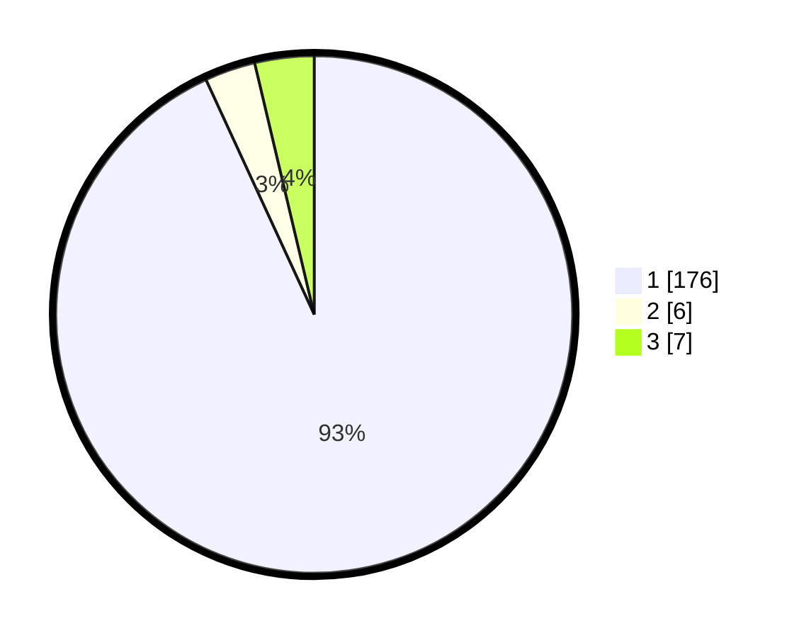

# Hasil

## Grafik

## Tabel

| No. | Nama Paslon    | Suara | Suara (raw) | Persentase |
|:--- |:-------------- | -----:| -----------:| ----------:|
| 1   | ANIES MUHAIMIN | 176   | [176][p-1]  | 93,12      |
| 2   | PRABOWO GIBRAN | 6     | [6][p-2]    | 3,17       |
| 3   | GANJAR MAHFUD  | 7     | [7][p-3]    | 3,70       |

[p-1]: https://github.com/gigit-pemilu/pemilu-2024/blob/main/pilpres/hitung-suara/sub/11-aceh/sub/07-pidie/sub/25-grong-grong/sub/2009-karieng/sub/002-tps/sub/paslon-1.txt
[p-2]: https://github.com/gigit-pemilu/pemilu-2024/blob/main/pilpres/hitung-suara/sub/11-aceh/sub/07-pidie/sub/25-grong-grong/sub/2009-karieng/sub/002-tps/sub/paslon-2.txt
[p-3]: https://github.com/gigit-pemilu/pemilu-2024/blob/main/pilpres/hitung-suara/sub/11-aceh/sub/07-pidie/sub/25-grong-grong/sub/2009-karieng/sub/002-tps/sub/paslon-3.txt

## Foto C Plano

https://sirekap-obj-formc.kpu.go.id/53a7/pemilu/ppwp/11/07/25/20/09/1107252009002-20240214-204752--556be325-7142-4665-98d9-24b2165b0c34.jpg

https://sirekap-obj-formc.kpu.go.id/53a7/pemilu/ppwp/11/07/25/20/09/1107252009002-20240214-204858--de56e30e-001c-45c2-b7a2-60e13dbfd7c1.jpg

https://sirekap-obj-formc.kpu.go.id/53a7/pemilu/ppwp/11/07/25/20/09/1107252009002-20240214-204930--0907ef9c-31fb-48ab-a712-f07f8d209c1d.jpg

## Metadata

| Key        | Value               |
| ---------- | ------------------- |
| Time Stamp | 2024-02-17 03:30:02 |

