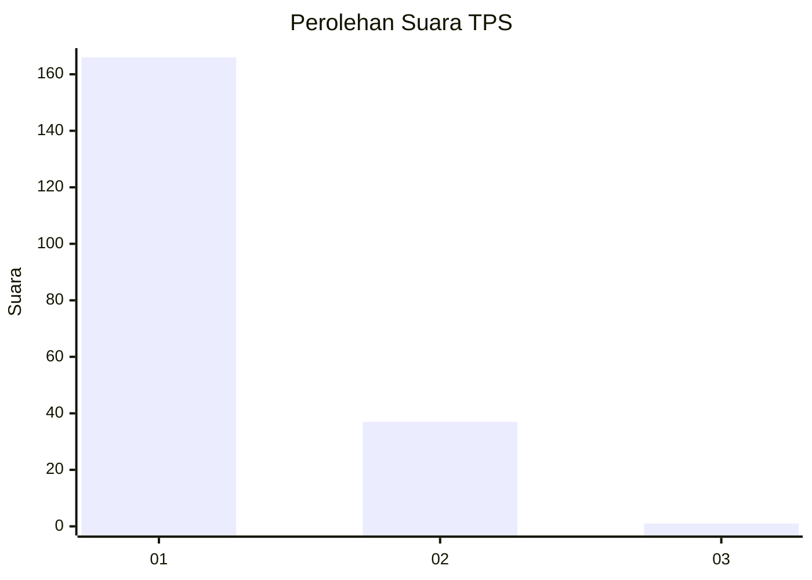
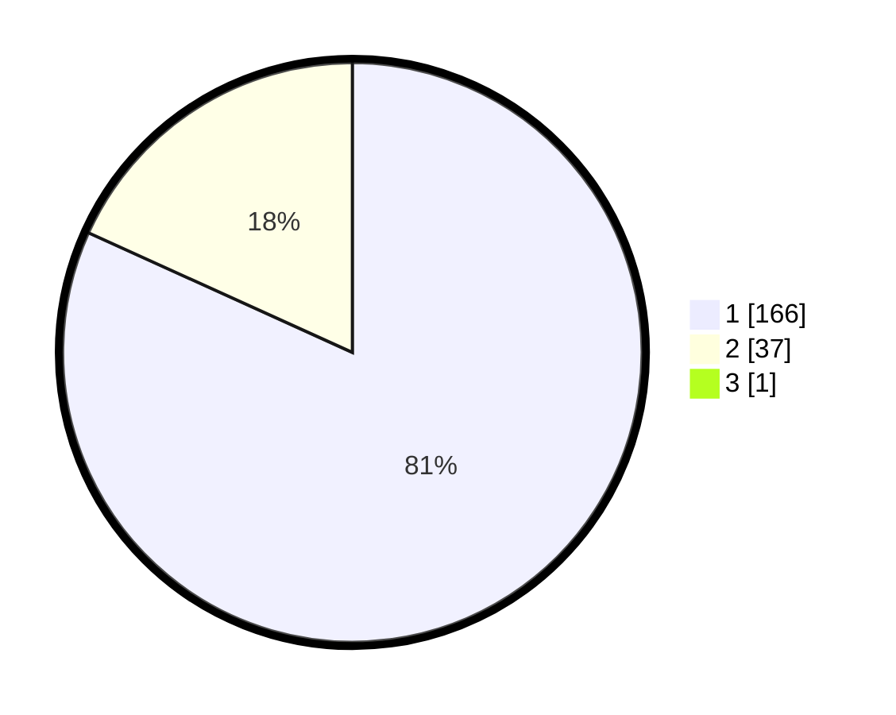

# Hasil

## Grafik

## Tabel

| No. | Nama Paslon    | Suara | Suara (raw) | Persentase |
|:--- |:-------------- | -----:| -----------:| ----------:|
| 1   | ANIES MUHAIMIN | 166   | [166][p-1]  | 81,37      |
| 2   | PRABOWO GIBRAN | 37    | [37][p-2]   | 18,14      |
| 3   | GANJAR MAHFUD  | 1     | [1][p-3]    | 0,49       |

[p-1]: https://github.com/gigit-pemilu/pemilu-2024-11-aceh/blob/main/pilpres/hitung-suara/sub/11-aceh/sub/07-pidie/sub/25-grong-grong/sub/2012-mesjid-memeuaneuk/sub/001-tps/sub/paslon-1.txt
[p-2]: https://github.com/gigit-pemilu/pemilu-2024-11-aceh/blob/main/pilpres/hitung-suara/sub/11-aceh/sub/07-pidie/sub/25-grong-grong/sub/2012-mesjid-memeuaneuk/sub/001-tps/sub/paslon-2.txt
[p-3]: https://github.com/gigit-pemilu/pemilu-2024-11-aceh/blob/main/pilpres/hitung-suara/sub/11-aceh/sub/07-pidie/sub/25-grong-grong/sub/2012-mesjid-memeuaneuk/sub/001-tps/sub/paslon-3.txt

## Foto C Plano

https://sirekap-obj-formc.kpu.go.id/41ea/pemilu/ppwp/11/07/25/20/12/1107252012001-20240214-193735--edb8e786-782b-409a-962d-19a7a4927cef.jpg

https://sirekap-obj-formc.kpu.go.id/41ea/pemilu/ppwp/11/07/25/20/12/1107252012001-20240214-200104--6eddc2ea-58b0-42a4-b465-138100a708c8.jpg

https://sirekap-obj-formc.kpu.go.id/41ea/pemilu/ppwp/11/07/25/20/12/1107252012001-20240214-200307--8aabbded-d237-4ff2-b51c-09a347ad8260.jpg

## Metadata

| Key        | Value               |
| ---------- | ------------------- |
| Time Stamp | 2024-02-24 22:31:28 |

