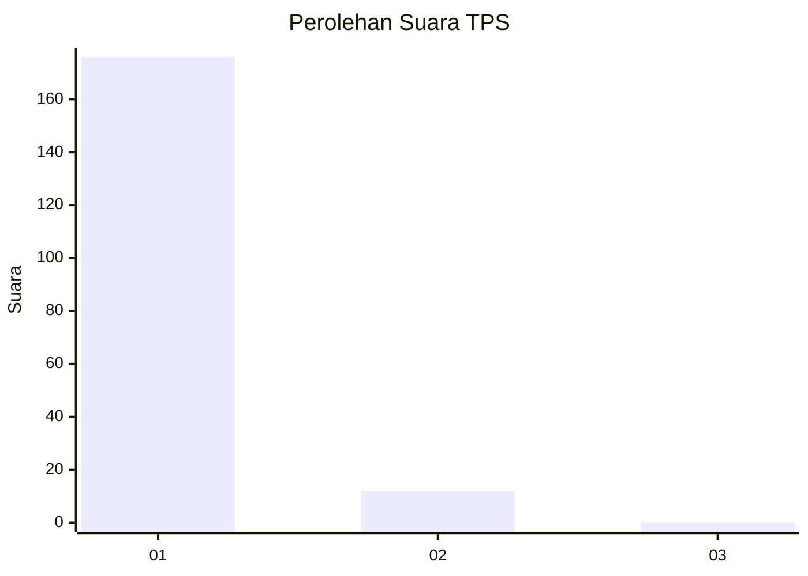
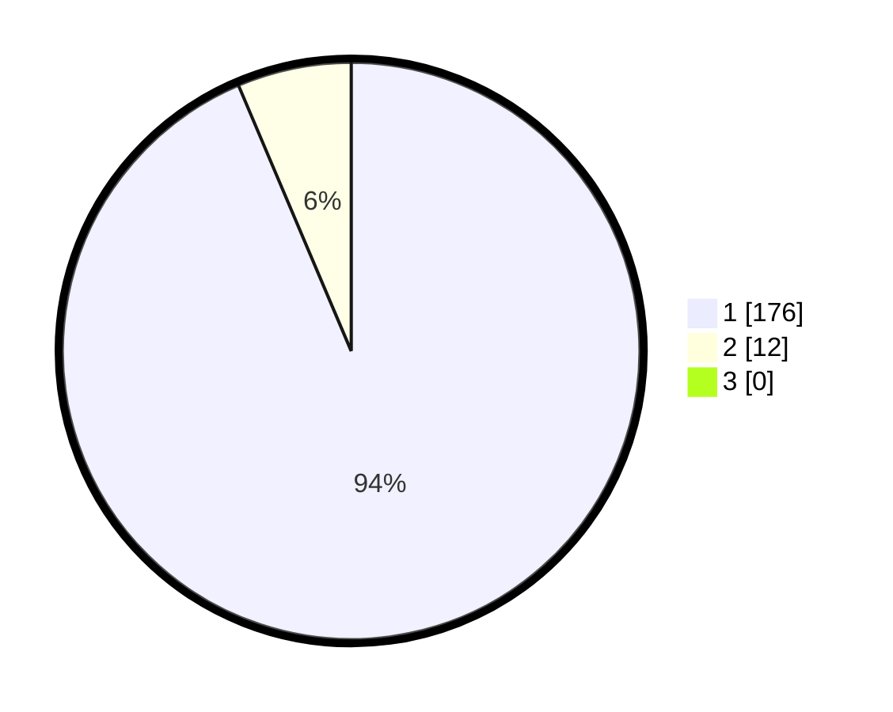

# Hasil

## Grafik

## Tabel

| No. | Nama Paslon    | Suara | Suara (raw) | Persentase |
|:--- |:-------------- | -----:| -----------:| ----------:|
| 1   | ANIES MUHAIMIN | 176   | [176][p-1]  | 93,62      |
| 2   | PRABOWO GIBRAN | 12    | [12][p-2]   | 6,38       |
| 3   | GANJAR MAHFUD  | 0     | [0][p-3]    | 0,00       |

[p-1]: https://github.com/gigit-pemilu/pemilu-2024-11-aceh/blob/main/pilpres/hitung-suara/sub/11-aceh/sub/07-pidie/sub/25-grong-grong/sub/2015-sukon/sub/001-tps/sub/paslon-1.txt
[p-2]: https://github.com/gigit-pemilu/pemilu-2024-11-aceh/blob/main/pilpres/hitung-suara/sub/11-aceh/sub/07-pidie/sub/25-grong-grong/sub/2015-sukon/sub/001-tps/sub/paslon-2.txt
[p-3]: https://github.com/gigit-pemilu/pemilu-2024-11-aceh/blob/main/pilpres/hitung-suara/sub/11-aceh/sub/07-pidie/sub/25-grong-grong/sub/2015-sukon/sub/001-tps/sub/paslon-3.txt

## Foto C Plano

https://sirekap-obj-formc.kpu.go.id/07a4/pemilu/ppwp/11/07/25/20/15/1107252015001-20240214-212143--784e533e-1840-46e1-84f6-1f66417bd47e.jpg

https://sirekap-obj-formc.kpu.go.id/07a4/pemilu/ppwp/11/07/25/20/15/1107252015001-20240214-212200--a84787b9-c113-4eaa-ac7b-fb1d41193600.jpg

https://sirekap-obj-formc.kpu.go.id/07a4/pemilu/ppwp/11/07/25/20/15/1107252015001-20240214-212218--4d678524-c01e-4db4-a862-ef08ee920f7e.jpg

## Metadata

| Key        | Value               |
| ---------- | ------------------- |
| Time Stamp | 2024-02-17 03:30:02 |

