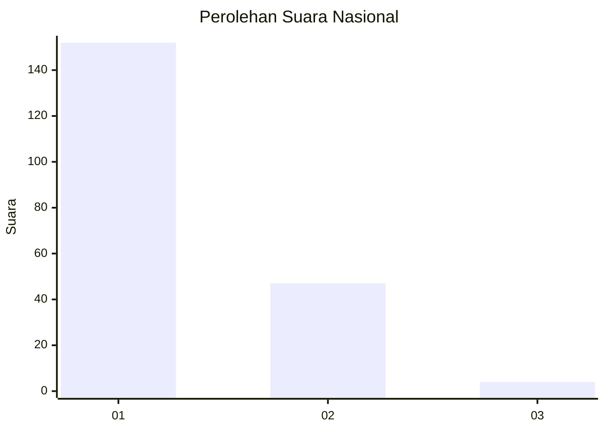
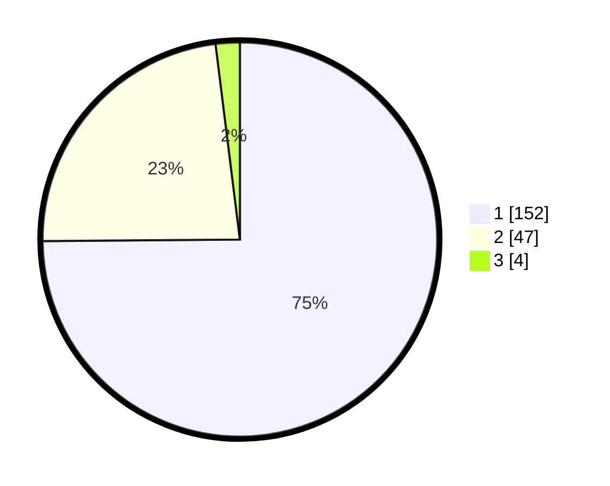

# Hasil

## Grafik

## Tabel

| No. | Nama Paslon    | Suara | Suara (raw) | Persentase |
|:--- |:-------------- | -----:| -----------:| ----------:|
| 1   | ANIES MUHAIMIN | 152   | [152][p-1]  | 74,88      |
| 2   | PRABOWO GIBRAN | 47    | [47][p-2]   | 23,15      |
| 3   | GANJAR MAHFUD  | 4     | [4][p-3]    | 1,97       |

[p-1]: https://github.com/gigit-pemilu/pemilu-2024/blob/main/pilpres/hitung-suara/sub/11-aceh/sub/07-pidie/sub/27-mane/sub/2001-lutueng/sub/001-tps/sub/paslon-1.txt
[p-2]: https://github.com/gigit-pemilu/pemilu-2024/blob/main/pilpres/hitung-suara/sub/11-aceh/sub/07-pidie/sub/27-mane/sub/2001-lutueng/sub/001-tps/sub/paslon-2.txt
[p-3]: https://github.com/gigit-pemilu/pemilu-2024/blob/main/pilpres/hitung-suara/sub/11-aceh/sub/07-pidie/sub/27-mane/sub/2001-lutueng/sub/001-tps/sub/paslon-3.txt

## Foto C Plano

https://sirekap-obj-formc.kpu.go.id/3fb7/pemilu/ppwp/11/07/27/20/01/1107272001001-20240215-105723--0db19577-fe2a-4078-9be8-ddf7fc666f4a.jpg

https://sirekap-obj-formc.kpu.go.id/3fb7/pemilu/ppwp/11/07/27/20/01/1107272001001-20240215-105834--dd6839ab-9dea-4997-86d9-d81e5a48a798.jpg

https://sirekap-obj-formc.kpu.go.id/3fb7/pemilu/ppwp/11/07/27/20/01/1107272001001-20240216-003459--cd61637a-7f75-419a-8c74-0b4298c60878.jpg

## Metadata

| Key        | Value               |
| ---------- | ------------------- |
| Time Stamp | 2024-02-16 01:00:27 |

## DATA PEMILIH TETAP

Jumlah pemilih dalam DPT: **295**.
 * L: **150**.
 * P: **145**.

## DATA PENGGUNA HAK PILIH

Jumlah pengguna hak pilih dalam DPT: **218**.
 * L: **112**.
 * P: **106**.

Jumlah pengguna hak pilih dalam DPTb: **0**.
 * L: **0**.
 * P: **0**.

Jumlah pengguna hak pilih dalam DPK: **0**.
 * L: **0**.
 * P: **0**.

Jumlah pengguna hak pilih: **218**.
 * L: **112**.
 * P: **106**.

## JUMLAH SUARA SAH DAN TIDAK SAH

JUMLAH SELURUH SUARA SAH: **203**.

JUMLAH SUARA TIDAK SAH: **15**.

JUMLAH SELURUH SUARA SAH DAN SUARA TIDAK SAH: **218**.

