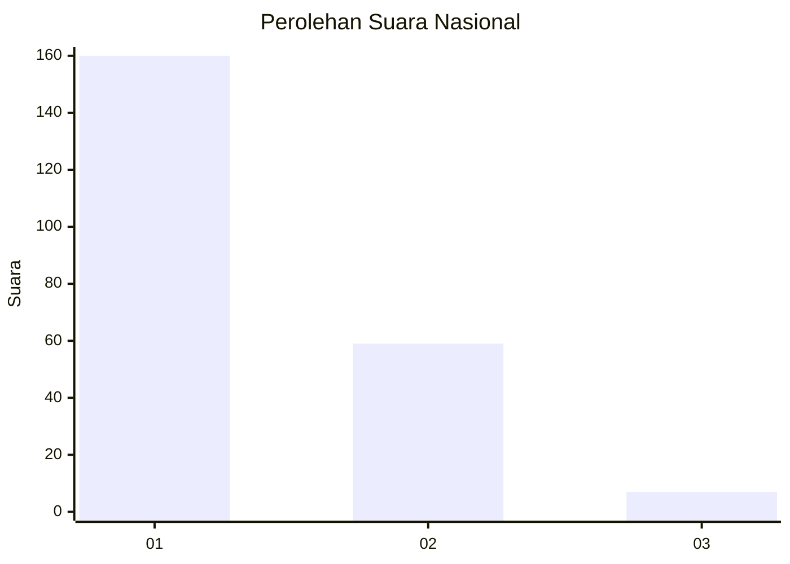
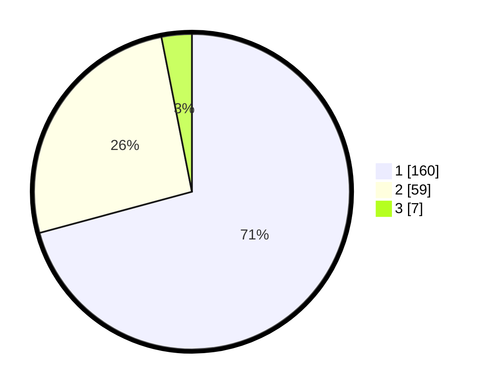

# Hasil

## Grafik

## Tabel

| No. | Nama Paslon    | Suara | Suara (raw) | Persentase |
|:--- |:-------------- | -----:| -----------:| ----------:|
| 1   | ANIES MUHAIMIN | 160   | [160][p-1]  | 70,80      |
| 2   | PRABOWO GIBRAN | 59    | [59][p-2]   | 26,11      |
| 3   | GANJAR MAHFUD  | 7     | [7][p-3]    | 3,10       |

[p-1]: https://github.com/gigit-pemilu/pemilu-2024/blob/main/pilpres/hitung-suara/sub/11-aceh/sub/07-pidie/sub/27-mane/sub/2001-lutueng/sub/003-tps/sub/paslon-1.txt
[p-2]: https://github.com/gigit-pemilu/pemilu-2024/blob/main/pilpres/hitung-suara/sub/11-aceh/sub/07-pidie/sub/27-mane/sub/2001-lutueng/sub/003-tps/sub/paslon-2.txt
[p-3]: https://github.com/gigit-pemilu/pemilu-2024/blob/main/pilpres/hitung-suara/sub/11-aceh/sub/07-pidie/sub/27-mane/sub/2001-lutueng/sub/003-tps/sub/paslon-3.txt

## Foto C Plano

https://sirekap-obj-formc.kpu.go.id/bb9c/pemilu/ppwp/11/07/27/20/01/1107272001003-20240216-184431--cf383937-ca9a-4edb-ba87-f5d32a7486c0.jpg

https://sirekap-obj-formc.kpu.go.id/bb9c/pemilu/ppwp/11/07/27/20/01/1107272001003-20240216-184432--826c5314-4c90-4d58-b24a-d7d3835f34df.jpg

https://sirekap-obj-formc.kpu.go.id/bb9c/pemilu/ppwp/11/07/27/20/01/1107272001003-20240216-184431--b2b994dd-61ea-420c-8a72-db615df417a4.jpg

## Metadata

| Key        | Value               |
| ---------- | ------------------- |
| Time Stamp | 2024-02-17 03:00:02 |

## DATA PEMILIH TETAP

Jumlah pemilih dalam DPT: **296**.
 * L: **136**.
 * P: **160**.

## DATA PENGGUNA HAK PILIH

Jumlah pengguna hak pilih dalam DPT: **233**.
 * L: **101**.
 * P: **132**.

Jumlah pengguna hak pilih dalam DPTb: **0**.
 * L: **0**.
 * P: **0**.

Jumlah pengguna hak pilih dalam DPK: **0**.
 * L: **0**.
 * P: **0**.

Jumlah pengguna hak pilih: **233**.
 * L: **101**.
 * P: **132**.

## JUMLAH SUARA SAH DAN TIDAK SAH

JUMLAH SELURUH SUARA SAH: **226**.

JUMLAH SUARA TIDAK SAH: **7**.

JUMLAH SELURUH SUARA SAH DAN SUARA TIDAK SAH: **233**.

