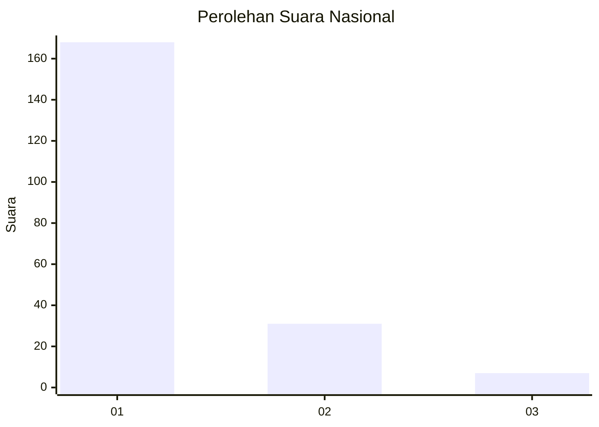
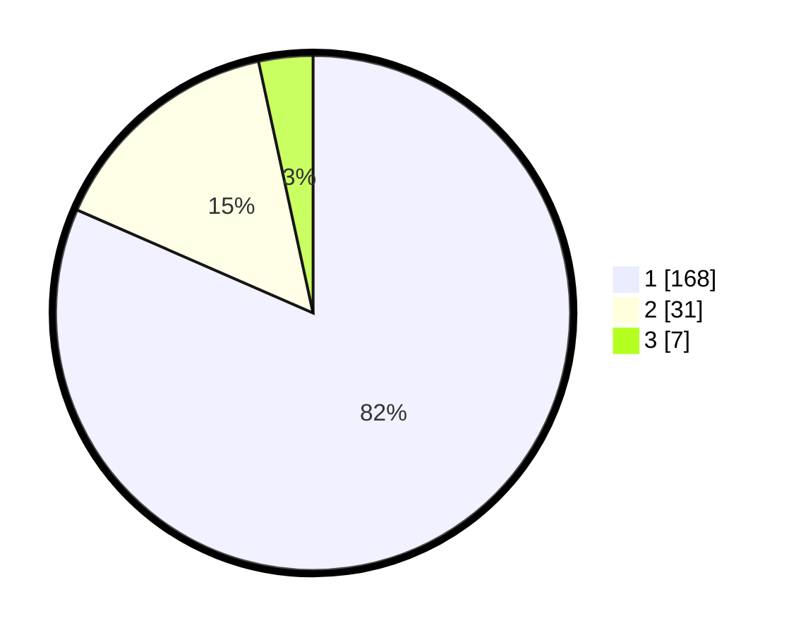

# Hasil

## Grafik

## Tabel

| No. | Nama Paslon    | Suara | Suara (raw) | Persentase |
|:--- |:-------------- | -----:| -----------:| ----------:|
| 1   | ANIES MUHAIMIN | 168   | [168][p-1]  | 81,55      |
| 2   | PRABOWO GIBRAN | 31    | [31][p-2]   | 15,05      |
| 3   | GANJAR MAHFUD  | 7     | [7][p-3]    | 3,40       |

[p-1]: https://github.com/gigit-pemilu/pemilu-2024/blob/main/pilpres/hitung-suara/sub/11-aceh/sub/07-pidie/sub/27-mane/sub/2001-lutueng/sub/005-tps/sub/paslon-1.txt
[p-2]: https://github.com/gigit-pemilu/pemilu-2024/blob/main/pilpres/hitung-suara/sub/11-aceh/sub/07-pidie/sub/27-mane/sub/2001-lutueng/sub/005-tps/sub/paslon-2.txt
[p-3]: https://github.com/gigit-pemilu/pemilu-2024/blob/main/pilpres/hitung-suara/sub/11-aceh/sub/07-pidie/sub/27-mane/sub/2001-lutueng/sub/005-tps/sub/paslon-3.txt

## Foto C Plano

https://sirekap-obj-formc.kpu.go.id/b828/pemilu/ppwp/11/07/27/20/01/1107272001005-20240216-212533--eb1129ce-bbdc-4e42-adc8-9f405c397f73.jpg

https://sirekap-obj-formc.kpu.go.id/b828/pemilu/ppwp/11/07/27/20/01/1107272001005-20240216-212535--be7f0f83-8e8c-45b1-82af-56e94950ee8d.jpg

https://sirekap-obj-formc.kpu.go.id/b828/pemilu/ppwp/11/07/27/20/01/1107272001005-20240216-212534--df539f37-caad-4a21-b48c-0db2f290782b.jpg

## Metadata

| Key        | Value               |
| ---------- | ------------------- |
| Time Stamp | 2024-02-17 03:00:02 |

## DATA PEMILIH TETAP

Jumlah pemilih dalam DPT: **282**.
 * L: **135**.
 * P: **147**.

## DATA PENGGUNA HAK PILIH

Jumlah pengguna hak pilih dalam DPT: **222**.
 * L: **102**.
 * P: **120**.

Jumlah pengguna hak pilih dalam DPTb: **0**.
 * L: **0**.
 * P: **0**.

Jumlah pengguna hak pilih dalam DPK: **0**.
 * L: **0**.
 * P: **0**.

Jumlah pengguna hak pilih: **222**.
 * L: **102**.
 * P: **120**.

## JUMLAH SUARA SAH DAN TIDAK SAH

JUMLAH SELURUH SUARA SAH: **206**.

JUMLAH SUARA TIDAK SAH: **16**.

JUMLAH SELURUH SUARA SAH DAN SUARA TIDAK SAH: **222**.

