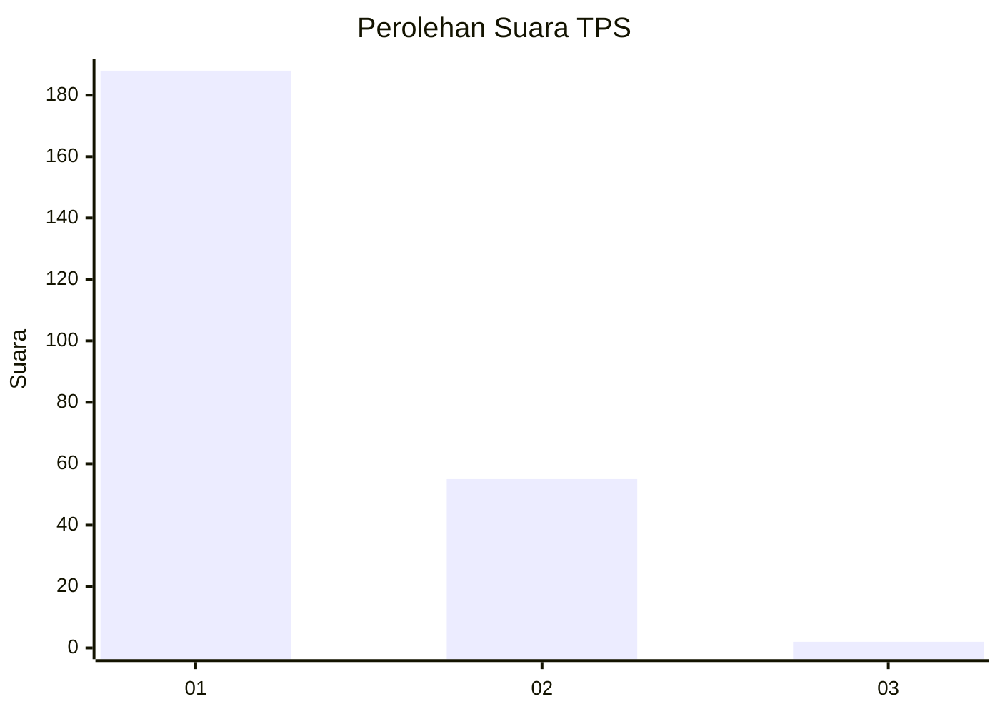
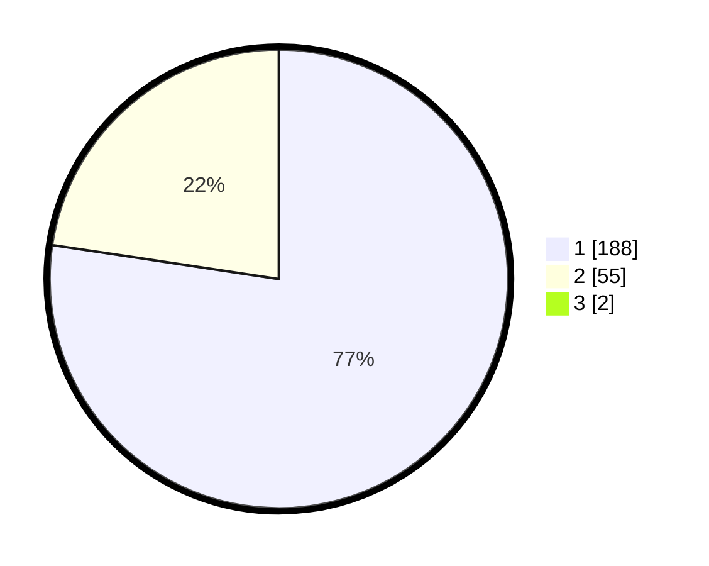

# Hasil

## Grafik

## Tabel

| No. | Nama Paslon    | Suara | Suara (raw) | Persentase |
|:--- |:-------------- | -----:| -----------:| ----------:|
| 1   | ANIES MUHAIMIN | 188   | [188][p-1]  | 76,73      |
| 2   | PRABOWO GIBRAN | 55    | [55][p-2]   | 22,45      |
| 3   | GANJAR MAHFUD  | 2     | [2][p-3]    | 0,82       |

[p-1]: https://github.com/gigit-pemilu/pemilu-2024-11-aceh/blob/main/pilpres/hitung-suara/sub/11-aceh/sub/07-pidie/sub/27-mane/sub/2003-mane/sub/003-tps/sub/paslon-1.txt
[p-2]: https://github.com/gigit-pemilu/pemilu-2024-11-aceh/blob/main/pilpres/hitung-suara/sub/11-aceh/sub/07-pidie/sub/27-mane/sub/2003-mane/sub/003-tps/sub/paslon-2.txt
[p-3]: https://github.com/gigit-pemilu/pemilu-2024-11-aceh/blob/main/pilpres/hitung-suara/sub/11-aceh/sub/07-pidie/sub/27-mane/sub/2003-mane/sub/003-tps/sub/paslon-3.txt

## Foto C Plano

https://sirekap-obj-formc.kpu.go.id/ecfa/pemilu/ppwp/11/07/27/20/03/1107272003003-20240216-175712--4169f97a-2223-4fa9-be43-3b7eb972c40a.jpg

https://sirekap-obj-formc.kpu.go.id/ecfa/pemilu/ppwp/11/07/27/20/03/1107272003003-20240216-175713--08c854aa-8648-488c-bcb0-8bad18a18853.jpg

https://sirekap-obj-formc.kpu.go.id/ecfa/pemilu/ppwp/11/07/27/20/03/1107272003003-20240216-175713--80f0c6a4-4606-4802-bffc-4ad6969ca2c9.jpg

## Metadata

| Key        | Value               |
| ---------- | ------------------- |
| Time Stamp | 2024-02-17 03:00:02 |

## DATA PEMILIH TETAP

Jumlah pemilih dalam DPT: **296**.
 * L: **112**.
 * P: **184**.

## DATA PENGGUNA HAK PILIH

Jumlah pengguna hak pilih dalam DPT: **282**.
 * L: **112**.
 * P: **170**.

Jumlah pengguna hak pilih dalam DPTb: **0**.
 * L: **0**.
 * P: **0**.

Jumlah pengguna hak pilih dalam DPK: **0**.
 * L: **0**.
 * P: **0**.

Jumlah pengguna hak pilih: **202**.
 * L: **112**.
 * P: **170**.

## JUMLAH SUARA SAH DAN TIDAK SAH

JUMLAH SELURUH SUARA SAH: **245**.

JUMLAH SUARA TIDAK SAH: **37**.

JUMLAH SELURUH SUARA SAH DAN SUARA TIDAK SAH: **282**.

