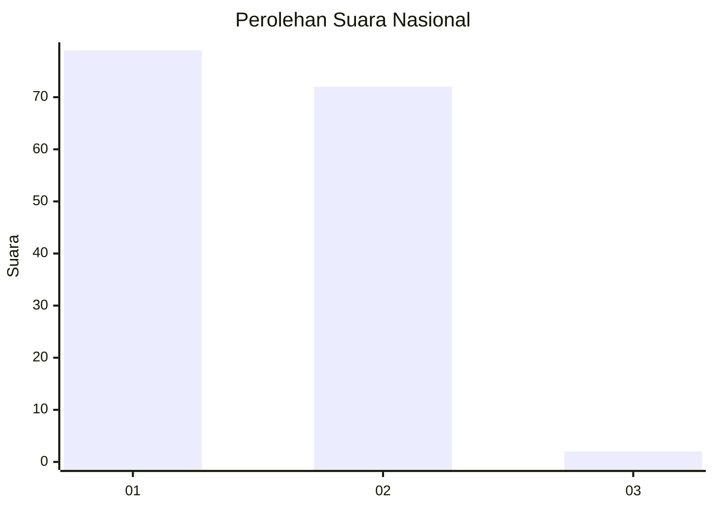
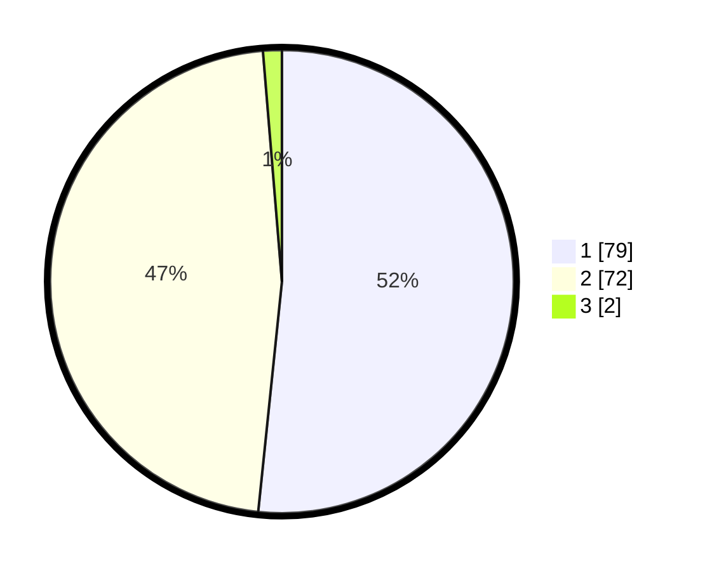

# Hasil

## Grafik

## Tabel

| No. | Nama Paslon    | Suara | Suara (raw) | Persentase |
|:--- |:-------------- | -----:| -----------:| ----------:|
| 1   | ANIES MUHAIMIN | 79    | [79][p-1]   | 51,63      |
| 2   | PRABOWO GIBRAN | 72    | [72][p-2]   | 47,06      |
| 3   | GANJAR MAHFUD  | 2     | [2][p-3]    | 1,31       |

[p-1]: https://github.com/gigit-pemilu/pemilu-2024/blob/main/pilpres/hitung-suara/sub/11-aceh/sub/07-pidie/sub/29-glumpang-baro/sub/2002-mee-teumpeun/sub/001-tps/sub/paslon-1.txt
[p-2]: https://github.com/gigit-pemilu/pemilu-2024/blob/main/pilpres/hitung-suara/sub/11-aceh/sub/07-pidie/sub/29-glumpang-baro/sub/2002-mee-teumpeun/sub/001-tps/sub/paslon-2.txt
[p-3]: https://github.com/gigit-pemilu/pemilu-2024/blob/main/pilpres/hitung-suara/sub/11-aceh/sub/07-pidie/sub/29-glumpang-baro/sub/2002-mee-teumpeun/sub/001-tps/sub/paslon-3.txt

## Foto C Plano

https://sirekap-obj-formc.kpu.go.id/47f3/pemilu/ppwp/11/07/29/20/02/1107292002001-20240215-035224--12208b97-f9a7-407a-8ce2-899b73d6e345.jpg

https://sirekap-obj-formc.kpu.go.id/47f3/pemilu/ppwp/11/07/29/20/02/1107292002001-20240215-034351--fda5d756-1b97-46d5-92c8-dd641606ee2d.jpg

https://sirekap-obj-formc.kpu.go.id/47f3/pemilu/ppwp/11/07/29/20/02/1107292002001-20240215-035456--53864adf-b9bc-4a31-b0ab-75e768b59837.jpg

## Metadata

| Key        | Value               |
| ---------- | ------------------- |
| Time Stamp | 2024-02-17 18:00:00 |

