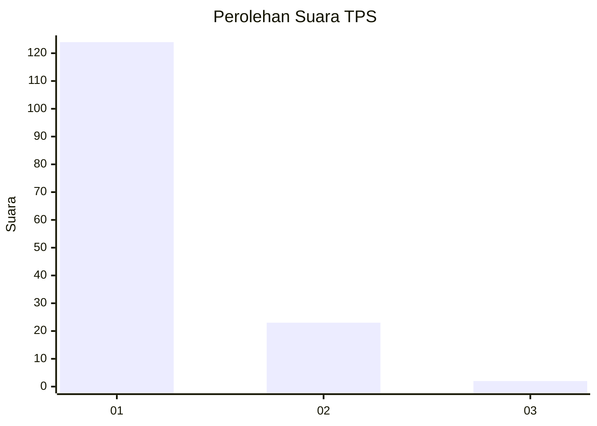
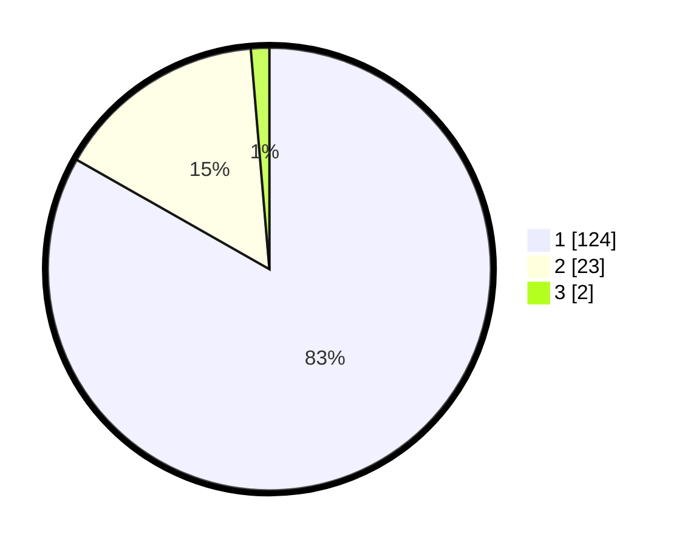

# Hasil

## Grafik

## Tabel

| No. | Nama Paslon    | Suara | Suara (raw) | Persentase |
|:--- |:-------------- | -----:| -----------:| ----------:|
| 1   | ANIES MUHAIMIN | 124   | [124][p-1]  | 83,22      |
| 2   | PRABOWO GIBRAN | 23    | [23][p-2]   | 15,44      |
| 3   | GANJAR MAHFUD  | 2     | [2][p-3]    | 1,34       |

[p-1]: https://github.com/gigit-pemilu/pemilu-2024-11-aceh/blob/main/pilpres/hitung-suara/sub/11-aceh/sub/07-pidie/sub/29-glumpang-baro/sub/2002-mee-teumpeun/sub/002-tps/sub/paslon-1.txt
[p-2]: https://github.com/gigit-pemilu/pemilu-2024-11-aceh/blob/main/pilpres/hitung-suara/sub/11-aceh/sub/07-pidie/sub/29-glumpang-baro/sub/2002-mee-teumpeun/sub/002-tps/sub/paslon-2.txt
[p-3]: https://github.com/gigit-pemilu/pemilu-2024-11-aceh/blob/main/pilpres/hitung-suara/sub/11-aceh/sub/07-pidie/sub/29-glumpang-baro/sub/2002-mee-teumpeun/sub/002-tps/sub/paslon-3.txt

## Foto C Plano

https://sirekap-obj-formc.kpu.go.id/0254/pemilu/ppwp/11/07/29/20/02/1107292002002-20240215-034605--6145c40b-d392-49e6-9ec4-2303bc95f498.jpg

https://sirekap-obj-formc.kpu.go.id/0254/pemilu/ppwp/11/07/29/20/02/1107292002002-20240215-033309--e95b29ab-111e-4e40-b46e-227c387ce8fe.jpg

https://sirekap-obj-formc.kpu.go.id/0254/pemilu/ppwp/11/07/29/20/02/1107292002002-20240215-034759--d098e86f-38bf-4544-9859-46879944ba86.jpg

## Metadata

| Key        | Value               |
| ---------- | ------------------- |
| Time Stamp | 2024-02-24 22:31:28 |

